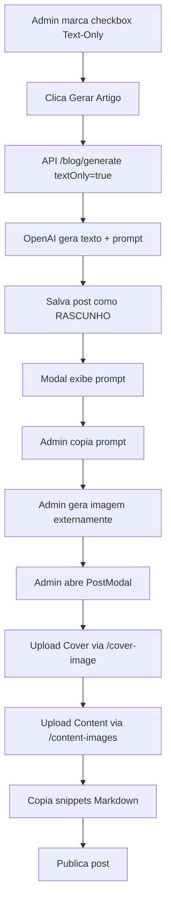

# 🎨 Blog Text-Only Mode - Sistema de Upload Manual de Imagens

Sistema inspirado no **TextOnly** do Instagram Admin que permite gerar artigos de blog com apenas texto e prompts de imagem, permitindo upload manual de imagens de capa e conteúdo.

## 📋 Funcionalidades Implementadas

### 1. **Modo Text-Only na Geração**
- ✅ Checkbox no admin blog para ativar modo "Texto + Upload Manual"
- ✅ API `/api/blog/generate` aceita parâmetro `textOnly: true`
- ✅ Quando ativado:
  - Gera apenas texto (título, conteúdo, tags, SEO)
  - Cria prompt de imagem detalhado (não gera a imagem)
  - Usa placeholder temporário como cover_image_url
  - Post fica como **rascunho** até upload de imagem

### 2. **Sistema de Upload de Imagens**

#### **Upload de Capa**
- **Endpoint:** `POST /api/admin/blog/posts/[slug]/cover-image`
- **Autenticação:** Cookie JWT de admin
- **Limite:** 5MB, apenas imagens
- **Storage:** Supabase Storage em `images/blog/covers/`
- **Ação:** Atualiza `cover_image_url` no banco de dados

#### **Upload de Imagens de Conteúdo**
- **Endpoint:** `POST /api/admin/blog/posts/[slug]/content-images`
- **Autenticação:** Cookie JWT de admin
- **Limite:** 5MB, apenas imagens
- **Storage:** Supabase Storage em `images/blog/content/`
- **Retorno:** URL pública + snippet Markdown pronto para colar

### 3. **UI de Upload no PostModal**

Quando `adminMode={true}`, o PostModal exibe:

```tsx
<PostImageUploader
  postSlug={post.slug}
  currentCoverUrl={post.cover_image_url}
  onCoverUpdated={(newUrl) => setCoverImageUrl(newUrl)}
/>
```

**Componente `PostImageUploader`:**
- 📸 **Upload de Capa:** Arrasta imagem, upload automático, atualiza preview
- 🖼️ **Upload de Conteúdo:** 
  - Campo para descrição (alt text)
  - Upload de imagem
  - Retorna Markdown: ``
  - Botão para copiar snippet

### 4. **Preview com Prompt de Imagem**

No `BlogPreviewModal`, quando `textOnly: true`:

```tsx
{post.textOnly && post.imagePrompt && (
  <div className="bg-gradient-to-br from-amber-50...">
    <h3>🎨 Prompt de Imagem (Gere em qualquer IA)</h3>
    <code>{post.imagePrompt}</code>
    <Button onClick={copyPrompt}>📋 Copiar Prompt</Button>
  </div>
)}
```

## 🚀 Como Usar

### **Modo Normal (Automático)**
1. Acesse `/admin/blog`
2. **Desmarque** checkbox "Modo Texto + Upload Manual"
3. Clique em "Gerar Artigos" → Escolha tema
4. DALL-E gera imagem automaticamente
5. Personalize e publique

### **Modo Text-Only (Manual)**
1. Acesse `/admin/blog`
2. **Marque** checkbox "🎨 Modo Texto + Upload Manual"
3. Clique em "Gerar Artigos" → Escolha tema
4. **No preview:**
   - Copie o prompt de imagem sugerido
   - Gere imagem no DALL-E/Midjourney/Stable Diffusion
5. **No modal de preview do post:**
   - Faça upload da imagem de capa
   - Faça upload de imagens para o conteúdo (fluxogramas, diagramas)
   - Copie snippets Markdown e cole no editor
6. Publique quando pronto

## 📁 Arquivos Modificados/Criados

### **API Routes**
- `app/api/blog/generate/route.ts` - Suporte a `textOnly` mode
- `app/api/admin/blog/posts/[slug]/cover-image/route.ts` - Upload de capa (NOVO)
- `app/api/admin/blog/posts/[slug]/content-images/route.ts` - Upload de conteúdo (NOVO)

### **Componentes**
- `components/blog/post-modal.tsx` - Prop `adminMode`, integração com uploader
- `components/blog/post-image-uploader.tsx` - Componente de upload (NOVO)
- `components/blog/blog-preview-modal.tsx` - Exibe prompt de imagem em text-only

### **Admin Pages**
- `app/admin/blog/page.tsx` - Checkbox textOnly, passando `adminMode={true}` para PostModal

## 🔐 Segurança

- ✅ Todos os endpoints de upload verificam cookie JWT de admin
- ✅ Validação de tipo de arquivo (apenas imagens)
- ✅ Limite de tamanho: 5MB
- ✅ Upload via Supabase Storage com URLs públicas
- ✅ Cleanup automático se falhar atualização do banco

## 🎯 Casos de Uso

### **Quando usar Text-Only:**
- 📊 Artigos com **fluxogramas** ou **diagramas customizados**
- 🖼️ Necessidade de **editar imagens** antes de publicar
- 💰 **Economizar créditos** da API DALL-E
- 🎨 Usar **outras IAs** de imagem (Midjourney, Sora, Leonardo)
- 📸 Usar **fotos reais** em vez de IA

### **Quando usar Modo Normal:**
- ⚡ Velocidade - publicar rápido
- 🤖 Confiar na IA para gerar imagem adequada
- 📝 Artigos simples sem necessidade de imagens customizadas

## 🔄 Fluxo Técnico



## 📝 Exemplo de Prompt Gerado

```
Modern professional illustration for blog post about 
'Como Automatizar Processos com IA'. 
Style: Clean, tech-focused, vibrant gradient background 
(purple to blue). Include: Robot icon, automation symbols, 
business charts. Aspect: 16:9, high quality, no text overlay.
```

## ✨ Melhorias Futuras

- [ ] Drag & drop de múltiplas imagens
- [ ] Preview de imagens antes do upload
- [ ] Editor Markdown com botão de insert image
- [ ] Histórico de prompts usados
- [ ] Integração direta com DALL-E/Midjourney via API
- [ ] Compressão automática de imagens
- [ ] Suporte a GIFs e vídeos

## 🐛 Troubleshooting

**Erro: "Unauthorized"**
- Verifique se está logado como admin
- Cookie `admin_token` deve estar presente

**Upload falha:**
- Verifique tamanho do arquivo (< 5MB)
- Confirme que é uma imagem válida (JPG, PNG, WEBP)
- Check logs do Supabase Storage

**Imagem não aparece:**
- URL pública está correta?
- Bucket `images` está público?
- RLS policies configuradas?

---

**Desenvolvido por:** CatBytes AI
**Data:** 7 de novembro de 2025
**Inspirado em:** Sistema TextOnly do Instagram Admin
