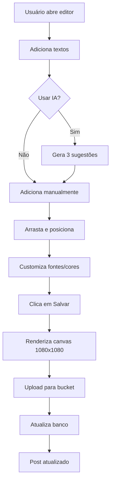

# 🎨 Editor Avançado de Posts do Instagram

## 📋 Visão Geral

O **Editor Avançado de Posts do Instagram** é uma ferramenta profissional que permite edição completa de posts com texto arrastável sobre imagens, múltiplas fontes, cores personalizadas, formatação (negrito/itálico) e sugestões de IA.

## ✨ Funcionalidades Implementadas

### 1. **Sistema de Camadas de Texto** 📝
- ✅ **Texto ilimitado**: Adicione quantos textos quiser na imagem
- ✅ **Posicionamento livre**: Arraste cada texto para qualquer posição
- ✅ **Controles individuais**: Cada texto tem suas próprias configurações
- ✅ **Exclusão individual**: Delete textos separadamente

### 2. **Fontes e Formatação** 🔤
- ✅ **3 tipos de fonte**:
  - **Arial (Moderna)**: Clean e profissional
  - **Georgia (Elegante)**: Serifa elegante
  - **Impact (Forte)**: Bold e impactante
- ✅ **Tamanho ajustável**: 20px até 120px (slider)
- ✅ **Negrito e Itálico**: Botões de formatação
- ✅ **Rotação**: -45° até +45° (slider)

### 3. **Cores Personalizadas** 🎨
- ✅ **Seletor de cores**: HexColorPicker com paleta completa
- ✅ **Cores por camada**: Cada texto pode ter sua própria cor
- ✅ **Preview em tempo real**: Veja as cores instantaneamente

### 4. **Sugestões de IA** 🤖
- ✅ **Geração inteligente**: 3 textos curtos e impactantes
- ✅ **Contexto do nicho**: Adaptado ao tipo de negócio
- ✅ **Posicionamento automático**: Textos distribuídos na imagem
- ✅ **Edição pós-geração**: Modifique os textos gerados

### 5. **Interface de 3 Abas** 📑
1. **Legenda (Caption)**: 
   - Edição da legenda do post
   - Contador de caracteres (limite: 2200)
   - Dicas de formatação
   
2. **Editar Imagem**:
   - Preview da imagem com textos
   - Controles de camadas
   - Lista de todas as camadas
   
3. **Preview**:
   - Mockup estilo Instagram
   - Visualização final do post

### 6. **Renderização Canvas** 🖼️
- ✅ **Exportação 1080x1080**: Tamanho ideal para Instagram
- ✅ **Qualidade alta**: PNG sem perda de qualidade
- ✅ **Sombras automáticas**: Melhora legibilidade do texto
- ✅ **Upload automático**: Salva no bucket Supabase

## 🏗️ Arquitetura Técnica

### Componentes

#### `AdvancedInstagramEditor`
**Localização**: `components/instagram/advanced-instagram-editor.tsx`

**Principais funções**:
```typescript
// Gerenciamento de camadas
addTextLayer()           // Adiciona nova camada de texto
updateLayer()            // Atualiza propriedades da camada
deleteLayer()            // Remove camada específica

// Sistema de arrastar
handleMouseDown()        // Inicia arrasto
handleMouseMove()        // Move texto
handleMouseUp()          // Finaliza arrasto

// Renderização
renderToCanvas()         // Gera imagem final 1080x1080

// IA
generateAISuggestion()   // Gera sugestões de texto

// Salvamento
handleSave()            // Salva post atualizado
```

**Estado gerenciado**:
```typescript
interface TextLayer {
  id: string
  text: string
  x: number              // Posição X (0-100%)
  y: number              // Posição Y (0-100%)
  fontSize: number       // 20-120px
  fontFamily: string     // Arial, Georgia, Impact
  color: string          // Hex color
  bold: boolean
  italic: boolean
  rotation: number       // -45 a +45 graus
}
```

### API Endpoints

#### 1. `/api/instagram/suggest-text` ✨
**Método**: POST

**Entrada**:
```json
{
  "nicho": "advogados",
  "titulo": "Automatize seu consultório",
  "caption": "Legenda do post..."
}
```

**Saída**:
```json
{
  "success": true,
  "suggestions": [
    "Automatize Agora Seu Consultório",
    "Ganhe 3 Horas Por Dia",
    "Atendimento 24/7 Sem Esforço"
  ]
}
```

**Features**:
- ✅ GPT-4o-mini para geração contextual
- ✅ Máximo 6 palavras por texto
- ✅ Adaptado ao nicho do cliente
- ✅ Foco em CTA, benefícios e urgência

#### 2. `/api/instagram/upload-custom-image` 📤
**Método**: POST

**Entrada**:
```json
{
  "dataUrl": "data:image/png;base64,...",
  "postId": "uuid-do-post"
}
```

**Saída**:
```json
{
  "success": true,
  "url": "https://supabase.co/storage/.../post-123.png",
  "path": "post-123-timestamp.png"
}
```

**Features**:
- ✅ Converte canvas dataURL para buffer
- ✅ Valida tamanho máximo (10MB)
- ✅ Upload para bucket `instagram-images`
- ✅ Atualiza URL no banco de dados
- ✅ Cleanup automático em caso de erro

### Integração

#### `InstagramEditModal` (Wrapper)
**Localização**: `components/instagram/instagram-edit-modal.tsx`

O modal antigo agora é um wrapper simples que delega para o editor avançado:

```typescript
export function InstagramEditModal({ post, isOpen, onClose, onSave }: Props) {
  return (
    <AdvancedInstagramEditor
      post={post}
      isOpen={isOpen}
      onClose={onClose}
      onSave={onSave}
    />
  )
}
```

**Vantagens**:
- ✅ Sem mudanças no código existente
- ✅ Drop-in replacement
- ✅ Compatibilidade retroativa

## 🎯 Como Usar

### 1. Abrir o Editor
1. Acesse o painel de Instagram em `/admin/instagram`
2. Clique no botão "✏️" em qualquer post pendente
3. O editor avançado abrirá automaticamente

### 2. Adicionar Texto na Imagem
1. Na aba "Editar Imagem", clique em "➕ Adicionar Texto"
2. Um novo texto aparecerá no centro da imagem
3. Arraste o texto para a posição desejada
4. Configure fonte, tamanho, cor e formatação

### 3. Usar Sugestões de IA
1. Clique no botão "✨ Sugerir Textos com IA"
2. A IA gerará 3 textos impactantes
3. Os textos aparecerão automaticamente na imagem
4. Edite conforme necessário

### 4. Personalizar Cada Texto
Para cada camada de texto:
- **Fonte**: Selecione entre Arial, Georgia ou Impact
- **Tamanho**: Arraste o slider (20-120px)
- **Cor**: Clique no botão de cor e escolha
- **Negrito**: Clique em **B**
- **Itálico**: Clique em *I*
- **Rotação**: Arraste o slider de rotação (-45° a +45°)
- **Excluir**: Clique no 🗑️ ao lado da camada

### 5. Preview e Salvar
1. Vá para a aba "Preview" para ver como ficará no Instagram
2. Clique em "💾 Salvar Post"
3. O sistema:
   - Renderiza a imagem em alta qualidade (1080x1080)
   - Faz upload para o bucket
   - Atualiza o post no banco
   - Fecha o modal automaticamente

## 🛠️ Dependências

### NPM Packages
```json
{
  "react-colorful": "^5.6.1",  // Seletor de cores
  "@radix-ui/react-slider": "latest"  // Sliders de controle
}
```

### Componentes Shadcn/UI
- ✅ `Dialog` - Modal principal
- ✅ `Button` - Botões de ação
- ✅ `Input` - Campos de texto
- ✅ `Textarea` - Legenda
- ✅ `Tabs` - Sistema de abas
- ✅ `Select` - Seletor de fontes
- ✅ `Slider` - Controles deslizantes
- ✅ `Card` - Layout de camadas

### APIs Externas
- ✅ **OpenAI GPT-4o-mini**: Sugestões de texto
- ✅ **Supabase Storage**: Armazenamento de imagens
- ✅ **Canvas API**: Renderização de imagens

## 📊 Fluxo de Trabalho



## 🎨 Exemplos de Uso

### Caso 1: CTA Principal com Subtítulo
```typescript
// Camada 1 (CTA)
{
  text: "AUTOMATIZE AGORA",
  fontFamily: "Impact",
  fontSize: 80,
  color: "#FFD700",  // Dourado
  bold: true,
  y: 20  // Topo da imagem
}

// Camada 2 (Subtítulo)
{
  text: "Seu consultório no piloto automático",
  fontFamily: "Georgia",
  fontSize: 40,
  color: "#FFFFFF",
  italic: true,
  y: 70  // Abaixo do CTA
}
```

### Caso 2: Benefícios com Lista
```typescript
// Camada 1
{
  text: "✓ Economize 3h por dia",
  fontFamily: "Arial",
  fontSize: 50,
  color: "#00FF00",
  y: 30
}

// Camada 2
{
  text: "✓ Atendimento 24/7",
  fontFamily: "Arial",
  fontSize: 50,
  color: "#00FF00",
  y: 50
}

// Camada 3
{
  text: "✓ Sem esforço",
  fontFamily: "Arial",
  fontSize: 50,
  color: "#00FF00",
  y: 70
}
```

## 🔒 Segurança

### Validações Implementadas
- ✅ **Tamanho de imagem**: Máximo 10MB
- ✅ **Formato**: Apenas PNG (renderização)
- ✅ **Rate limiting**: Sugestões de IA limitadas
- ✅ **Autenticação**: Endpoints protegidos

### Storage Policies
O bucket `instagram-images` tem políticas configuradas para:
- ✅ Upload público (com autenticação)
- ✅ Leitura pública (URLs permanentes)
- ✅ Deleção apenas por service role

## 📈 Performance

### Otimizações
- ✅ **Canvas rendering**: Assíncrono, não bloqueia UI
- ✅ **Drag & drop**: Debounced para suavidade
- ✅ **Preview**: Atualização em tempo real
- ✅ **Upload**: Compressão PNG automática

### Limites
- **Camadas de texto**: Ilimitadas (recomendado: até 5)
- **Tamanho de fonte**: 20px - 120px
- **Rotação**: -45° a +45°
- **Tamanho de imagem**: Máximo 10MB

## 🐛 Troubleshooting

### Problema: Texto não aparece na imagem final
**Solução**: Verifique se a camada está dentro dos limites (x: 0-100%, y: 0-100%)

### Problema: Upload falha com erro 413
**Solução**: Imagem excede 10MB. Reduza a qualidade ou tamanho.

### Problema: Sugestões de IA não aparecem
**Solução**: Verifique se `OPENAI_API_KEY` está configurada em `.env.local`

### Problema: Cores não salvam
**Solução**: Certifique-se de fechar o seletor de cores antes de salvar

## 🚀 Próximas Melhorias (Roadmap)

### Fase 1 (Atual) ✅
- [x] Sistema de camadas de texto
- [x] Drag & drop
- [x] 3 fontes
- [x] Cores personalizadas
- [x] Negrito e itálico
- [x] Sugestões de IA
- [x] Upload para bucket

### Fase 2 (Futuro)
- [ ] Mais fontes (Google Fonts)
- [ ] Stickers e emojis grandes
- [ ] Backgrounds coloridos para texto
- [ ] Gradientes e sombras customizáveis
- [ ] Templates pré-definidos
- [ ] Histórico de edições (undo/redo)
- [ ] Filtros de imagem
- [ ] Recorte e redimensionamento

### Fase 3 (Avançado)
- [ ] Animações de texto
- [ ] Upload de imagens próprias
- [ ] Layers de imagem (sobreposição)
- [ ] Mascara e recortes customizados
- [ ] Exportação em múltiplos tamanhos
- [ ] Biblioteca de assets

## 📝 Notas Técnicas

### Coordenadas do Canvas
O sistema usa coordenadas **relativas (%)** na UI e converte para **pixels absolutos** no canvas:

```typescript
// UI: Posição relativa (0-100%)
const uiX = 50  // 50% da largura

// Canvas: Posição absoluta (0-1080px)
const canvasX = (uiX / 100) * 1080  // 540px
```

### Fontes no Canvas
As fontes são aplicadas com fallbacks:

```typescript
const fontString = `${bold ? 'bold ' : ''}${italic ? 'italic ' : ''}${fontSize}px ${fontFamily}, sans-serif`
// Exemplo: "bold italic 80px Impact, sans-serif"
```

### Sombras de Texto
Para melhor legibilidade, aplicamos sombra automática:

```typescript
ctx.shadowColor = 'rgba(0, 0, 0, 0.8)'
ctx.shadowBlur = 15
ctx.shadowOffsetX = 3
ctx.shadowOffsetY = 3
```

## 🎓 Referências

- [Canvas API - MDN](https://developer.mozilla.org/en-US/docs/Web/API/Canvas_API)
- [react-colorful](https://github.com/omgovich/react-colorful)
- [Shadcn UI](https://ui.shadcn.com/)
- [Instagram Best Practices](https://business.instagram.com/blog/best-practices-for-instagram-feed-posts)

---

**Desenvolvido com ❤️ por CatBytes**

Para suporte, entre em contato através do painel de administração.
