# 📋 PLANO COMPLETO DE PROFISSIONALIZAÇÃO DO PORTFÓLIO CATBYTES

> **Desenvolvedor:** Izadora Cury Pierette
> **Data:** 2025-11-01
> **Objetivo:** Escalar e profissionalizar o portfólio com design moderno, animações avançadas, SEO otimizado e suporte a múltiplos idiomas (PT-BR / EN-US)

---

## 📊 ANÁLISE DO ESTADO ATUAL

### ✅ Pontos Fortes Existentes
- **SEO Sólido:** Schema.org, Open Graph, Twitter Cards, sitemap.xml, robots.txt
- **Acessibilidade:** ARIA labels, HTML semântico, navegação por teclado
- **Dark Mode:** Implementado com CSS variables e localStorage
- **Performance:** Lazy loading de imagens, código modular (1.836 linhas)
- **AI Features:** 3 funcionalidades interativas com Google Gemini API
- **Netlify Functions:** Backend serverless bem estruturado
- **Design Responsivo:** Tailwind CSS + media queries customizadas

### 🎯 Áreas de Melhoria
- ❌ **Sem i18n:** Apenas PT-BR (precisa EN-US)
- ⚠️ **Animações básicas:** Potencial para microinterações avançadas
- ⚠️ **Vanilla JS:** Migração para React/Next.js trará benefícios (já no roadmap)
- ⚠️ **Performance:** Core Web Vitals podem ser otimizados
- ⚠️ **Design:** Pode ser modernizado com componentes mais sofisticados

---

## 🎨 PARTE 1: PROFISSIONALIZAÇÃO DO DESIGN

### 1.1 Layout Moderno e Responsivo

#### **Estratégia de Migração para React + Next.js**

**Por que migrar?**
- ✅ Melhor SEO com SSR (Server-Side Rendering) ou SSG (Static Site Generation)
- ✅ Code splitting automático = melhor performance
- ✅ Roteamento integrado para /pt-br e /en
- ✅ Ecossistema rico de bibliotecas modernas
- ✅ TypeScript nativo para maior confiabilidade

**Stack Recomendada:**
```json
{
  "framework": "Next.js 14+ (App Router)",
  "styling": "Tailwind CSS v3.4+",
  "animations": "Framer Motion v11+",
  "i18n": "next-intl v3.0+",
  "forms": "React Hook Form + Zod",
  "analytics": "Vercel Analytics + Plausible",
  "deployment": "Vercel ou Netlify"
}
```

#### **Estrutura de Pastas Next.js Recomendada**

```
catbytes-portfolio/
├── app/                          # App Router (Next.js 14+)
│   ├── [locale]/                # Internacionalização dinâmica
│   │   ├── layout.tsx           # Layout compartilhado
│   │   ├── page.tsx             # Homepage
│   │   ├── projects/            # Página de projetos (futura)
│   │   │   └── [slug]/page.tsx  # Projeto individual
│   │   └── about/page.tsx       # Sobre mim (futura)
│   ├── api/                     # API Routes (substituir Netlify Functions)
│   │   ├── identify-cat/route.ts
│   │   ├── adopt-cat/route.ts
│   │   └── generate-ad/route.ts
│   └── globals.css              # Tailwind imports
├── components/                   # Componentes reutilizáveis
│   ├── ui/                      # Primitivos (Button, Card, etc)
│   ├── sections/                # Seções da página
│   │   ├── Hero.tsx
│   │   ├── About.tsx
│   │   ├── Skills.tsx
│   │   ├── Projects.tsx
│   │   ├── AIFeatures.tsx
│   │   └── Contact.tsx
│   ├── animations/              # Componentes animados
│   │   ├── FadeIn.tsx
│   │   ├── SlideUp.tsx
│   │   └── ParallaxSection.tsx
│   └── layout/                  # Layout components
│       ├── Header.tsx
│       ├── Footer.tsx
│       └── LanguageToggle.tsx
├── lib/                         # Utilidades
│   ├── utils.ts                 # Helpers gerais
│   ├── animations.ts            # Configurações de animação
│   └── validations.ts           # Schemas Zod
├── hooks/                       # Custom React Hooks
│   ├── useScrollProgress.ts
│   ├── useIntersectionObserver.ts
│   └── useTheme.ts
├── messages/                    # Traduções i18n
│   ├── pt-BR.json
│   └── en-US.json
├── public/                      # Assets estáticos
│   ├── images/
│   ├── fonts/
│   └── particles-config.json
├── styles/                      # CSS adicional
│   └── animations.css
├── middleware.ts                # i18n middleware
├── next.config.js
├── tailwind.config.ts
└── tsconfig.json
```

---

### 1.2 Bibliotecas e Ferramentas Recomendadas

#### **Design System & UI Components**

```bash
# Opção 1: shadcn/ui (recomendado - totalmente customizável)
npx shadcn-ui@latest init
npx shadcn-ui@latest add button card input textarea
npx shadcn-ui@latest add tabs carousel dialog

# Opção 2: Radix UI (primitivos sem estilo)
npm install @radix-ui/react-dialog @radix-ui/react-tabs
npm install @radix-ui/react-tooltip @radix-ui/react-scroll-area

# Opção 3: Headless UI (oficial da Tailwind)
npm install @headlessui/react
```

**Recomendação:** Use **shadcn/ui** porque:
- ✅ Baseado em Radix UI (acessibilidade nativa)
- ✅ Componentes copiados para seu projeto (full control)
- ✅ Tailwind CSS integrado
- ✅ TypeScript first
- ✅ Variantes com `class-variance-authority`

#### **Styling & Design Tokens**

```bash
# Tailwind CSS v3 com plugins essenciais
npm install -D tailwindcss postcss autoprefixer
npm install -D @tailwindcss/typography @tailwindcss/forms
npm install -D tailwindcss-animate

# CSS-in-JS (opcional, para casos específicos)
npm install @emotion/react @emotion/styled
```

**Configuração Tailwind Avançada:**

```javascript
// tailwind.config.ts
import type { Config } from 'tailwindcss'

const config: Config = {
  darkMode: ['class'],
  content: [
    './app/**/*.{ts,tsx}',
    './components/**/*.{ts,tsx}',
  ],
  theme: {
    extend: {
      colors: {
        // CatBytes Brand Colors
        catbytes: {
          purple: '#8A2BE2',
          green: '#2E8B57',
          blue: '#00BFFF',
          orange: '#FF8C00',
        },
        // Dark mode customizado
        dark: {
          bg: '#1A202C',
          surface: '#2D3748',
          text: '#E2E8F0',
        },
      },
      fontFamily: {
        comfortaa: ['Comfortaa', 'cursive'],
        inter: ['Inter', 'sans-serif'],
      },
      animation: {
        'fade-in': 'fadeIn 0.6s ease-out',
        'slide-up': 'slideUp 0.8s ease-out',
        'pulse-slow': 'pulse 3s cubic-bezier(0.4, 0, 0.6, 1) infinite',
        'gradient': 'gradient 8s linear infinite',
      },
      keyframes: {
        fadeIn: {
          '0%': { opacity: '0' },
          '100%': { opacity: '1' },
        },
        slideUp: {
          '0%': { opacity: '0', transform: 'translateY(50px)' },
          '100%': { opacity: '1', transform: 'translateY(0)' },
        },
        gradient: {
          '0%, 100%': { backgroundPosition: '0% 50%' },
          '50%': { backgroundPosition: '100% 50%' },
        },
      },
    },
  },
  plugins: [
    require('@tailwindcss/typography'),
    require('@tailwindcss/forms'),
    require('tailwindcss-animate'),
  ],
}

export default config
```

---

### 1.3 Otimização da Galeria de Projetos

#### **Implementação com Framer Motion + Embla Carousel**

```bash
npm install framer-motion embla-carousel-react
npm install embla-carousel-autoplay
```

**Componente ProjectsGallery.tsx:**

```tsx
'use client'

import { useCallback, useEffect, useState } from 'react'
import useEmblaCarousel from 'embla-carousel-react'
import Autoplay from 'embla-carousel-autoplay'
import { motion, AnimatePresence } from 'framer-motion'
import Image from 'next/image'

interface Project {
  id: string
  title: string
  description: string
  image: string
  tech: string[]
  link: string
  github?: string
}

export function ProjectsGallery({ projects }: { projects: Project[] }) {
  const [emblaRef, emblaApi] = useEmblaCarousel(
    { loop: true, skipSnaps: false },
    [Autoplay({ delay: 5000, stopOnInteraction: true })]
  )
  const [selectedIndex, setSelectedIndex] = useState(0)

  const onSelect = useCallback(() => {
    if (!emblaApi) return
    setSelectedIndex(emblaApi.selectedScrollSnap())
  }, [emblaApi])

  useEffect(() => {
    if (!emblaApi) return
    emblaApi.on('select', onSelect)
    onSelect()
  }, [emblaApi, onSelect])

  return (
    <div className="relative">
      {/* Carousel Container */}
      <div className="overflow-hidden" ref={emblaRef}>
        <div className="flex gap-4">
          {projects.map((project, index) => (
            <motion.div
              key={project.id}
              className="flex-[0_0_100%] min-w-0 md:flex-[0_0_50%] lg:flex-[0_0_33.333%]"
              initial={{ opacity: 0, scale: 0.9 }}
              animate={{
                opacity: index === selectedIndex ? 1 : 0.6,
                scale: index === selectedIndex ? 1 : 0.95
              }}
              transition={{ duration: 0.5 }}
            >
              <ProjectCard project={project} />
            </motion.div>
          ))}
        </div>
      </div>

      {/* Navigation Dots */}
      <div className="flex justify-center gap-2 mt-6">
        {projects.map((_, index) => (
          <button
            key={index}
            className={`h-2 rounded-full transition-all ${
              index === selectedIndex
                ? 'w-8 bg-catbytes-purple'
                : 'w-2 bg-gray-400'
            }`}
            onClick={() => emblaApi?.scrollTo(index)}
            aria-label={`Go to project ${index + 1}`}
          />
        ))}
      </div>
    </div>
  )
}

function ProjectCard({ project }: { project: Project }) {
  return (
    <motion.div
      className="group relative overflow-hidden rounded-2xl bg-white dark:bg-dark-surface shadow-xl"
      whileHover={{ y: -8, boxShadow: '0 20px 40px rgba(0,0,0,0.2)' }}
      transition={{ duration: 0.3 }}
    >
      {/* Image */}
      <div className="relative h-64 overflow-hidden">
        <Image
          src={project.image}
          alt={project.title}
          fill
          className="object-cover transition-transform duration-500 group-hover:scale-110"
        />
        <div className="absolute inset-0 bg-gradient-to-t from-black/60 to-transparent opacity-0 group-hover:opacity-100 transition-opacity" />
      </div>

      {/* Content */}
      <div className="p-6">
        <h3 className="text-2xl font-bold mb-2">{project.title}</h3>
        <p className="text-gray-600 dark:text-gray-300 mb-4">
          {project.description}
        </p>

        {/* Tech Stack */}
        <div className="flex flex-wrap gap-2 mb-4">
          {project.tech.map((tech) => (
            <span
              key={tech}
              className="px-3 py-1 text-xs bg-catbytes-purple/10 text-catbytes-purple rounded-full"
            >
              {tech}
            </span>
          ))}
        </div>

        {/* Links */}
        <div className="flex gap-3">
          <a
            href={project.link}
            target="_blank"
            rel="noopener noreferrer"
            className="flex-1 text-center px-4 py-2 bg-catbytes-purple text-white rounded-lg hover:bg-catbytes-purple/90 transition"
          >
            Ver Projeto
          </a>
          {project.github && (
            <a
              href={project.github}
              target="_blank"
              rel="noopener noreferrer"
              className="px-4 py-2 border-2 border-catbytes-purple text-catbytes-purple rounded-lg hover:bg-catbytes-purple hover:text-white transition"
            >
              GitHub
            </a>
          )}
        </div>
      </div>
    </motion.div>
  )
}
```

**Melhorias UX na Galeria:**

1. ✅ **Keyboard Navigation:** Setas esquerda/direita
2. ✅ **Touch Gestures:** Swipe nativo em mobile
3. ✅ **Lazy Loading:** Next.js Image otimiza automaticamente
4. ✅ **Autoplay pausável:** Para ao interagir
5. ✅ **Indicadores visuais:** Dots navigation com progresso
6. ✅ **Hover effects:** Cards elevam e expandem imagem
7. ✅ **Acessibilidade:** aria-labels, focus states

---

## 🎬 PARTE 2: ANIMAÇÕES NO FRONTEND

### 2.1 Microinterações e Animações por Seção

#### **Hero Section - Entrada Impactante**

```tsx
'use client'

import { motion } from 'framer-motion'
import { TypeAnimation } from 'react-type-animation'

export function Hero() {
  return (
    <section className="relative min-h-screen flex items-center justify-center overflow-hidden">
      {/* Particles Background (usar react-tsparticles) */}
      <ParticlesBackground />

      <div className="container mx-auto px-4 z-10">
        {/* Avatar com animação */}
        <motion.div
          initial={{ scale: 0, rotate: -180 }}
          animate={{ scale: 1, rotate: 0 }}
          transition={{
            type: 'spring',
            stiffness: 260,
            damping: 20,
            delay: 0.2
          }}
          className="mb-8"
        >
          <Image
            src="/images/axel-avatar.webp"
            alt="Axel - Gato mascote"
            width={200}
            height={200}
            className="rounded-full mx-auto shadow-2xl"
          />
        </motion.div>

        {/* Título com gradiente animado */}
        <motion.h1
          initial={{ opacity: 0, y: 50 }}
          animate={{ opacity: 1, y: 0 }}
          transition={{ delay: 0.5, duration: 0.8 }}
          className="text-6xl md:text-8xl font-bold text-center mb-6 bg-gradient-to-r from-catbytes-purple via-catbytes-blue to-catbytes-green bg-clip-text text-transparent animate-gradient"
          style={{ backgroundSize: '200% 200%' }}
        >
          CatBytes
        </motion.h1>

        {/* Typing Animation */}
        <div className="text-2xl md:text-3xl text-center mb-8">
          <TypeAnimation
            sequence={[
              'Criatividade',
              2000,
              'Código',
              2000,
              'Inteligência Artificial',
              2000,
              'Paixão por Tecnologia',
              2000,
            ]}
            wrapper="span"
            speed={50}
            repeat={Infinity}
            className="text-catbytes-purple font-bold"
          />
        </div>

        {/* CTA Button */}
        <motion.div
          initial={{ opacity: 0, scale: 0.8 }}
          animate={{ opacity: 1, scale: 1 }}
          transition={{ delay: 1, duration: 0.5 }}
          className="flex justify-center gap-4"
        >
          <motion.a
            href="#projects"
            whileHover={{ scale: 1.05, boxShadow: '0 10px 30px rgba(138, 43, 226, 0.4)' }}
            whileTap={{ scale: 0.95 }}
            className="px-8 py-4 bg-catbytes-purple text-white rounded-full font-semibold shadow-lg"
          >
            Ver Projetos
          </motion.a>
          <motion.a
            href="#contact"
            whileHover={{ scale: 1.05 }}
            whileTap={{ scale: 0.95 }}
            className="px-8 py-4 border-2 border-catbytes-purple text-catbytes-purple rounded-full font-semibold"
          >
            Entrar em Contato
          </motion.a>
        </motion.div>
      </div>

      {/* Scroll Indicator */}
      <motion.div
        className="absolute bottom-8 left-1/2 -translate-x-1/2"
        animate={{ y: [0, 10, 0] }}
        transition={{ repeat: Infinity, duration: 2 }}
      >
        <div className="w-6 h-10 border-2 border-catbytes-purple rounded-full flex justify-center">
          <motion.div
            className="w-1.5 h-3 bg-catbytes-purple rounded-full mt-2"
            animate={{ y: [0, 16, 0] }}
            transition={{ repeat: Infinity, duration: 2 }}
          />
        </div>
      </motion.div>
    </section>
  )
}
```

#### **About Section - Scroll-Triggered Animations**

```tsx
'use client'

import { motion } from 'framer-motion'
import { useInView } from 'framer-motion'
import { useRef } from 'react'

export function About() {
  const ref = useRef(null)
  const isInView = useInView(ref, { once: true, amount: 0.3 })

  const containerVariants = {
    hidden: { opacity: 0 },
    visible: {
      opacity: 1,
      transition: {
        staggerChildren: 0.2
      }
    }
  }

  const itemVariants = {
    hidden: { opacity: 0, y: 50 },
    visible: {
      opacity: 1,
      y: 0,
      transition: { duration: 0.6, ease: 'easeOut' }
    }
  }

  return (
    <section ref={ref} className="py-20 px-4">
      <motion.div
        variants={containerVariants}
        initial="hidden"
        animate={isInView ? 'visible' : 'hidden'}
        className="container mx-auto"
      >
        {/* Título */}
        <motion.h2
          variants={itemVariants}
          className="text-5xl font-bold text-center mb-12"
        >
          Sobre Mim
        </motion.h2>

        <div className="grid md:grid-cols-2 gap-12 items-center">
          {/* Imagem com efeito parallax */}
          <motion.div
            variants={itemVariants}
            whileHover={{ scale: 1.05, rotate: 2 }}
            transition={{ type: 'spring', stiffness: 300 }}
          >
            <Image
              src="/images/izadora.webp"
              alt="Izadora Cury Pierette"
              width={500}
              height={500}
              className="rounded-2xl shadow-2xl"
            />
          </motion.div>

          {/* Texto */}
          <motion.div variants={itemVariants} className="space-y-6">
            <p className="text-lg leading-relaxed">
              Olá! Sou <strong>Izadora</strong>, desenvolvedora front-end apaixonada por criar
              experiências digitais incríveis que unem <span className="text-catbytes-purple font-semibold">criatividade</span> e{' '}
              <span className="text-catbytes-green font-semibold">tecnologia</span>.
            </p>

            <p className="text-lg leading-relaxed">
              Com expertise em <strong>React, Next.js e Inteligência Artificial</strong>,
              transformo ideias em produtos que fazem a diferença.
            </p>

            {/* Skills Icons com hover */}
            <motion.div
              variants={itemVariants}
              className="flex flex-wrap gap-4 mt-8"
            >
              {['React', 'Next.js', 'TypeScript', 'Tailwind', 'Node.js', 'IA'].map((skill) => (
                <motion.span
                  key={skill}
                  whileHover={{ scale: 1.1, rotate: 5 }}
                  className="px-4 py-2 bg-gradient-to-r from-catbytes-purple to-catbytes-blue text-white rounded-lg font-semibold shadow-lg"
                >
                  {skill}
                </motion.span>
              ))}
            </motion.div>
          </motion.div>
        </div>
      </motion.div>
    </section>
  )
}
```

#### **Contact Section - Interactive Form**

```tsx
'use client'

import { motion } from 'framer-motion'
import { useState } from 'react'

export function Contact() {
  const [focused, setFocused] = useState<string | null>(null)
  const [submitted, setSubmitted] = useState(false)

  return (
    <section className="py-20 px-4">
      <div className="container mx-auto max-w-2xl">
        <h2 className="text-5xl font-bold text-center mb-12">
          Vamos Conversar?
        </h2>

        <AnimatePresence mode="wait">
          {!submitted ? (
            <motion.form
              key="form"
              initial={{ opacity: 0, y: 20 }}
              animate={{ opacity: 1, y: 0 }}
              exit={{ opacity: 0, y: -20 }}
              className="space-y-6"
            >
              {/* Nome */}
              <div className="relative">
                <motion.label
                  animate={{
                    y: focused === 'name' ? -24 : 0,
                    scale: focused === 'name' ? 0.85 : 1,
                    color: focused === 'name' ? '#8A2BE2' : '#666'
                  }}
                  className="absolute left-4 top-4 pointer-events-none"
                >
                  Seu Nome
                </motion.label>
                <motion.input
                  type="text"
                  onFocus={() => setFocused('name')}
                  onBlur={(e) => !e.target.value && setFocused(null)}
                  whileFocus={{
                    scale: 1.02,
                    boxShadow: '0 0 0 3px rgba(138, 43, 226, 0.2)'
                  }}
                  className="w-full px-4 py-4 border-2 border-gray-300 rounded-lg focus:border-catbytes-purple transition-all"
                />
              </div>

              {/* Email */}
              <div className="relative">
                <motion.label
                  animate={{
                    y: focused === 'email' ? -24 : 0,
                    scale: focused === 'email' ? 0.85 : 1,
                    color: focused === 'email' ? '#8A2BE2' : '#666'
                  }}
                  className="absolute left-4 top-4 pointer-events-none"
                >
                  Seu Email
                </motion.label>
                <motion.input
                  type="email"
                  onFocus={() => setFocused('email')}
                  onBlur={(e) => !e.target.value && setFocused(null)}
                  whileFocus={{
                    scale: 1.02,
                    boxShadow: '0 0 0 3px rgba(138, 43, 226, 0.2)'
                  }}
                  className="w-full px-4 py-4 border-2 border-gray-300 rounded-lg focus:border-catbytes-purple transition-all"
                />
              </div>

              {/* Mensagem */}
              <div className="relative">
                <motion.label
                  animate={{
                    y: focused === 'message' ? -24 : 0,
                    scale: focused === 'message' ? 0.85 : 1,
                    color: focused === 'message' ? '#8A2BE2' : '#666'
                  }}
                  className="absolute left-4 top-4 pointer-events-none"
                >
                  Sua Mensagem
                </motion.label>
                <motion.textarea
                  rows={5}
                  onFocus={() => setFocused('message')}
                  onBlur={(e) => !e.target.value && setFocused(null)}
                  whileFocus={{
                    scale: 1.02,
                    boxShadow: '0 0 0 3px rgba(138, 43, 226, 0.2)'
                  }}
                  className="w-full px-4 py-4 border-2 border-gray-300 rounded-lg focus:border-catbytes-purple transition-all resize-none"
                />
              </div>

              {/* Submit Button */}
              <motion.button
                type="submit"
                whileHover={{ scale: 1.05 }}
                whileTap={{ scale: 0.95 }}
                className="w-full py-4 bg-gradient-to-r from-catbytes-purple to-catbytes-blue text-white rounded-lg font-semibold text-lg shadow-xl"
                onClick={(e) => {
                  e.preventDefault()
                  setSubmitted(true)
                }}
              >
                Enviar Mensagem
              </motion.button>
            </motion.form>
          ) : (
            <motion.div
              key="success"
              initial={{ opacity: 0, scale: 0.8 }}
              animate={{ opacity: 1, scale: 1 }}
              className="text-center py-20"
            >
              <motion.div
                initial={{ scale: 0 }}
                animate={{ scale: 1 }}
                transition={{ type: 'spring', stiffness: 200, delay: 0.2 }}
                className="w-24 h-24 bg-green-500 rounded-full flex items-center justify-center mx-auto mb-6"
              >
                <svg className="w-12 h-12 text-white" fill="none" stroke="currentColor" viewBox="0 0 24 24">
                  <motion.path
                    initial={{ pathLength: 0 }}
                    animate={{ pathLength: 1 }}
                    transition={{ duration: 0.5, delay: 0.5 }}
                    strokeLinecap="round"
                    strokeLinejoin="round"
                    strokeWidth={3}
                    d="M5 13l4 4L19 7"
                  />
                </svg>
              </motion.div>
              <h3 className="text-3xl font-bold mb-4">Mensagem Enviada!</h3>
              <p className="text-gray-600 dark:text-gray-300">
                Obrigada pelo contato! Responderei em breve.
              </p>
            </motion.div>
          )}
        </AnimatePresence>
      </div>
    </section>
  )
}
```

---

### 2.2 Ferramentas de Animação Recomendadas

#### **Instalação das Dependências**

```bash
# Framer Motion (essencial - animações React)
npm install framer-motion

# React Type Animation (efeito de digitação)
npm install react-type-animation

# React Intersection Observer (detectar elementos na viewport)
npm install react-intersection-observer

# TSParticles (substituir particles.js vanilla)
npm install @tsparticles/react @tsparticles/slim

# Lottie (animações JSON exportadas do After Effects)
npm install lottie-react

# Auto Animate (animações automáticas em listas/grids)
npm install @formkit/auto-animate
```

#### **Comparação de Bibliotecas**

| Biblioteca | Uso | Peso | Performance | Recomendação |
|------------|-----|------|-------------|--------------|
| **Framer Motion** | Animações complexas, gestures, layout animations | ~60KB | ⭐⭐⭐⭐⭐ | ✅ Essencial |
| **GSAP** | Animações timeline, SVG morphing, scroll-triggered | ~47KB | ⭐⭐⭐⭐⭐ | ⚠️ Use apenas para casos específicos |
| **React Spring** | Animações baseadas em física | ~28KB | ⭐⭐⭐⭐ | ❌ Framer Motion é mais completo |
| **Lottie** | Animações exportadas do After Effects | ~35KB | ⭐⭐⭐⭐ | ✅ Para micro-animações |
| **Auto Animate** | Animações automáticas em listas | ~5KB | ⭐⭐⭐⭐⭐ | ✅ Super leve e útil |

**Recomendação Final:** Use **Framer Motion** como base + **Lottie** para micro-animações customizadas.

---

### 2.3 Performance e SEO com Animações

#### **Boas Práticas para Não Prejudicar Performance**

```tsx
'use client'

import { motion, useReducedMotion } from 'framer-motion'

export function ResponsiveAnimation({ children }: { children: React.ReactNode }) {
  // Respeitar preferência de movimento reduzido
  const shouldReduceMotion = useReducedMotion()

  const variants = {
    hidden: { opacity: 0, y: shouldReduceMotion ? 0 : 50 },
    visible: {
      opacity: 1,
      y: 0,
      transition: {
        duration: shouldReduceMotion ? 0 : 0.6
      }
    }
  }

  return (
    <motion.div
      initial="hidden"
      whileInView="visible"
      viewport={{ once: true, amount: 0.3 }} // Anima apenas 1x quando 30% visível
      variants={variants}
    >
      {children}
    </motion.div>
  )
}
```

**Checklist de Performance:**

- ✅ **Use `will-change` com moderação:** Apenas em elementos que realmente animam
- ✅ **Anime transform e opacity:** Propriedades GPU-accelerated
- ❌ **Evite animar width/height/top/left:** Causam reflow
- ✅ **Use `once: true` em viewport:** Não re-anima ao scrollar de volta
- ✅ **Respeite `prefers-reduced-motion`:** Acessibilidade para usuários sensíveis
- ✅ **Lazy load componentes animados:** Code splitting com `dynamic()`

**Exemplo de Lazy Loading:**

```tsx
import dynamic from 'next/dynamic'

// Carrega componente pesado apenas quando necessário
const HeavyAnimation = dynamic(() => import('./HeavyAnimation'), {
  ssr: false, // Desabilita SSR para animações client-side
  loading: () => <div>Carregando...</div>
})

export function MyPage() {
  return (
    <div>
      <h1>Conteúdo sempre visível</h1>
      <HeavyAnimation />
    </div>
  )
}
```

---

## 🔍 PARTE 3: SEO AVANÇADO COM NEXT.JS

### 3.1 Otimização On-Page Completa

#### **Metadata API do Next.js 14+**

```tsx
// app/[locale]/layout.tsx
import { Metadata } from 'next'

export const metadata: Metadata = {
  metadataBase: new URL('https://catbytes.com'),
  title: {
    default: 'Izadora Cury Pierette | CatBytes — Portfólio Criativo',
    template: '%s | CatBytes'
  },
  description: 'Desenvolvedora front-end especializada em React, Next.js e IA. Criando experiências digitais que unem criatividade e tecnologia.',
  keywords: ['react', 'next.js', 'desenvolvedor front-end', 'portfolio', 'web development', 'AI'],
  authors: [{ name: 'Izadora Cury Pierette', url: 'https://catbytes.com' }],
  creator: 'Izadora Cury Pierette',
  publisher: 'CatBytes',

  // Open Graph
  openGraph: {
    type: 'website',
    locale: 'pt_BR',
    alternateLocale: 'en_US',
    url: 'https://catbytes.com',
    title: 'CatBytes — Criatividade, Código e IA',
    description: 'Portfólio de Izadora Cury Pierette',
    siteName: 'CatBytes',
    images: [
      {
        url: '/images/og-1200x630.jpg',
        width: 1200,
        height: 630,
        alt: 'CatBytes Portfolio'
      }
    ]
  },

  // Twitter
  twitter: {
    card: 'summary_large_image',
    title: 'CatBytes — Criatividade, Código e IA',
    description: 'Portfólio de Izadora Cury Pierette',
    creator: '@izadoracury',
    images: ['/images/twitter-card.jpg']
  },

  // Robots
  robots: {
    index: true,
    follow: true,
    googleBot: {
      index: true,
      follow: true,
      'max-video-preview': -1,
      'max-image-preview': 'large',
      'max-snippet': -1,
    },
  },

  // Verificação
  verification: {
    google: 'seu-codigo-google-search-console',
    yandex: 'seu-codigo-yandex',
    bing: 'seu-codigo-bing'
  },

  // Alternates (i18n)
  alternates: {
    canonical: 'https://catbytes.com',
    languages: {
      'pt-BR': 'https://catbytes.com/pt-br',
      'en-US': 'https://catbytes.com/en'
    }
  },

  // Icons
  icons: {
    icon: '/favicon-32x32.png',
    apple: '/apple-touch-icon.png',
  },

  // Manifest
  manifest: '/site.webmanifest',
}

export default function RootLayout({ children }: { children: React.ReactNode }) {
  return (
    <html lang="pt-BR">
      <body>{children}</body>
    </html>
  )
}
```

#### **Structured Data (JSON-LD) com next-seo**

```bash
npm install next-seo
```

```tsx
// components/seo/PersonSchema.tsx
import { PersonJsonLd } from 'next-seo'

export function PersonSchema() {
  return (
    <PersonJsonLd
      type="Person"
      name="Izadora Cury Pierette"
      url="https://catbytes.com"
      image="https://catbytes.com/images/izadora.webp"
      sameAs={[
        'https://www.linkedin.com/in/izadoracury',
        'https://github.com/ipierette',
        'https://twitter.com/izadoracury'
      ]}
      jobTitle="Desenvolvedora Front-End"
      worksFor={{
        '@type': 'Organization',
        name: 'CatBytes'
      }}
      description="Desenvolvedora front-end especializada em React, Next.js e Inteligência Artificial"
    />
  )
}
```

```tsx
// components/seo/WebsiteSchema.tsx
export function WebsiteSchema() {
  return (
    <script
      type="application/ld+json"
      dangerouslySetInnerHTML={{
        __html: JSON.stringify({
          '@context': 'https://schema.org',
          '@type': 'WebSite',
          name: 'CatBytes',
          url: 'https://catbytes.com',
          potentialAction: {
            '@type': 'SearchAction',
            target: {
              '@type': 'EntryPoint',
              urlTemplate: 'https://catbytes.com/search?q={search_term_string}'
            },
            'query-input': 'required name=search_term_string'
          },
          inLanguage: ['pt-BR', 'en-US']
        })
      }}
    />
  )
}
```

---

### 3.2 Otimização de Imagens

#### **Next.js Image Component**

```tsx
import Image from 'next/image'

export function OptimizedImage() {
  return (
    <Image
      src="/images/project-hero.jpg"
      alt="Descrição detalhada do projeto"
      width={1200}
      height={630}
      quality={85} // Padrão é 75, aumente apenas se necessário
      priority={false} // true apenas para LCP (Largest Contentful Paint)
      placeholder="blur" // Blur placeholder enquanto carrega
      blurDataURL="data:image/jpeg;base64,..." // Gerar com plaiceholder
      sizes="(max-width: 768px) 100vw, (max-width: 1200px) 50vw, 33vw"
      className="rounded-lg"
    />
  )
}
```

**Gerar Blur Placeholders:**

```bash
npm install plaiceholder sharp
```

```typescript
// lib/getBase64.ts
import { getPlaiceholder } from 'plaiceholder'

export async function getBase64(imageSrc: string) {
  try {
    const res = await fetch(imageSrc)
    const buffer = await res.arrayBuffer()
    const { base64 } = await getPlaiceholder(Buffer.from(buffer))
    return base64
  } catch (err) {
    console.error(err)
    return null
  }
}
```

**Formatos Modernos Automáticos:**

Next.js automaticamente serve imagens em **WebP/AVIF** se o navegador suportar. Não precisa fazer nada!

---

### 3.3 Core Web Vitals - Otimização Completa

#### **next.config.js Otimizado**

```javascript
/** @type {import('next').NextConfig} */
const nextConfig = {
  // Imagens otimizadas
  images: {
    formats: ['image/avif', 'image/webp'],
    deviceSizes: [640, 750, 828, 1080, 1200, 1920, 2048, 3840],
    imageSizes: [16, 32, 48, 64, 96, 128, 256, 384],
    domains: ['catbytes.com'], // Adicione domínios externos
    minimumCacheTTL: 60 * 60 * 24 * 365, // 1 ano
  },

  // Compressão
  compress: true,

  // Headers de segurança e performance
  async headers() {
    return [
      {
        source: '/:path*',
        headers: [
          {
            key: 'X-DNS-Prefetch-Control',
            value: 'on'
          },
          {
            key: 'Strict-Transport-Security',
            value: 'max-age=63072000; includeSubDomains; preload'
          },
          {
            key: 'X-Content-Type-Options',
            value: 'nosniff'
          },
          {
            key: 'X-Frame-Options',
            value: 'SAMEORIGIN'
          },
          {
            key: 'Referrer-Policy',
            value: 'origin-when-cross-origin'
          },
        ],
      },
      {
        source: '/fonts/:path*',
        headers: [
          {
            key: 'Cache-Control',
            value: 'public, max-age=31536000, immutable',
          },
        ],
      },
    ]
  },

  // Webpack otimizado
  webpack: (config, { isServer }) => {
    if (!isServer) {
      config.optimization.splitChunks = {
        chunks: 'all',
        cacheGroups: {
          default: false,
          vendors: false,
          commons: {
            name: 'commons',
            chunks: 'all',
            minChunks: 2,
          },
          lib: {
            test: /[\\/]node_modules[\\/]/,
            name(module) {
              const packageName = module.context.match(
                /[\\/]node_modules[\\/](.*?)([\\/]|$)/
              )[1]
              return `npm.${packageName.replace('@', '')}`
            },
          },
        },
      }
    }
    return config
  },

  // Experimental features para performance
  experimental: {
    optimizeCss: true,
    optimizePackageImports: ['framer-motion', 'lucide-react'],
  },
}

module.exports = nextConfig
```

#### **Font Optimization**

```tsx
// app/layout.tsx
import { Inter, Comfortaa } from 'next/font/google'

const inter = Inter({
  subsets: ['latin'],
  display: 'swap',
  variable: '--font-inter',
  preload: true,
})

const comfortaa = Comfortaa({
  subsets: ['latin'],
  display: 'swap',
  variable: '--font-comfortaa',
  preload: true,
})

export default function RootLayout({ children }: { children: React.ReactNode }) {
  return (
    <html lang="pt-BR" className={`${inter.variable} ${comfortaa.variable}`}>
      <body className="font-inter">{children}</body>
    </html>
  )
}
```

**Benefícios:**
- ✅ Fontes auto-hospedadas (não precisa Google Fonts CDN)
- ✅ Preload automático
- ✅ Font swap para evitar FOIT (Flash of Invisible Text)
- ✅ Zero layout shift (CLS = 0)

---

### 3.4 Sitemap e Robots.txt Dinâmicos

#### **app/sitemap.ts**

```typescript
import { MetadataRoute } from 'next'

export default function sitemap(): MetadataRoute.Sitemap {
  const baseUrl = 'https://catbytes.com'
  const lastModified = new Date()

  // URLs estáticas
  const staticPages = [
    {
      url: baseUrl,
      lastModified,
      changeFrequency: 'monthly' as const,
      priority: 1,
    },
    {
      url: `${baseUrl}/pt-br`,
      lastModified,
      changeFrequency: 'monthly' as const,
      priority: 0.9,
    },
    {
      url: `${baseUrl}/en`,
      lastModified,
      changeFrequency: 'monthly' as const,
      priority: 0.9,
    },
  ]

  // URLs dinâmicas (projetos futuros)
  // const projects = await getProjects()
  // const projectPages = projects.map((project) => ({
  //   url: `${baseUrl}/projects/${project.slug}`,
  //   lastModified: project.updatedAt,
  //   changeFrequency: 'weekly' as const,
  //   priority: 0.7,
  // }))

  return [...staticPages]
}
```

#### **app/robots.ts**

```typescript
import { MetadataRoute } from 'next'

export default function robots(): MetadataRoute.Robots {
  return {
    rules: [
      {
        userAgent: '*',
        allow: '/',
        disallow: ['/api/', '/admin/'],
      },
      {
        userAgent: 'GPTBot', // ChatGPT crawler
        allow: '/',
      },
    ],
    sitemap: 'https://catbytes.com/sitemap.xml',
    host: 'https://catbytes.com',
  }
}
```

---

### 3.5 Analytics e Monitoramento

```bash
npm install @vercel/analytics @vercel/speed-insights
```

```tsx
// app/layout.tsx
import { Analytics } from '@vercel/analytics/react'
import { SpeedInsights } from '@vercel/speed-insights/next'

export default function RootLayout({ children }: { children: React.ReactNode }) {
  return (
    <html lang="pt-BR">
      <body>
        {children}
        <Analytics />
        <SpeedInsights />
      </body>
    </html>
  )
}
```

**Alternativa Open Source:**

```bash
npm install @t3-oss/env-nextjs zod
npm install plausible-tracker
```

```tsx
// lib/plausible.ts
import Plausible from 'plausible-tracker'

const { trackPageview, trackEvent } = Plausible({
  domain: 'catbytes.com',
  apiHost: 'https://plausible.io',
})

export { trackPageview, trackEvent }
```

---

## 🌍 PARTE 4: INTERNACIONALIZAÇÃO (i18n)

### 4.1 Configuração com next-intl

#### **Instalação**

```bash
npm install next-intl
```

#### **Estrutura de Pastas**

```
messages/
├── pt-BR.json
└── en-US.json

app/
├── [locale]/
│   ├── layout.tsx
│   ├── page.tsx
│   ├── projects/
│   └── about/
└── layout.tsx (root)

middleware.ts
```

#### **middleware.ts - Detecção de Idioma**

```typescript
import createMiddleware from 'next-intl/middleware'

export default createMiddleware({
  // Lista de idiomas suportados
  locales: ['pt-BR', 'en-US'],

  // Idioma padrão
  defaultLocale: 'pt-BR',

  // Estratégia de detecção
  localeDetection: true,

  // Prefixo de URL
  localePrefix: 'as-needed', // /pt-br/... e /en/...
})

export const config = {
  matcher: ['/((?!api|_next|_vercel|.*\\..*).*)']
}
```

---

### 4.2 Arquivos de Tradução

#### **messages/pt-BR.json**

```json
{
  "nav": {
    "home": "Início",
    "about": "Sobre",
    "skills": "Habilidades",
    "projects": "Projetos",
    "contact": "Contato"
  },
  "hero": {
    "title": "CatBytes",
    "subtitle": "Criatividade, Código e IA",
    "cta": {
      "projects": "Ver Projetos",
      "contact": "Entrar em Contato"
    },
    "typing": {
      "creativity": "Criatividade",
      "code": "Código",
      "ai": "Inteligência Artificial",
      "passion": "Paixão por Tecnologia"
    }
  },
  "about": {
    "title": "Sobre Mim",
    "intro": "Olá! Sou <strong>Izadora</strong>, desenvolvedora front-end apaixonada por criar experiências digitais incríveis que unem <creativity>criatividade</creativity> e <tech>tecnologia</tech>.",
    "description": "Com expertise em <strong>React, Next.js e Inteligência Artificial</strong>, transformo ideias em produtos que fazem a diferença.",
    "downloadCV": "Baixar Currículo"
  },
  "skills": {
    "title": "Habilidades",
    "subtitle": "Tecnologias que domino",
    "levels": {
      "beginner": "Iniciante",
      "intermediate": "Intermediário",
      "advanced": "Avançado",
      "expert": "Especialista"
    }
  },
  "projects": {
    "title": "Projetos",
    "subtitle": "Conheça alguns dos meus trabalhos",
    "viewProject": "Ver Projeto",
    "viewCode": "Ver Código",
    "items": {
      "meowflix": {
        "title": "MeowFlix IA",
        "description": "Plataforma de recomendação de filmes com IA generativa"
      },
      "catbutler": {
        "title": "CATButler",
        "description": "Sistema de gestão de tarefas com assistente virtual"
      }
    }
  },
  "contact": {
    "title": "Vamos Conversar?",
    "form": {
      "name": "Seu Nome",
      "email": "Seu Email",
      "message": "Sua Mensagem",
      "submit": "Enviar Mensagem",
      "sending": "Enviando...",
      "success": {
        "title": "Mensagem Enviada!",
        "description": "Obrigada pelo contato! Responderei em breve."
      }
    }
  },
  "footer": {
    "copyright": "© {year} CatBytes. Todos os direitos reservados.",
    "madeWith": "Feito com ❤️ e ☕ por Izadora"
  }
}
```

#### **messages/en-US.json**

```json
{
  "nav": {
    "home": "Home",
    "about": "About",
    "skills": "Skills",
    "projects": "Projects",
    "contact": "Contact"
  },
  "hero": {
    "title": "CatBytes",
    "subtitle": "Creativity, Code & AI",
    "cta": {
      "projects": "View Projects",
      "contact": "Get in Touch"
    },
    "typing": {
      "creativity": "Creativity",
      "code": "Code",
      "ai": "Artificial Intelligence",
      "passion": "Passion for Technology"
    }
  },
  "about": {
    "title": "About Me",
    "intro": "Hi! I'm <strong>Izadora</strong>, a front-end developer passionate about creating incredible digital experiences that combine <creativity>creativity</creativity> and <tech>technology</tech>.",
    "description": "With expertise in <strong>React, Next.js and Artificial Intelligence</strong>, I transform ideas into products that make a difference.",
    "downloadCV": "Download Resume"
  },
  "skills": {
    "title": "Skills",
    "subtitle": "Technologies I master",
    "levels": {
      "beginner": "Beginner",
      "intermediate": "Intermediate",
      "advanced": "Advanced",
      "expert": "Expert"
    }
  },
  "projects": {
    "title": "Projects",
    "subtitle": "Check out some of my work",
    "viewProject": "View Project",
    "viewCode": "View Code",
    "items": {
      "meowflix": {
        "title": "MeowFlix AI",
        "description": "Movie recommendation platform with generative AI"
      },
      "catbutler": {
        "title": "CATButler",
        "description": "Task management system with virtual assistant"
      }
    }
  },
  "contact": {
    "title": "Let's Talk?",
    "form": {
      "name": "Your Name",
      "email": "Your Email",
      "message": "Your Message",
      "submit": "Send Message",
      "sending": "Sending...",
      "success": {
        "title": "Message Sent!",
        "description": "Thanks for reaching out! I'll get back to you soon."
      }
    }
  },
  "footer": {
    "copyright": "© {year} CatBytes. All rights reserved.",
    "madeWith": "Made with ❤️ and ☕ by Izadora"
  }
}
```

---

### 4.3 Componente de Toggle de Idioma

```tsx
'use client'

import { useLocale } from 'next-intl'
import { useRouter, usePathname } from 'next/navigation'
import { motion } from 'framer-motion'
import { Globe } from 'lucide-react'

const languages = [
  { code: 'pt-BR', label: 'PT', flag: '🇧🇷' },
  { code: 'en-US', label: 'EN', flag: '🇺🇸' },
]

export function LanguageToggle() {
  const locale = useLocale()
  const router = useRouter()
  const pathname = usePathname()

  const switchLanguage = (newLocale: string) => {
    // Remove o locale atual do pathname
    const pathnameWithoutLocale = pathname.replace(`/${locale}`, '')

    // Redireciona para o novo locale
    router.push(`/${newLocale}${pathnameWithoutLocale}`)
  }

  return (
    <div className="flex items-center gap-2 bg-gray-100 dark:bg-dark-surface rounded-full p-1">
      {languages.map((lang) => (
        <motion.button
          key={lang.code}
          onClick={() => switchLanguage(lang.code)}
          className={`relative px-4 py-2 rounded-full font-medium transition-colors ${
            locale === lang.code
              ? 'text-white'
              : 'text-gray-600 dark:text-gray-400 hover:text-gray-900 dark:hover:text-white'
          }`}
          whileHover={{ scale: 1.05 }}
          whileTap={{ scale: 0.95 }}
        >
          {locale === lang.code && (
            <motion.div
              layoutId="active-language"
              className="absolute inset-0 bg-catbytes-purple rounded-full"
              transition={{ type: 'spring', stiffness: 300, damping: 30 }}
            />
          )}
          <span className="relative z-10 flex items-center gap-1">
            <span>{lang.flag}</span>
            <span>{lang.label}</span>
          </span>
        </motion.button>
      ))}
    </div>
  )
}
```

---

### 4.4 Uso de Traduções nos Componentes

```tsx
'use client'

import { useTranslations } from 'next-intl'
import { motion } from 'framer-motion'

export function Hero() {
  const t = useTranslations('hero')

  return (
    <section className="min-h-screen flex items-center justify-center">
      <div className="container mx-auto px-4 text-center">
        <motion.h1
          initial={{ opacity: 0, y: 50 }}
          animate={{ opacity: 1, y: 0 }}
          className="text-6xl md:text-8xl font-bold mb-6"
        >
          {t('title')}
        </motion.h1>

        <p className="text-2xl mb-8">{t('subtitle')}</p>

        <div className="flex justify-center gap-4">
          <motion.a
            href="#projects"
            whileHover={{ scale: 1.05 }}
            className="px-8 py-4 bg-catbytes-purple text-white rounded-full"
          >
            {t('cta.projects')}
          </motion.a>
          <motion.a
            href="#contact"
            whileHover={{ scale: 1.05 }}
            className="px-8 py-4 border-2 border-catbytes-purple rounded-full"
          >
            {t('cta.contact')}
          </motion.a>
        </div>
      </div>
    </section>
  )
}
```

**Tradução com HTML:**

```tsx
import { useTranslations } from 'next-intl'

export function About() {
  const t = useTranslations('about')

  return (
    <section>
      <h2>{t('title')}</h2>
      <p
        dangerouslySetInnerHTML={{
          __html: t('intro')
            .replace('<creativity>', '<span class="text-catbytes-purple font-bold">')
            .replace('</creativity>', '</span>')
            .replace('<tech>', '<span class="text-catbytes-green font-bold">')
            .replace('</tech>', '</span>')
        }}
      />
    </section>
  )
}
```

---

### 4.5 SEO Multilíngue

```tsx
// app/[locale]/layout.tsx
import { useTranslations } from 'next-intl'
import { notFound } from 'next/navigation'

export function generateMetadata({ params: { locale } }: { params: { locale: string } }) {
  const isValidLocale = ['pt-BR', 'en-US'].includes(locale)
  if (!isValidLocale) notFound()

  const translations = {
    'pt-BR': {
      title: 'Izadora Cury Pierette | CatBytes — Portfólio Criativo',
      description: 'Desenvolvedora front-end especializada em React, Next.js e IA.'
    },
    'en-US': {
      title: 'Izadora Cury Pierette | CatBytes — Creative Portfolio',
      description: 'Front-end developer specialized in React, Next.js and AI.'
    }
  }

  const t = translations[locale as keyof typeof translations]

  return {
    title: t.title,
    description: t.description,
    alternates: {
      canonical: `https://catbytes.com/${locale}`,
      languages: {
        'pt-BR': 'https://catbytes.com/pt-BR',
        'en-US': 'https://catbytes.com/en-US'
      }
    },
    openGraph: {
      locale: locale === 'pt-BR' ? 'pt_BR' : 'en_US',
      alternateLocale: locale === 'pt-BR' ? 'en_US' : 'pt_BR'
    }
  }
}

export default function LocaleLayout({
  children,
  params: { locale }
}: {
  children: React.ReactNode
  params: { locale: string }
}) {
  return (
    <html lang={locale}>
      <head>
        <link rel="alternate" hrefLang="pt-BR" href="https://catbytes.com/pt-BR" />
        <link rel="alternate" hrefLang="en-US" href="https://catbytes.com/en-US" />
        <link rel="alternate" hrefLang="x-default" href="https://catbytes.com" />
      </head>
      <body>{children}</body>
    </html>
  )
}
```

---

## ✅ PARTE 5: CHECKLIST FINAL E BOAS PRÁTICAS

### 5.1 Checklist Pré-Lançamento

#### **Performance**

- [ ] Lighthouse Score > 95 em todas as métricas
- [ ] Core Web Vitals otimizados:
  - [ ] LCP (Largest Contentful Paint) < 2.5s
  - [ ] FID (First Input Delay) < 100ms
  - [ ] CLS (Cumulative Layout Shift) < 0.1
- [ ] Imagens otimizadas (WebP/AVIF)
- [ ] Lazy loading implementado
- [ ] Code splitting configurado
- [ ] Fonts auto-hospedadas (next/font)
- [ ] Critical CSS inlined
- [ ] Preload de recursos críticos

#### **SEO**

- [ ] Meta tags completas (title, description, keywords)
- [ ] Open Graph configurado
- [ ] Twitter Cards configuradas
- [ ] Schema.org JSON-LD implementado (Person, WebSite, Portfolio)
- [ ] Sitemap.xml gerado e submetido ao Google Search Console
- [ ] Robots.txt configurado
- [ ] URLs amigáveis (slugs semânticos)
- [ ] Canonical tags configuradas
- [ ] Hreflang tags para i18n
- [ ] Alt text em todas as imagens
- [ ] Heading hierarchy correta (H1 > H2 > H3)
- [ ] SSL/HTTPS ativo
- [ ] Google Analytics / Plausible configurado
- [ ] Google Search Console verificado
- [ ] Velocidade mobile otimizada

#### **Acessibilidade (a11y)**

- [ ] HTML semântico (main, section, nav, footer)
- [ ] ARIA labels onde necessário
- [ ] Navegação por teclado funcional (Tab, Enter, Esc)
- [ ] Focus states visíveis
- [ ] Contraste de cores adequado (WCAG AA mínimo)
- [ ] Skip to content link
- [ ] Textos alternativos em imagens
- [ ] Formulários com labels associados
- [ ] Mensagens de erro descritivas
- [ ] `prefers-reduced-motion` respeitado
- [ ] Testes com screen readers (NVDA, JAWS, VoiceOver)
- [ ] Teste com extensão axe DevTools
- [ ] Lighthouse Accessibility Score > 95

#### **Internacionalização**

- [ ] Traduções completas (PT-BR e EN-US)
- [ ] Toggle de idioma funcional
- [ ] URLs com locale (/pt-br, /en)
- [ ] Hreflang tags configuradas
- [ ] Metadata traduzida
- [ ] Datas/números formatados por locale
- [ ] SEO configurado para cada idioma
- [ ] Detecção automática de idioma (Accept-Language)

#### **Funcionalidade**

- [ ] Todos os links funcionando
- [ ] Formulário de contato validado
- [ ] Integração com Formspree/alternativa testada
- [ ] Dark mode funcional
- [ ] Responsive em todos os breakpoints (mobile, tablet, desktop)
- [ ] Testes em navegadores (Chrome, Firefox, Safari, Edge)
- [ ] APIs funcionando (Gemini, SerpApi, etc)
- [ ] Fallbacks para erros de API
- [ ] Loading states implementados
- [ ] Error boundaries configurados

#### **Segurança**

- [ ] Headers de segurança configurados (CSP, HSTS, etc)
- [ ] Variáveis de ambiente protegidas (.env.local)
- [ ] API keys não expostas no frontend
- [ ] Rate limiting em API routes
- [ ] Validação de inputs (client + server)
- [ ] Proteção contra XSS/CSRF
- [ ] HTTPS forçado
- [ ] Dependências atualizadas (npm audit)

#### **Deploy**

- [ ] Build sem erros (`npm run build`)
- [ ] Testes de produção localmente (`npm run start`)
- [ ] Variáveis de ambiente configuradas no Vercel/Netlify
- [ ] Domínio personalizado configurado
- [ ] DNS configurado corretamente
- [ ] Redirects configurados (www → non-www ou vice-versa)
- [ ] 404 page customizada
- [ ] 500 error page customizada
- [ ] Monitoring configurado (Sentry/LogRocket)
- [ ] Backup do código no GitHub

---

### 5.2 Plugins e Ferramentas Essenciais

#### **Desenvolvimento**

```bash
# ESLint + Prettier
npm install -D eslint prettier eslint-config-prettier
npm install -D @typescript-eslint/parser @typescript-eslint/eslint-plugin

# Husky + Lint-staged (Git hooks)
npm install -D husky lint-staged
npx husky install

# Commitlint (mensagens de commit padronizadas)
npm install -D @commitlint/cli @commitlint/config-conventional
```

**package.json:**

```json
{
  "scripts": {
    "dev": "next dev",
    "build": "next build",
    "start": "next start",
    "lint": "next lint",
    "format": "prettier --write .",
    "typecheck": "tsc --noEmit",
    "prepare": "husky install"
  },
  "lint-staged": {
    "*.{js,jsx,ts,tsx}": ["eslint --fix", "prettier --write"],
    "*.{json,md,css}": ["prettier --write"]
  }
}
```

---

#### **SEO e Analytics**

```bash
# Google Analytics 4
npm install react-ga4

# Plausible Analytics (alternativa privacy-first)
npm install plausible-tracker

# SEO
npm install next-seo

# Sitemap generator
npm install next-sitemap
```

---

#### **Testing**

```bash
# Vitest (mais rápido que Jest)
npm install -D vitest @vitejs/plugin-react jsdom

# React Testing Library
npm install -D @testing-library/react @testing-library/jest-dom @testing-library/user-event

# Playwright (E2E testing)
npm install -D @playwright/test
npx playwright install

# Accessibility testing
npm install -D @axe-core/playwright
```

---

#### **Performance**

```bash
# Bundle analyzer
npm install -D @next/bundle-analyzer

# Lighthouse CI
npm install -D @lhci/cli

# Image optimization
npm install sharp # Next.js requer sharp para produção
```

---

#### **VS Code Extensions Recomendadas**

Crie `.vscode/extensions.json`:

```json
{
  "recommendations": [
    "bradlc.vscode-tailwindcss",
    "dbaeumer.vscode-eslint",
    "esbenp.prettier-vscode",
    "formulahendry.auto-rename-tag",
    "christian-kohler.path-intellisense",
    "ms-playwright.playwright",
    "axe-core.vscode-axe-linter",
    "lokalise.i18n-ally"
  ]
}
```

---

### 5.3 Workflow de Desenvolvimento Recomendado

```mermaid
graph TD
    A[Início] --> B[Criar branch feature/nome]
    B --> C[Desenvolver feature]
    C --> D[Testes locais]
    D --> E{Passou?}
    E -->|Não| C
    E -->|Sim| F[Commit com commitlint]
    F --> G[Push para GitHub]
    G --> H[CI/CD - Vercel Preview]
    H --> I[Review no Vercel Preview]
    I --> J{Aprovado?}
    J -->|Não| C
    J -->|Sim| K[Merge para main]
    K --> L[Deploy automático em produção]
    L --> M[Monitoramento]
```



---

### 5.4 Estrutura de Commits (Conventional Commits)

```
feat: adiciona componente de toggle de idioma
fix: corrige bug no formulário de contato
docs: atualiza README com instruções de i18n
style: formata código com Prettier
refactor: reorganiza estrutura de pastas
perf: otimiza carregamento de imagens
test: adiciona testes para Hero component
chore: atualiza dependências
```

---

### 5.5 Core Web Vitals - Metas de Performance

| Métrica | Meta | Como Medir | Como Otimizar |
|---------|------|------------|---------------|
| **LCP** | < 2.5s | Lighthouse, PageSpeed Insights | - Use Next.js Image<br>- Preload hero image<br>- Optimize fonts<br>- Use CDN |
| **FID** | < 100ms | Chrome DevTools, Web Vitals | - Code splitting<br>- Minimize JS<br>- Use web workers |
| **CLS** | < 0.1 | Lighthouse | - Reserve space for images<br>- Use next/font<br>- Avoid dynamic content shifts |
| **TTFB** | < 600ms | Chrome DevTools | - Use SSG quando possível<br>- Optimize API responses<br>- Use Edge Functions |
| **INP** | < 200ms | Chrome DevTools | - Debounce/throttle events<br>- Optimize re-renders<br>- Use React.memo |

---

## 📊 PARTE 6: PLANO DE IMPLEMENTAÇÃO FASEADO

### Fase 1: Fundação (Semana 1-2)

**Objetivo:** Migrar de vanilla JS para Next.js 14 com TypeScript

- [ ] Criar projeto Next.js com App Router
- [ ] Configurar TypeScript + ESLint + Prettier
- [ ] Migrar CSS para Tailwind CSS v3
- [ ] Configurar estrutura de pastas
- [ ] Implementar componentes base (Header, Footer, Layout)
- [ ] Configurar dark mode
- [ ] Configurar fonts (next/font)

**Comandos:**

```bash
npx create-next-app@latest catbytes-portfolio --typescript --tailwind --app --src-dir
cd catbytes-portfolio
npm install framer-motion embla-carousel-react next-intl
```

---

### Fase 2: Seções e Conteúdo (Semana 3-4)

**Objetivo:** Recriar todas as seções com componentes React

- [ ] Hero section com animações
- [ ] About section
- [ ] Skills carousel
- [ ] Projects gallery
- [ ] AI Features tabs
- [ ] Contact form
- [ ] Footer
- [ ] Back-to-top button
- [ ] WhatsApp FAB

---

### Fase 3: Animações e Microinterações (Semana 5)

**Objetivo:** Implementar animações avançadas com Framer Motion

- [ ] Scroll-triggered animations
- [ ] Hover effects
- [ ] Page transitions
- [ ] Loading states
- [ ] Success/error feedback
- [ ] Particles.js migration (react-tsparticles)
- [ ] Typing animation
- [ ] Respect prefers-reduced-motion

---

### Fase 4: Internacionalização (Semana 6)

**Objetivo:** Adicionar suporte a PT-BR e EN-US

- [ ] Configurar next-intl
- [ ] Criar arquivos de tradução
- [ ] Implementar toggle de idioma
- [ ] Traduzir todo o conteúdo
- [ ] Configurar hreflang tags
- [ ] Testar navegação entre idiomas

---

### Fase 5: SEO Avançado (Semana 7)

**Objetivo:** Maximizar visibilidade nos motores de busca

- [ ] Configurar Metadata API
- [ ] Implementar Schema.org JSON-LD
- [ ] Gerar sitemap dinâmico
- [ ] Configurar robots.txt
- [ ] Otimizar imagens (blur placeholders)
- [ ] Configurar Open Graph e Twitter Cards
- [ ] Submeter ao Google Search Console
- [ ] Configurar Google Analytics / Plausible

---

### Fase 6: Performance e Otimização (Semana 8)

**Objetivo:** Atingir Lighthouse Score > 95

- [ ] Otimizar bundle size (code splitting)
- [ ] Implementar lazy loading
- [ ] Configurar caching headers
- [ ] Otimizar Core Web Vitals
- [ ] Testar em diferentes dispositivos
- [ ] Testar em diferentes navegadores
- [ ] Fix de bugs encontrados

---

### Fase 7: Acessibilidade e Testes (Semana 9)

**Objetivo:** Garantir acessibilidade WCAG AA

- [ ] Testes com axe DevTools
- [ ] Testes com screen readers
- [ ] Navegação por teclado
- [ ] Contraste de cores
- [ ] Focus states
- [ ] ARIA labels
- [ ] Testes E2E com Playwright
- [ ] Testes unitários com Vitest

---

### Fase 8: Deploy e Monitoramento (Semana 10)

**Objetivo:** Lançar versão profissional em produção

- [ ] Deploy no Vercel/Netlify
- [ ] Configurar domínio customizado
- [ ] Configurar SSL/HTTPS
- [ ] Configurar redirects
- [ ] Configurar error pages
- [ ] Configurar monitoring (Sentry)
- [ ] Configurar analytics
- [ ] Documentação final

---

## 🎯 RESUMO EXECUTIVO

### Tecnologias Principais

| Categoria | Tecnologia Escolhida | Justificativa |
|-----------|---------------------|---------------|
| **Framework** | Next.js 14 (App Router) | SSG/SSR, SEO excelente, routing integrado |
| **Linguagem** | TypeScript | Type safety, melhor DX |
| **Styling** | Tailwind CSS v3 | Produtividade, consistência, tree-shaking |
| **Animações** | Framer Motion | API declarativa, performance, gestures |
| **i18n** | next-intl | Integração nativa Next.js, SEO-friendly |
| **Forms** | React Hook Form + Zod | Performance, validação type-safe |
| **Analytics** | Vercel Analytics | Zero config, privacy-friendly |
| **Hosting** | Vercel | Otimizado para Next.js, edge functions |

---

### Benefícios da Migração

✅ **SEO:** SSG = Google indexa 100% do conteúdo
✅ **Performance:** Code splitting automático, otimização de imagens
✅ **i18n:** URLs separadas por idioma (/pt-br, /en)
✅ **DX:** TypeScript + Hot Reload = menos bugs
✅ **Escalabilidade:** Fácil adicionar blog, CMS, autenticação
✅ **Manutenibilidade:** Componentes reutilizáveis
✅ **Acessibilidade:** Ferramentas modernas facilitam a11y

---

### Métricas de Sucesso

- 🎯 Lighthouse Score > 95 (todas as categorias)
- 🎯 Core Web Vitals no verde
- 🎯 100% traduzido (PT-BR + EN-US)
- 🎯 Zero erros de acessibilidade (axe)
- 🎯 < 3s de loading (3G)
- 🎯 100% mobile responsive

---

### Próximos Passos Recomendados

1. **Agora:** Criar repositório Git para novo projeto Next.js
2. **Fase 1:** Seguir estrutura de pastas recomendada
3. **Fase 2-3:** Implementar componentes + animações
4. **Fase 4:** Adicionar i18n
5. **Fase 5-6:** Otimizar SEO e performance
6. **Fase 7-8:** Testar e fazer deploy

---

## 📚 RECURSOS ADICIONAIS

### Documentação Oficial

- [Next.js Docs](https://nextjs.org/docs)
- [Tailwind CSS](https://tailwindcss.com/docs)
- [Framer Motion](https://www.framer.com/motion/)
- [next-intl](https://next-intl-docs.vercel.app/)
- [shadcn/ui](https://ui.shadcn.com/)

### Ferramentas de Teste

- [Lighthouse](https://developers.google.com/web/tools/lighthouse)
- [PageSpeed Insights](https://pagespeed.web.dev/)
- [WebPageTest](https://www.webpagetest.org/)
- [axe DevTools](https://www.deque.com/axe/devtools/)
- [WAVE](https://wave.webaim.org/)

### Inspiração

- [Awwwards](https://www.awwwards.com/)
- [Dribbble - Portfolio](https://dribbble.com/tags/portfolio)
- [Behance](https://www.behance.net/)

---

**Boa sorte com a profissionalização do CatBytes! 🐱💻✨**

Se precisar de ajuda na implementação, consulte este documento seção por seção.
