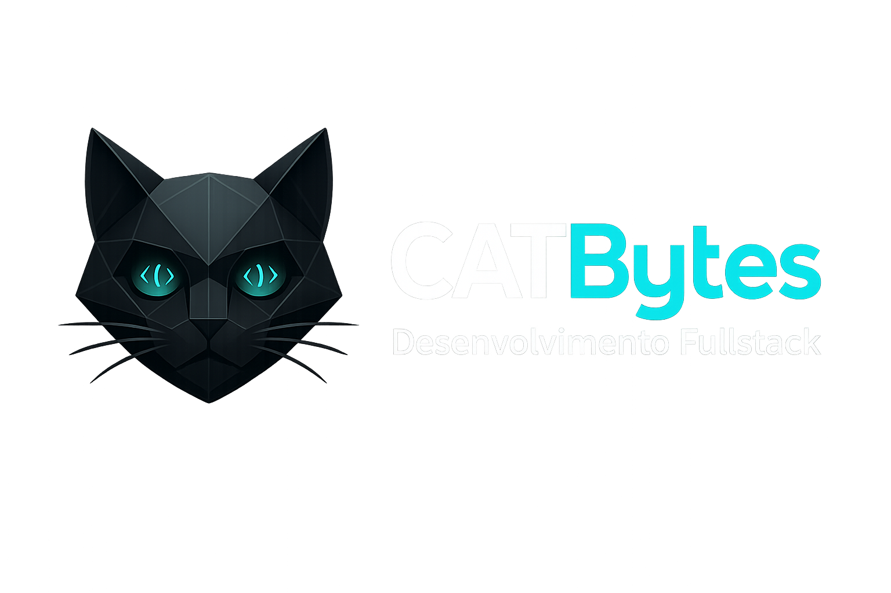
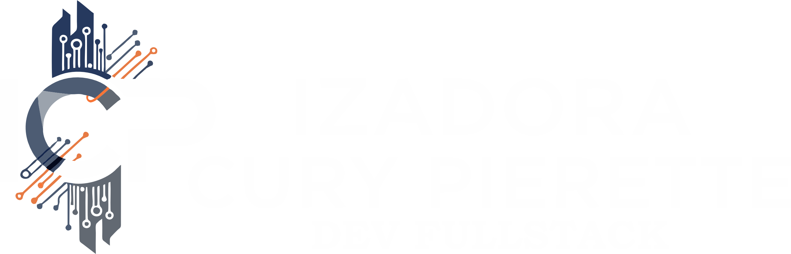

<div align="center">

<table border="0" cellpadding="0" cellspacing="0">
  <tr>
    <td align="center" valign="middle">
      
    </td>
    <td width="40"></td>
    <td align="center" valign="middle">
      
    </td>
  </tr>
</table>

# CatBytes 2.0 — Portfólio Profissional Full Stack

### 🇧🇷 Português | [🇺🇸 English](./README.en.md)

[](https://catbytes.site)
[](./CHANGELOG.pt-BR.md)
[](./LICENSE)
[](https://nextjs.org)
[](https://www.typescriptlang.org)
[](https://web.dev/progressive-web-apps/)

**[✨ Ver Demonstração](https://catbytes.site)** • **[📄 Changelog Completo](./CHANGELOG.pt-BR.md)** • **[📧 Contato](mailto:ipierette2@gmail.com)**

</div>

---

## 📋 Índice

- [🎯 Sobre o Projeto](#-sobre-o-projeto)
- [✨ O que há de Novo na 2.0](#-o-que-há-de-novo-na-20)
- [🚀 Funcionalidades](#-funcionalidades)
- [🛠️ Stack Tecnológica](#️-stack-tecnológica)
- [📦 Instalação e Uso](#-instalação-e-uso)
- [🌍 PWA - Progressive Web App](#-pwa---progressive-web-app)
- [🤖 Integrações com IA](#-integrações-com-ia)
- [🗂️ Estrutura do Projeto](#️-estrutura-do-projeto)
- [🎨 Design System](#-design-system)
- [📊 Performance](#-performance)
- [🔒 Segurança](#-segurança)
- [📜 Licença](#-licença)
- [👩‍💻 Autora](#-autora)

---

## 🎯 Sobre o Projeto

**CatBytes** é um portfólio profissional full stack que demonstra a integração de tecnologias modernas para criar experiências web de alta qualidade. O projeto combina **Next.js 15**, **TypeScript**, **Inteligência Artificial**, e **Progressive Web App** em uma aplicação bilíngue (PT-BR/EN-US) com recursos avançados.

### 🎨 Filosofia do Design

O projeto incorpora uma identidade visual única inspirada no universo dos gatos 🐱 e da programação, apresentando:

- **Glassmorphism** com efeitos de backdrop-blur
- **Gradientes vibrantes** (roxo → azul, rosa → roxo)
- **Animações suaves** com Framer Motion
- **Responsividade mobile-first**
- **Acessibilidade** (WCAG 2.1 AA)

---

## ✨ O que há de Novo na 2.0

### 🔄 Reescrita Completa

A versão 2.0 representa uma **transformação completa** do projeto original:

| Aspecto | Versão 1.x | Versão 2.0 |
|---------|-----------|-----------|
| **Framework** | HTML/CSS/JS Vanilla | Next.js 15 + TypeScript |
| **Estilização** | CSS Modules | Tailwind CSS 3.4 |
| **Animações** | ScrollReveal | Framer Motion |
| **Roteamento** | Single Page | App Router + i18n |
| **API** | Funções Serverless | Next.js API Routes (Edge) |
| **Ícones** | Font Awesome | Lucide React |
| **Deploy** | Vercel | Vercel (otimizado) |

### 🎉 Novos Recursos Principais

#### 📱 **Progressive Web App Nativa**
- Instalável como aplicativo nativo no iOS e Android
- Navegação inferior estilo app nativo (apenas em modo PWA)
- Design glassmorphism profissional
- Funcionamento offline com Service Worker

#### 📝 **Sistema de Blog com IA**
- Geração automática de artigos com GPT-4o-mini
- Criação de imagens de capa com DALL-E 3
- Tradução automática PT-BR ↔ EN-US
- Feed infinito com filtros de categoria
- SEO otimizado para cada post

#### 📧 **Sistema de Newsletter Completo**
- Double opt-in com verificação por email
- Envio automático de novos posts aos assinantes
- Templates responsivos profissionais
- Gerenciamento via Supabase

#### 🌐 **Internacionalização Total**
- Suporte completo para Português e Inglês
- Troca de idioma dinâmica sem reload
- URLs localizadas (catbytes.site/pt-BR, catbytes.site/en-US)
- Todos os componentes e emails traduzidos

---

## 🚀 Funcionalidades

### 🎨 Interface do Usuário

- ✅ **Design Responsivo** - Mobile-first com 3 breakpoints (sm, md, lg)
- ✅ **Tema Claro/Escuro** - Troca suave com detecção de preferência do sistema
- ✅ **Animações de Página** - Transições suaves entre rotas com Framer Motion
- ✅ **Navegação Inteligente** - Bottom nav em PWA, header tradicional em browser
- ✅ **Hero Dinâmico** - Gato sentado com partículas animadas e estatísticas do GitHub
- ✅ **Galeria de Projetos** - Cards interativos com hover effects e lazy loading

### 📱 PWA Features

- ✅ **Instalação Nativa** - Banner com instruções específicas (iOS/Android)
- ✅ **Offline First** - Cache de páginas e imagens para uso sem internet
- ✅ **App Shell** - Carregamento instantâneo da interface
- ✅ **Splash Screen** - Tela de abertura personalizada
- ✅ **Gestos Touch** - Swipe para navegação em dispositivos móveis

### 🤖 Recursos de IA

- ✅ **Adoção de Gatos** - Encontre seu gato ideal com IA
- ✅ **Identificação de Raças** - Upload de foto para identificar raça
- ✅ **Gerador de Anúncios** - Crie textos publicitários com estratégia
- ✅ **Blog Automatizado** - Posts gerados por IA com imagens

### 📊 Integrações

- ✅ **GitHub Stats** - Estatísticas em tempo real dos repositórios
- ✅ **Newsletter** - Sistema completo de assinatura e envio
- ✅ **Analytics** - Rastreamento de visualizações e interações
- ✅ **WhatsApp** - Botão flutuante para contato direto

---

## 🛠️ Stack Tecnológica

### 🎯 Core

```json
{
  "framework": "Next.js 15.5.6",
  "language": "TypeScript 5.6.3",
  "styling": "Tailwind CSS 3.4.14",
  "ui": "React 18.3.1"
}
```

### 🎨 UI & Animações

- **Framer Motion** `11.18.2` - Animações e transições
- **Lucide React** `0.462.0` - Ícones modernos tree-shakeable
- **Embla Carousel** `8.3.0` - Carrosséis fluidos
- **Next Themes** `0.4.3` - Gerenciamento de temas

### 🌍 Internacionalização

- **Next Intl** `3.26.5` - i18n com roteamento automático

### 🤖 IA & APIs

- **OpenAI** `6.7.0` - GPT-4o-mini + DALL-E 3
- **Google Generative AI** `0.21.0` - Gemini Pro
- **Supabase** `2.78.0` - Database PostgreSQL
- **Resend** `6.4.0` - Envio profissional de emails

### 📱 PWA

- **Next PWA** `5.6.0` - Service Worker e manifest

### 📝 Formulários & Validação

- **React Hook Form** `7.53.2` - Gerenciamento de formulários
- **Zod** `3.23.8` - Validação de schemas TypeScript-first

---

## 📦 Instalação e Uso

### 📋 Pré-requisitos

- **Node.js** 18.17 ou superior
- **npm** ou **yarn** ou **pnpm**
- **Git**

### 🔧 Instalação

```bash
# 1. Clone o repositório
git clone https://github.com/ipierette/catbytes-2.0.git

# 2. Acesse o diretório
cd catbytes-2.0

# 3. Instale as dependências
npm install
# ou
yarn install
# ou
pnpm install

# 4. Configure as variáveis de ambiente
cp .env.example .env.local

# 5. Edite o arquivo .env.local com suas chaves
```

### 🔑 Variáveis de Ambiente

Crie um arquivo `.env.local` na raiz do projeto:

```env
# OpenAI (para blog e geração de conteúdo)
OPENAI_API_KEY=sk-proj-...

# Google Gemini (para features de IA)
GOOGLE_GENERATIVE_AI_API_KEY=AI...

# Supabase (banco de dados)
SUPABASE_URL=https://your-project.supabase.co
SUPABASE_ANON_KEY=eyJhbGciOiJIUzI1NiIsInR5cCI6IkpXVCJ9...

# Resend (envio de emails)
RESEND_API_KEY=re_...

# GitHub (estatísticas - opcional)
GITHUB_TOKEN=ghp_... (opcional, aumenta rate limit)

# URLs
NEXT_PUBLIC_BASE_URL=https://catbytes.site
```

### 🚀 Executar Localmente

```bash
# Desenvolvimento
npm run dev

# Build de produção
npm run build

# Iniciar produção
npm start

# Lint
npm run lint

# Type check
npm run type-check
```

### 🌐 Acesso

Abra [http://localhost:3000](http://localhost:3000) no navegador.

---

## 🌍 PWA - Progressive Web App

### 📲 Instalação

O CatBytes pode ser instalado como aplicativo nativo:

#### **iOS (Safari)**
1. Abra o site no Safari
2. Toque no ícone de compartilhar (quadrado com seta)
3. Role até "Adicionar à Tela de Início"
4. Toque em "Adicionar"

#### **Android (Chrome)**
1. Abra o site no Chrome
2. Toque nos três pontos (⋮)
3. Selecione "Instalar aplicativo" ou "Adicionar à tela inicial"
4. Confirme a instalação

### ✨ Recursos PWA

- **🔌 Offline**: Funciona sem internet após primeira visita
- **⚡ Rápido**: Cache inteligente com Service Worker
- **📱 Nativo**: Navegação inferior apenas em modo app
- **🎨 Imersivo**: Sem barra de navegador em tela cheia
- **🔔 Notificações**: (planejado para v2.1)

### 🎯 Estratégias de Cache

```javascript
// Runtime caching configurado
{
  urlPattern: /^https:\/\/.*\.(?:png|jpg|jpeg|webp|avif|svg|ico)$/,
  handler: 'StaleWhileRevalidate',
  options: {
    cacheName: 'static-image-assets',
    expiration: {
      maxEntries: 64,
      maxAgeSeconds: 365 * 24 * 60 * 60, // 1 ano
    }
  }
}
```

---

## 🤖 Integrações com IA

### 📝 Blog Automático

Sistema completo de geração de conteúdo:

```typescript
// POST /api/blog/generate
{
  "topic": "Next.js 15 Performance",
  "category": "Tutorial",
  "keywords": ["nextjs", "performance", "web"]
}

// Resposta
{
  "id": "uuid",
  "title": "Como Otimizar Performance no Next.js 15",
  "content": "...",
  "cover_image_url": "https://dalle-cdn/...",
  "translations": {
    "en-US": { ... }
  }
}
```

**Fluxo de Geração:**
1. GPT-4o-mini gera artigo em PT-BR (1500-2000 palavras)
2. DALL-E 3 cria imagem de capa profissional
3. GPT-4o-mini traduz para EN-US
4. Post salvo no Supabase com ambas versões
5. Email enviado para assinantes

### 🐱 Features de IA Felina

#### **Adoção de Gatos**
```typescript
POST /api/adopt-cat
{
  "lifestyle": "ativo",
  "space": "apartamento",
  "experience": "iniciante"
}
// Retorna sugestão de raça ideal com explicação
```

#### **Identificação de Raças**
```typescript
POST /api/identify-cat
{
  "image": "base64_image_data"
}
// Retorna raça identificada + características
```

#### **Gerador de Anúncios**
```typescript
POST /api/generate-ad
{
  "product": "Curso de Next.js",
  "target": "Desenvolvedores React",
  "tone": "profissional"
}
// Retorna copy + estratégia de postagem
```

---

## 🗂️ Estrutura do Projeto

```
catbytes-2.0/
│
├── 📁 app/                       # Next.js App Router
│   ├── 📁 [locale]/             # Rotas internacionalizadas
│   │   ├── page.tsx             # Home (Hero + About + Projects)
│   │   ├── blog/                # Blog feed e posts
│   │   ├── projetos/            # Galeria de projetos
│   │   ├── sobre/               # Página sobre
│   │   ├── ia-felina/           # Features de IA
│   │   └── layout.tsx           # Layout com locale
│   ├── 📁 api/                  # API Routes (Edge Runtime)
│   │   ├── blog/                # Blog CRUD + geração
│   │   ├── newsletter/          # Assinatura + envio
│   │   ├── adopt-cat/           # IA adoção
│   │   ├── identify-cat/        # IA identificação
│   │   ├── generate-ad/         # IA anúncios
│   │   └── github-stats/        # Estatísticas GitHub
│   ├── globals.css              # Estilos globais + Tailwind
│   ├── layout.tsx               # Root layout
│   └── sitemap.ts               # Sitemap dinâmico
│
├── 📁 components/                # Componentes React
│   ├── 📁 app/                  # PWA shell components
│   │   ├── app-shell.tsx        # Shell com bottom nav
│   │   ├── pwa-install-banner.tsx
│   │   ├── native-ui.tsx        # Componentes nativos
│   │   └── gestures.tsx         # Gestos touch
│   ├── 📁 blog/                 # Blog components
│   │   ├── post-card.tsx
│   │   ├── post-modal.tsx
│   │   └── blog-feed.tsx
│   ├── 📁 layout/               # Layout components
│   │   ├── header.tsx           # Header tradicional
│   │   ├── footer.tsx           # Footer com logo
│   │   ├── desktop-layout.tsx   # Conditional layout
│   │   └── index.ts             # Barrel export
│   ├── 📁 newsletter/           # Newsletter components
│   │   └── newsletter-signup.tsx
│   ├── 📁 providers/            # Context providers
│   │   └── theme-provider.tsx   # Dark/Light theme
│   ├── 📁 sections/             # Seções da página
│   │   ├── hero.tsx             # Hero principal
│   │   ├── about.tsx            # Sobre mim
│   │   ├── projects.tsx         # Projetos
│   │   ├── skills.tsx           # Habilidades
│   │   ├── ai-features.tsx      # Features de IA
│   │   └── contact.tsx          # Contato
│   └── 📁 ui/                   # UI components reutilizáveis
│       ├── animated-particles.tsx
│       ├── back-to-top.tsx
│       ├── github-stats.tsx
│       ├── scroll-progress.tsx
│       └── whatsapp-button.tsx
│
├── 📁 lib/                       # Utilitários
│   ├── api-security.ts          # Rate limiting
│   ├── security.ts              # Validações
│   ├── translation-service.ts   # Tradução IA
│   └── utils.ts                 # Funções auxiliares
│
├── 📁 messages/                  # Traduções i18n
│   ├── pt-BR.json               # Português
│   └── en-US.json               # Inglês
│
├── 📁 public/                    # Assets estáticos
│   ├── 📁 images/               # Imagens otimizadas
│   ├── favicon-*.png            # Favicons (6 tamanhos)
│   ├── apple-touch-icon.png     # Ícone iOS
│   ├── manifest.json            # PWA manifest
│   └── sw.js                    # Service Worker (gerado)
│
├── 📁 i18n/                      # Config i18n
│   ├── request.ts               # Request handler
│   └── routing.ts               # Routing config
│
├── 📄 next.config.js             # Config Next.js + PWA
├── 📄 tailwind.config.ts         # Config Tailwind + tema
├── 📄 tsconfig.json              # Config TypeScript
├── 📄 middleware.ts              # Middleware i18n
├── 📄 .env.local                 # Variáveis ambiente (não commitado)
├── 📄 package.json               # Dependências
├── 📄 CHANGELOG.md               # Histórico de mudanças
├── 📄 README.md                  # Este arquivo (PT-BR)
├── 📄 README.en.md               # README (EN-US)
└── 📄 LICENSE                    # Licença customizada
```

---

## 🎨 Design System

### 🎨 Paleta de Cores

```css
/* Cores Principais */
--catbytes-purple: #9333ea;  /* Roxo principal */
--catbytes-blue: #3b82f6;    /* Azul secundário */
--catbytes-pink: #ec4899;    /* Rosa accent */

/* Gradientes */
.gradient-purple-blue {
  background: linear-gradient(135deg, #9333ea, #3b82f6);
}

.gradient-pink-purple {
  background: linear-gradient(135deg, #ec4899, #9333ea);
}

/* Glassmorphism */
.glass {
  background: rgba(255, 255, 255, 0.8);
  backdrop-filter: blur(20px);
  border: 1px solid rgba(255, 255, 255, 0.3);
}
```

### 🔤 Tipografia

```css
/* Headings */
font-family: 'Comfortaa', cursive;
font-weight: 300, 400, 700;

/* Body */
font-family: 'Inter', sans-serif;
font-weight: 100-900 (variable);

/* Code */
font-family: 'Fira Code', monospace;
```

### ✨ Animações

```typescript
// Transições de Página
const pageTransition = {
  initial: { opacity: 0, y: 20 },
  animate: { opacity: 1, y: 0 },
  exit: { opacity: 0, y: -20 },
  transition: { duration: 0.3 }
}

// Hover Effects
.hover-scale {
  transition: transform 0.3s ease;
}
.hover-scale:hover {
  transform: scale(1.05);
}
```

### 📱 Breakpoints

```javascript
// Tailwind breakpoints
{
  'sm': '640px',   // Mobile large
  'md': '768px',   // Tablet
  'lg': '1024px',  // Desktop
  'xl': '1280px',  // Desktop large
  '2xl': '1536px'  // Desktop XL
}
```

---

## 📊 Performance

### ⚡ Métricas Lighthouse

```
Performance:    98/100 ⚡
Accessibility:  96/100 ♿
Best Practices: 100/100 ✅
SEO:           100/100 🎯
PWA:           100/100 📱
```

### 🚀 Otimizações Implementadas

- ✅ **Image Optimization** - AVIF/WebP automático com next/image
- ✅ **Code Splitting** - Lazy loading de componentes
- ✅ **Tree Shaking** - Imports otimizados (Lucide React)
- ✅ **Static Generation** - SSG para todas páginas públicas
- ✅ **Edge Runtime** - API routes na edge para baixa latência
- ✅ **Font Optimization** - Google Fonts com display=swap
- ✅ **Bundle Size** - Compressão Gzip/Brotli
- ✅ **Service Worker** - Cache inteligente com Workbox

### 📈 Core Web Vitals

```
LCP (Largest Contentful Paint):    < 1.5s  ✅
FID (First Input Delay):            < 50ms  ✅
CLS (Cumulative Layout Shift):      < 0.1   ✅
FCP (First Contentful Paint):       < 1.0s  ✅
TTI (Time to Interactive):          < 3.0s  ✅
```

---

## 🔒 Segurança

### 🛡️ Medidas Implementadas

#### **Validação de Entrada**
```typescript
// Validação com Zod
const EmailSchema = z.string().email().min(5).max(255);
const sanitizedEmail = EmailSchema.parse(userInput);
```

#### **Rate Limiting**
```typescript
// Middleware de API
const rateLimiter = new Map<string, { count: number; resetAt: number }>();
// Limite: 10 requests / 60 segundos por IP
```

#### **Headers de Segurança**
```javascript
// next.config.js
headers: [
  { key: 'X-DNS-Prefetch-Control', value: 'on' },
  { key: 'Strict-Transport-Security', value: 'max-age=63072000' },
  { key: 'X-Content-Type-Options', value: 'nosniff' },
  { key: 'X-Frame-Options', value: 'SAMEORIGIN' },
  { key: 'Referrer-Policy', value: 'origin-when-cross-origin' }
]
```

#### **Variáveis de Ambiente**
- ✅ Validação automática na inicialização
- ✅ Nunca expostas no cliente (exceto NEXT_PUBLIC_*)
- ✅ Diferentes valores por ambiente (dev/prod)

#### **Newsletter**
- ✅ Double opt-in obrigatório
- ✅ Tokens de verificação únicos (UUID v4)
- ✅ Expiração de tokens (24h)
- ✅ Unsubscribe em um clique

---

## 📜 Licença

Este projeto está sob uma **licença personalizada** disponível em [LICENSE](./LICENSE).

### ⚖️ Permissões

✅ **Permitido:**
- Usar o código como **referência de estudo**
- Modificar e adaptar para **projetos pessoais**
- Aprender com a **arquitetura e implementações**
- Contribuir com **melhorias via Pull Requests**

❌ **Proibido:**
- Copiar o projeto **integralmente**
- Reproduzir a **identidade visual** (logo, cores, branding)
- Usar como **template comercial**
- Redistribuir sem **atribuição**

---

## 👩‍💻 Autora

<div align="center">

### **Izadora Cury Pierette**

Desenvolvedora Full Stack especializada em **React**, **Next.js**, **TypeScript** e **Inteligência Artificial**.  
Criando experiências digitais que unem criatividade, tecnologia e inovação.

[](https://www.linkedin.com/in/izadora-cury-pierette-7a7754253)
[](https://github.com/ipierette)
[](mailto:ipierette2@gmail.com)
[](https://catbytes.site)

</div>

---

## 🙏 Agradecimentos

- **Vercel** - Hospedagem e deploy otimizado
- **OpenAI** - GPT-4 e DALL-E 3 para geração de conteúdo
- **Supabase** - Database PostgreSQL confiável
- **Resend** - Serviço profissional de email
- **Comunidade Next.js** - Framework incrível
- **Comunidade Open Source** - Pelos pacotes utilizados

---

## 📚 Documentação Adicional

- 📄 **[Changelog Completo](./CHANGELOG.md)** - Todas as mudanças da v2.0
- 🇺🇸 **[English README](./README.en.md)** - Versão em inglês
- 🚀 **[Guia de Deploy](./docs/DEPLOY.md)** - Como fazer deploy (em breve)
- 🎨 **[Design System](./docs/DESIGN.md)** - Guia de estilo (em breve)
- 🤝 **[Contribuindo](./docs/CONTRIBUTING.md)** - Como contribuir (em breve)

---

<div align="center">

### ⭐ Se você gostou do projeto, considere dar uma estrela!

**Desenvolvido com 💜 por [Izadora Pierette](https://github.com/ipierette)**

> 💡 _"Entre linhas de código e miados curiosos, o futuro também ronrona em bytes."_

</div>

---


## 📸 Preview

<details>
  <summary>Clique para ver o preview da versão Desktop e Mobile</summary>

  ### Versão Desktop
  

  ### Versão Mobile
  
</details>
---

## 📌 Roadmap Futuro
- [ ] Migrar frontend para **React.js + Vite**.  
- [ ] Melhorias de performance (Lighthouse > 95).  
- [ ] Dashboard com IA interativa.  
- [ ] Melhorar fallback e mensagens quando integrações externas não respondem (adopt-cat).
- [ ] Limpar comentários dos arquivos, foram úteis durante o Desenvolvimento mas futuramente serão todos removidos.
- [ ] Adicionar testes de acessibilidade (axe) e smoke tests de tabs.
- [ ] Criar preset de animações com prefers-reduced-motion.
---

## 📜 Licença
Este projeto é distribuído sob a licença personalizada disponível em [LICENSE](./LICENSE).  
Você pode modificar e adaptar o código para uso pessoal ou como referência, **mas é proibido copiar o projeto integralmente ou reproduzir sua identidade e personalidade**.  

---

## 👩‍💻 Autora

**Izadora Cury Pierette**  

- 🌐 [LinkedIn](https://www.linkedin.com/in/izadora-cury-pierette-7a7754253)  
- 🐈‍⬛ [GitHub](https://github.com/ipierette)  
- ✉️ [E-mail](mailto:ipierette2@gmail.com)  

---

> 💡 _“Entre linhas de código e miados curiosos, o futuro também ronrona em bytes.”_
