# 🎬 CatBytes Media Studio - Especificação Completa

**Versão:** 1.0  
**Data:** 15 de Novembro de 2025  
**Status:** Planejamento → Implementação

---

## 📋 Índice

1. [Visão Geral](#visão-geral)
2. [Arquitetura do Sistema](#arquitetura-do-sistema)
3. [Media Studio Core](#media-studio-core)
4. [Sistema de Vídeos](#sistema-de-vídeos)
5. [Sistema de Podcasts](#sistema-de-podcasts)
6. [Integração com Blog](#integração-com-blog)
7. [Analytics e Engagement](#analytics-e-engagement)
8. [Database Schema](#database-schema)
9. [Fluxo de Trabalho](#fluxo-de-trabalho)
10. [Roadmap de Implementação](#roadmap-de-implementação)

---

## 🎯 Visão Geral

### Objetivo Principal

O **CatBytes Media Studio** é uma plataforma integrada de produção e distribuição de conteúdo multimídia que centraliza a criação de:

- **Vídeos** para redes sociais (YouTube, TikTok, Instagram Reels, LinkedIn)
- **Podcasts** gerados com narração AI (Eleven Labs)
- **Posts de blog** enriquecidos com mídia embarcada
- **Newsletter** com distribuição segmentada por tipo de conteúdo

### Diferencial Estratégico

**Studio-First Approach**: Toda produção de conteúdo de video começa no Studio, que funciona como o **único ponto de criação** para alimentar todos os canais de distribuição.

```
┌─────────────────────────────────┐
│   CATBYTES MEDIA STUDIO         │
│   (Centro de Produção)          │
└────────────┬────────────────────┘
             │
        ┌────┴────┐
        │ OUTPUTS │
        └────┬────┘
             │
    ┌────────┼────────┐
    │        │        │
    ▼        ▼        ▼
 Videos  Podcasts  Blog
    │        │        │
    ├────────┼────────┤
    │        │        │
    ▼        ▼        ▼
 Social   RSS    Newsletter
```

---

## 🏗️ Arquitetura do Sistema

### Stack Tecnológico

```typescript
{
  "frontend": {
    "framework": "Next.js 15.5.6 (App Router)",
    "ui": "Tailwind CSS + Framer Motion",
    "forms": "React Hook Form + Zod",
    "state": "React Context + Local State"
  },
  "backend": {
    "runtime": "Next.js API Routes (Edge + Node)",
    "database": "Supabase PostgreSQL",
    "storage": "Supabase Storage",
    "auth": "Supabase Auth"
  },
  "ai": {
    "content": "OpenAI GPT-4 (roteiros)",
    "narration": "Eleven Labs (voice synthesis)",
    "translation": "Gemini API Funciona mais é gratuita pode falahar melhor usar a open ai (i18n)"
  },
  "media": {
    "video": "FFmpeg (server-side rendering)",
    "audio": "Eleven Labs API",
    "images": "Cloudinary / Supabase Storage"
  },
  "distribution": {
    "social": "YouTube API, TikTok API, Instagram Graph API, LinkedIn API",
    "podcast": "RSS 2.0 Feed",
    "email": "Resend (newsletter)"
  }
}
```

### Capacidade Supabase (Free Tier)

| Recurso | Limite | Uso Estimado | Status | Observação |
|---------|--------|--------------|--------|------------|
| Database | 500MB | ~50MB | ✅ OK | Apenas metadata |
| Storage | 1GB | ~200MB | ✅ OK | Armazenamento temporário |
| API Requests | 50k/dia | ~5k/dia | ✅ OK | |
| Bandwidth | 2GB/mês | ~500MB/mês | ✅ OK | Upload/download de vídeos |

**Estratégia de Storage:**
- **Screenshots:** armazenadas apenas durante criação do vídeo (deletadas após render)
- **Vídeos:** armazenados apenas durante publicação (deletados após upload nas redes)
- Tempo médio no storage:
  - Screenshots: 5-30 minutos (até render)
  - Vídeos renderizados: 10-30 minutos (até publicação)
- Exemplo de uso temporário:
  - 20 screenshots @ 2MB cada = 40MB
  - Vídeo renderizado @ 100MB × 3 formatos = 300MB
  - **Total temporário:** 340MB
  - **Após publicação:** 0MB (tudo deletado)
- Storage permanente: ~200MB (thumbnails, assets permanentes, podcasts)
- **Capacidade Real:** ~10-20 projetos simultâneos em criação

---

## 🎬 Media Studio Core

### 1. Interface do Studio

**Localização:** `/app/[locale]/admin/studio`

```typescript
// Estrutura de Navegação
interface StudioNavigation {
  tabs: [
    'create',      // Criação de conteúdo
    'editor',      // Editor de vídeo profissional (NOVO)
    'projects',    // Projetos em andamento
    'library',     // Biblioteca de assets
    'publish',     // Publicação e distribuição
    'analytics'    // Métricas de performance
  ]
}
```

### 1.1 Editor de Vídeo Profissional

**Componente:** `components/studio/video-editor/index.tsx`

O CatBytes Media Studio inclui um **editor de vídeo profissional integrado** com interface moderna e intuitiva, inspirado em ferramentas como CapCut, DaVinci Resolve e Adobe Premiere.

#### Arquitetura do Editor

```
┌─────────────────────────────────────────────────────────────┐
│                    CATBYTES VIDEO EDITOR                    │
├─────────────────────────────────────────────────────────────┤
│  Toolbar: Tools | Effects | Transitions | Text | Audio     │
├──────────────────────┬──────────────────────────────────────┤
│                      │                                      │
│   Asset Library      │       Preview Canvas                 │
│   - Videos           │       - Playback Controls            │
│   - Images           │       - Real-time Preview            │
│   - Audio            │       - Zoom/Pan                     │
│   - Screenshots      │       - Grid/Guides                  │
│   - Text Presets     │                                      │
│   - Effects          │                                      │
│                      │                                      │
├──────────────────────┴──────────────────────────────────────┤
│                    Timeline (Multi-track)                   │
│  ┌────────────────────────────────────────────────────────┐ │
│  │ Video Track 1  ▓▓▓▓▓▓░░░░░▓▓▓▓▓░░░░░░░░▓▓▓▓▓▓▓        │ │
│  │ Video Track 2  ░░░░░░▓▓▓░░░░░░░▓▓▓▓░░░░░░░░░░         │ │
│  │ Text/Graphics  ░░░░░░░░░▓▓░░░░░░░░░░▓▓▓░░░░░░         │ │
│  │ Audio Track 1  ═══════════════════════════════         │ │
│  │ Audio Track 2  ░░░░░░░░░░═════════░░░░░░░░░░          │ │
│  └────────────────────────────────────────────────────────┘ │
│           00:00:00                           00:01:30      │
└─────────────────────────────────────────────────────────────┘
```

#### Features do Editor

```typescript
interface VideoEditorFeatures {
  timeline: {
    multiTrack: true,              // Múltiplas camadas de vídeo/áudio
    dragAndDrop: true,              // Arrastar assets para timeline
    magneticSnap: true,             // Snap magnético entre clips
    rippleEdit: true,               // Edição ripple (automove clips)
    trimming: true,                 // Cortar início/fim de clips
    splitting: true,                // Dividir clips
    zoom: 'dynamic',                // Zoom in/out na timeline
    playhead: 'scrubable',          // Scrub na timeline
    keyframes: true,                // Animação por keyframes
  },
  
  preview: {
    realTime: true,                 // Preview em tempo real
    quality: ['360p', '720p', '1080p'],
    playbackSpeed: [0.25, 0.5, 1, 1.5, 2],
    fullscreen: true,
    grid: true,                     // Grid de alinhamento
    safeZones: true,                // Safe zones (9:16, 16:9, 1:1)
    colorGrading: true,             // Preview com color grading
  },
  
  editing: {
    cut: true,                      // Cortar (Cmd+K)
    copy: true,                     // Copiar (Cmd+C)
    paste: true,                    // Colar (Cmd+V)
    delete: true,                   // Deletar (Del)
    undo: true,                     // Desfazer (Cmd+Z)
    redo: true,                     // Refazer (Cmd+Shift+Z)
    duplicateClip: true,            // Duplicar clip (Cmd+D)
    groupClips: true,               // Agrupar clips
  },
  
  effects: {
    transitions: [
      'fade', 'dissolve', 'wipe', 'slide',
      'zoom', 'blur', 'glitch', 'modern-swipe'
    ],
    filters: [
      'brightness', 'contrast', 'saturation', 'hue',
      'temperature', 'vignette', 'blur', 'sharpen',
      'vintage', 'cinematic', 'black-white'
    ],
    animations: [
      'slide-in', 'fade-in', 'zoom-in', 'bounce',
      'rotate', 'scale', 'custom-keyframe'
    ],
    overlays: [
      'gradient', 'light-leaks', 'dust', 'film-grain',
      'bokeh', 'particles'
    ]
  },
  
  text: {
    templates: true,                // Templates de texto (títulos, lower thirds)
    fonts: 'google-fonts',          // Integração Google Fonts
    animations: true,               // Animações de entrada/saída
    styles: ['bold', 'italic', 'outline', 'shadow', 'gradient'],
    positioning: 'free-transform',  // Posicionamento livre
    keyframeAnimation: true,        // Animação customizada
  },
  
  audio: {
    waveform: true,                 // Visualização de waveform
    volumeControl: true,            // Controle de volume por clip
    fade: true,                     // Fade in/out
    ducking: true,                  // Auto-ducking (baixar música quando narração)
    normalize: true,                // Normalizar áudio
    voiceover: true,                // Gravação de voiceover
    audioLibrary: true,             // Biblioteca de música/SFX
  },
  
  export: {
    presets: {
      youtube: '1080p 16:9 60fps',
      tiktok: '1080p 9:16 30fps',
      instagram: '1080p 9:16 30fps',
      linkedin: '720p 1:1 30fps',
      custom: 'user-defined'
    },
    formats: ['mp4', 'mov', 'webm'],
    quality: ['draft', 'good', 'best'],
    backgroundRender: true,         // Renderização em background
  }
}
```

#### Componente Principal

**Arquivo:** `components/studio/video-editor/video-editor.tsx`

```tsx
'use client'

import { useState, useRef, useCallback } from 'react'
import { motion, AnimatePresence } from 'framer-motion'
import { 
  Play, Pause, SkipBack, SkipForward, Volume2, 
  Scissors, Copy, Trash2, Undo, Redo, Download,
  Grid, Maximize, ZoomIn, ZoomOut, Layers
} from 'lucide-react'

interface VideoEditorProps {
  projectId: string
  initialProject?: VideoProject
}

export function VideoEditor({ projectId, initialProject }: VideoEditorProps) {
  const [project, setProject] = useState(initialProject)
  const [currentTime, setCurrentTime] = useState(0)
  const [isPlaying, setIsPlaying] = useState(false)
  const [selectedClip, setSelectedClip] = useState<string | null>(null)
  const [timelineZoom, setTimelineZoom] = useState(1)
  const [previewQuality, setPreviewQuality] = useState<'360p' | '720p' | '1080p'>('720p')
  
  const canvasRef = useRef<HTMLCanvasElement>(null)
  const timelineRef = useRef<HTMLDivElement>(null)
  
  // History para undo/redo
  const [history, setHistory] = useState<VideoProject[]>([project])
  const [historyIndex, setHistoryIndex] = useState(0)

  const handleUndo = useCallback(() => {
    if (historyIndex > 0) {
      setHistoryIndex(historyIndex - 1)
      setProject(history[historyIndex - 1])
    }
  }, [historyIndex, history])

  const handleRedo = useCallback(() => {
    if (historyIndex < history.length - 1) {
      setHistoryIndex(historyIndex + 1)
      setProject(history[historyIndex + 1])
    }
  }, [historyIndex, history])

  const addToHistory = useCallback((newProject: VideoProject) => {
    const newHistory = history.slice(0, historyIndex + 1)
    newHistory.push(newProject)
    setHistory(newHistory)
    setHistoryIndex(newHistory.length - 1)
    setProject(newProject)
  }, [history, historyIndex])

  return (
    <div className="h-screen flex flex-col bg-gray-900 text-white">
      {/* Top Toolbar */}
      <EditorToolbar
        onUndo={handleUndo}
        onRedo={handleRedo}
        canUndo={historyIndex > 0}
        canRedo={historyIndex < history.length - 1}
        project={project}
      />

      {/* Main Content */}
      <div className="flex-1 flex overflow-hidden">
        {/* Left Sidebar - Asset Library */}
        <AssetLibrary
          projectId={projectId}
          onAssetDrop={(asset) => {
            // Add asset to timeline
          }}
        />

        {/* Center - Preview Canvas */}
        <PreviewCanvas
          ref={canvasRef}
          project={project}
          currentTime={currentTime}
          isPlaying={isPlaying}
          quality={previewQuality}
          onTimeUpdate={setCurrentTime}
        />

        {/* Right Sidebar - Properties Panel */}
        <PropertiesPanel
          selectedClip={selectedClip}
          onUpdate={(updates) => {
            // Update clip properties
          }}
        />
      </div>

      {/* Bottom - Timeline */}
      <Timeline
        ref={timelineRef}
        project={project}
        currentTime={currentTime}
        zoom={timelineZoom}
        selectedClip={selectedClip}
        onClipSelect={setSelectedClip}
        onClipUpdate={(clipId, updates) => {
          // Update clip in project
        }}
        onTimelineChange={(newTimeline) => {
          addToHistory({ ...project, timeline: newTimeline })
        }}
      />

      {/* Playback Controls */}
      <PlaybackControls
        isPlaying={isPlaying}
        currentTime={currentTime}
        duration={project.duration}
        onPlay={() => setIsPlaying(true)}
        onPause={() => setIsPlaying(false)}
        onSeek={setCurrentTime}
      />
    </div>
  )
}
```

#### Timeline Component

**Arquivo:** `components/studio/video-editor/timeline.tsx`

```tsx
'use client'

import { useRef, useCallback, useEffect } from 'react'
import { motion, useDragControls } from 'framer-motion'

interface TimelineProps {
  project: VideoProject
  currentTime: number
  zoom: number
  selectedClip: string | null
  onClipSelect: (clipId: string | null) => void
  onClipUpdate: (clipId: string, updates: Partial<TimelineClip>) => void
  onTimelineChange: (timeline: Timeline) => void
}

export function Timeline({
  project,
  currentTime,
  zoom,
  selectedClip,
  onClipSelect,
  onClipUpdate,
  onTimelineChange
}: TimelineProps) {
  const timelineRef = useRef<HTMLDivElement>(null)
  const pixelsPerSecond = 50 * zoom // Base: 50px por segundo

  const timeToPixels = (time: number) => time * pixelsPerSecond
  const pixelsToTime = (pixels: number) => pixels / pixelsPerSecond

  return (
    <div className="h-64 bg-gray-800 border-t border-gray-700 flex flex-col">
      {/* Timeline Header */}
      <div className="h-10 bg-gray-850 border-b border-gray-700 flex items-center px-4 gap-2">
        <span className="text-xs font-medium">Timeline</span>
        <div className="flex-1" />
        <ZoomControls zoom={zoom} onZoomChange={setZoom} />
      </div>

      {/* Tracks Container */}
      <div className="flex-1 overflow-auto relative" ref={timelineRef}>
        {/* Time Ruler */}
        <TimeRuler 
          duration={project.duration}
          pixelsPerSecond={pixelsPerSecond}
        />

        {/* Playhead */}
        <motion.div
          className="absolute top-0 bottom-0 w-0.5 bg-red-500 z-50 pointer-events-none"
          style={{ left: timeToPixels(currentTime) }}
          initial={false}
          animate={{ left: timeToPixels(currentTime) }}
        >
          <div className="w-3 h-3 bg-red-500 rounded-full -ml-1.5 -mt-1" />
        </motion.div>

        {/* Tracks */}
        <div className="space-y-1 p-4">
          {project.timeline.tracks.map((track, index) => (
            <Track
              key={track.id}
              track={track}
              trackIndex={index}
              pixelsPerSecond={pixelsPerSecond}
              selectedClip={selectedClip}
              onClipSelect={onClipSelect}
              onClipUpdate={onClipUpdate}
            />
          ))}
        </div>
      </div>
    </div>
  )
}

function Track({ 
  track, 
  pixelsPerSecond, 
  selectedClip,
  onClipSelect,
  onClipUpdate 
}: TrackProps) {
  return (
    <div className="h-16 bg-gray-750 rounded flex items-center relative">
      {/* Track Label */}
      <div className="w-32 px-3 text-xs font-medium border-r border-gray-700">
        {track.name}
      </div>

      {/* Clips Container */}
      <div className="flex-1 relative h-full">
        {track.clips.map((clip) => (
          <DraggableClip
            key={clip.id}
            clip={clip}
            pixelsPerSecond={pixelsPerSecond}
            isSelected={selectedClip === clip.id}
            onSelect={() => onClipSelect(clip.id)}
            onUpdate={(updates) => onClipUpdate(clip.id, updates)}
          />
        ))}
      </div>
    </div>
  )
}

function DraggableClip({ 
  clip, 
  pixelsPerSecond, 
  isSelected,
  onSelect,
  onUpdate 
}: ClipProps) {
  const dragControls = useDragControls()
  
  const clipWidth = (clip.endTime - clip.startTime) * pixelsPerSecond
  const clipPosition = clip.startTime * pixelsPerSecond

  return (
    <motion.div
      drag="x"
      dragControls={dragControls}
      dragMomentum={false}
      dragElastic={0}
      onDragEnd={(e, info) => {
        const newStartTime = (clipPosition + info.offset.x) / pixelsPerSecond
        onUpdate({ startTime: newStartTime, endTime: newStartTime + (clip.endTime - clip.startTime) })
      }}
      className={`absolute h-12 rounded cursor-move transition-all ${
        isSelected 
          ? 'bg-orange-500 ring-2 ring-orange-400 z-10' 
          : 'bg-blue-500 hover:bg-blue-400'
      }`}
      style={{ 
        left: clipPosition,
        width: clipWidth,
        top: '50%',
        transform: 'translateY(-50%)'
      }}
      onClick={onSelect}
    >
      {/* Clip Content */}
      <div className="px-2 py-1 text-xs truncate">
        {clip.name}
      </div>

      {/* Trim Handles */}
      {isSelected && (
        <>
          <div className="absolute left-0 top-0 bottom-0 w-1 bg-white cursor-ew-resize" />
          <div className="absolute right-0 top-0 bottom-0 w-1 bg-white cursor-ew-resize" />
        </>
      )}
    </motion.div>
  )
}
```

#### Preview Canvas

**Arquivo:** `components/studio/video-editor/preview-canvas.tsx`

```tsx
'use client'

import { useRef, useEffect, forwardRef } from 'react'
import { Grid, Maximize2, Eye, EyeOff } from 'lucide-react'

interface PreviewCanvasProps {
  project: VideoProject
  currentTime: number
  isPlaying: boolean
  quality: '360p' | '720p' | '1080p'
  onTimeUpdate: (time: number) => void
}

export const PreviewCanvas = forwardRef<HTMLCanvasElement, PreviewCanvasProps>(
  ({ project, currentTime, isPlaying, quality, onTimeUpdate }, ref) => {
    const canvasRef = useRef<HTMLCanvasElement>(null)
    const [showGrid, setShowGrid] = useState(true)
    const [showSafeZones, setShowSafeZones] = useState(true)
    const [aspectRatio, setAspectRatio] = useState<'16:9' | '9:16' | '1:1'>('16:9')

    useEffect(() => {
      if (!canvasRef.current) return

      const canvas = canvasRef.current
      const ctx = canvas.getContext('2d')
      if (!ctx) return

      // Renderizar frame atual
      renderFrame(ctx, project, currentTime)

      // Se estiver tocando, atualizar tempo
      if (isPlaying) {
        const interval = setInterval(() => {
          onTimeUpdate(currentTime + 1/30) // 30fps
        }, 1000/30)
        return () => clearInterval(interval)
      }
    }, [project, currentTime, isPlaying])

    const renderFrame = (ctx: CanvasRenderingContext2D, project: VideoProject, time: number) => {
      // Clear canvas
      ctx.clearRect(0, 0, ctx.canvas.width, ctx.canvas.height)

      // Get all active clips at current time
      const activeClips = project.timeline.tracks
        .flatMap(track => track.clips)
        .filter(clip => time >= clip.startTime && time <= clip.endTime)
        .sort((a, b) => a.zIndex - b.zIndex)

      // Render each clip
      for (const clip of activeClips) {
        renderClip(ctx, clip, time)
      }

      // Draw grid if enabled
      if (showGrid) {
        drawGrid(ctx)
      }

      // Draw safe zones if enabled
      if (showSafeZones) {
        drawSafeZones(ctx, aspectRatio)
      }
    }

    return (
      <div className="flex-1 bg-black relative flex flex-col">
        {/* Preview Controls */}
        <div className="h-12 bg-gray-800 border-b border-gray-700 flex items-center px-4 gap-2">
          <select
            value={quality}
            onChange={(e) => setQuality(e.target.value as any)}
            className="px-2 py-1 bg-gray-700 rounded text-xs"
          >
            <option value="360p">360p (Draft)</option>
            <option value="720p">720p (Preview)</option>
            <option value="1080p">1080p (Full)</option>
          </select>

          <select
            value={aspectRatio}
            onChange={(e) => setAspectRatio(e.target.value as any)}
            className="px-2 py-1 bg-gray-700 rounded text-xs"
          >
            <option value="16:9">16:9 (YouTube)</option>
            <option value="9:16">9:16 (TikTok/IG)</option>
            <option value="1:1">1:1 (LinkedIn)</option>
          </select>

          <div className="flex-1" />

          <button
            onClick={() => setShowGrid(!showGrid)}
            className={`p-1.5 rounded ${showGrid ? 'bg-orange-500' : 'bg-gray-700'}`}
            title="Toggle Grid"
          >
            <Grid className="w-4 h-4" />
          </button>

          <button
            onClick={() => setShowSafeZones(!showSafeZones)}
            className={`p-1.5 rounded ${showSafeZones ? 'bg-orange-500' : 'bg-gray-700'}`}
            title="Toggle Safe Zones"
          >
            {showSafeZones ? <Eye className="w-4 h-4" /> : <EyeOff className="w-4 h-4" />}
          </button>

          <button className="p-1.5 rounded bg-gray-700" title="Fullscreen">
            <Maximize2 className="w-4 h-4" />
          </button>
        </div>

        {/* Canvas Container */}
        <div className="flex-1 flex items-center justify-center p-8">
          <canvas
            ref={canvasRef}
            className="max-w-full max-h-full shadow-2xl"
            width={1920}
            height={1080}
          />
        </div>

        {/* Timecode Display */}
        <div className="absolute bottom-4 right-4 bg-black/80 px-3 py-1 rounded font-mono text-sm">
          {formatTimecode(currentTime)}
        </div>
      </div>
    )
  }
)

function formatTimecode(seconds: number): string {
  const h = Math.floor(seconds / 3600)
  const m = Math.floor((seconds % 3600) / 60)
  const s = Math.floor(seconds % 60)
  const f = Math.floor((seconds % 1) * 30) // 30fps
  return `${h.toString().padStart(2, '0')}:${m.toString().padStart(2, '0')}:${s.toString().padStart(2, '0')}:${f.toString().padStart(2, '0')}`
}

function drawGrid(ctx: CanvasRenderingContext2D) {
  const { width, height } = ctx.canvas
  ctx.strokeStyle = 'rgba(255, 255, 255, 0.1)'
  ctx.lineWidth = 1

  // Vertical lines
  for (let x = 0; x < width; x += width / 12) {
    ctx.beginPath()
    ctx.moveTo(x, 0)
    ctx.lineTo(x, height)
    ctx.stroke()
  }

  // Horizontal lines
  for (let y = 0; y < height; y += height / 12) {
    ctx.beginPath()
    ctx.moveTo(0, y)
    ctx.lineTo(width, y)
    ctx.stroke()
  }
}

function drawSafeZones(ctx: CanvasRenderingContext2D, aspectRatio: string) {
  const { width, height } = ctx.canvas
  const margin = 0.1 // 10% margin

  ctx.strokeStyle = 'rgba(255, 165, 0, 0.5)'
  ctx.lineWidth = 2
  ctx.setLineDash([5, 5])

  ctx.strokeRect(
    width * margin,
    height * margin,
    width * (1 - 2 * margin),
    height * (1 - 2 * margin)
  )

  ctx.setLineDash([])
}
```

#### Effects & Transitions Panel

**Arquivo:** `components/studio/video-editor/effects-panel.tsx`

```tsx
'use client'

import { useState } from 'react'
import { motion } from 'framer-motion'
import { Sparkles, Wand2, Type, Music } from 'lucide-react'

interface EffectsPanelProps {
  onApplyEffect: (effect: Effect) => void
}

export function EffectsPanel({ onApplyEffect }: EffectsPanelProps) {
  const [activeTab, setActiveTab] = useState<'transitions' | 'filters' | 'text' | 'audio'>('transitions')

  const transitions = [
    { id: 'fade', name: 'Fade', preview: '/effects/fade.gif' },
    { id: 'dissolve', name: 'Dissolve', preview: '/effects/dissolve.gif' },
    { id: 'slide-left', name: 'Slide Left', preview: '/effects/slide-left.gif' },
    { id: 'slide-right', name: 'Slide Right', preview: '/effects/slide-right.gif' },
    { id: 'zoom-in', name: 'Zoom In', preview: '/effects/zoom-in.gif' },
    { id: 'blur', name: 'Blur Transition', preview: '/effects/blur.gif' },
    { id: 'glitch', name: 'Glitch', preview: '/effects/glitch.gif' },
    { id: 'modern-swipe', name: 'Modern Swipe', preview: '/effects/swipe.gif' },
  ]

  const filters = [
    { id: 'cinematic', name: 'Cinematic', preview: '/filters/cinematic.jpg' },
    { id: 'vintage', name: 'Vintage', preview: '/filters/vintage.jpg' },
    { id: 'black-white', name: 'Black & White', preview: '/filters/bw.jpg' },
    { id: 'warm', name: 'Warm', preview: '/filters/warm.jpg' },
    { id: 'cool', name: 'Cool', preview: '/filters/cool.jpg' },
    { id: 'vignette', name: 'Vignette', preview: '/filters/vignette.jpg' },
    { id: 'sharpen', name: 'Sharpen', preview: '/filters/sharpen.jpg' },
    { id: 'blur', name: 'Blur', preview: '/filters/blur.jpg' },
  ]

  const textTemplates = [
    { id: 'title-1', name: 'Bold Title', preview: '/text/title-1.png' },
    { id: 'lower-third-1', name: 'Lower Third', preview: '/text/lower-third.png' },
    { id: 'subtitle-1', name: 'Subtitle', preview: '/text/subtitle.png' },
    { id: 'callout-1', name: 'Callout', preview: '/text/callout.png' },
  ]

  return (
    <div className="w-80 bg-gray-800 border-l border-gray-700 flex flex-col">
      {/* Tabs */}
      <div className="h-12 bg-gray-850 border-b border-gray-700 flex">
        <Tab
          active={activeTab === 'transitions'}
          onClick={() => setActiveTab('transitions')}
          icon={<Sparkles className="w-4 h-4" />}
          label="Transitions"
        />
        <Tab
          active={activeTab === 'filters'}
          onClick={() => setActiveTab('filters')}
          icon={<Wand2 className="w-4 h-4" />}
          label="Filters"
        />
        <Tab
          active={activeTab === 'text'}
          onClick={() => setActiveTab('text')}
          icon={<Type className="w-4 h-4" />}
          label="Text"
        />
        <Tab
          active={activeTab === 'audio'}
          onClick={() => setActiveTab('audio')}
          icon={<Music className="w-4 h-4" />}
          label="Audio"
        />
      </div>

      {/* Content */}
      <div className="flex-1 overflow-auto p-4">
        {activeTab === 'transitions' && (
          <EffectGrid items={transitions} onSelect={onApplyEffect} />
        )}
        {activeTab === 'filters' && (
          <EffectGrid items={filters} onSelect={onApplyEffect} />
        )}
        {activeTab === 'text' && (
          <EffectGrid items={textTemplates} onSelect={onApplyEffect} />
        )}
        {activeTab === 'audio' && (
          <AudioEffects onApply={onApplyEffect} />
        )}
      </div>
    </div>
  )
}

function EffectGrid({ items, onSelect }: { items: any[], onSelect: (item: any) => void }) {
  return (
    <div className="grid grid-cols-2 gap-3">
      {items.map((item) => (
        <motion.button
          key={item.id}
          onClick={() => onSelect(item)}
          className="relative aspect-video rounded-lg overflow-hidden bg-gray-700 hover:ring-2 hover:ring-orange-500 transition-all group"
          whileHover={{ scale: 1.05 }}
          whileTap={{ scale: 0.95 }}
        >
          
          <div className="absolute bottom-0 left-0 right-0 bg-gradient-to-t from-black/80 to-transparent p-2">
            <p className="text-xs font-medium">{item.name}</p>
          </div>
        </motion.button>
      ))}
    </div>
  )
}
```

**Componente:** `components/studio/content-creator.tsx`

```tsx
interface ContentCreatorProps {
  type: 'video' | 'podcast' | 'blog-video'
  mode: 'ai-assisted' | 'manual'
}

// Features
- Script Generator (OpenAI)
- Visual Asset Manager
- Narration Generator (Eleven Labs)
- Timeline Editor
- Multi-format Export
- Social Media Optimizer
```

#### Fluxo de Criação

```mermaid
graph TD
    A[Selecionar Tipo] --> B{Tipo?}
    B -->|Vídeo| C[Script AI/Manual]
    B -->|Podcast| D[Roteiro AI]
    B -->|Blog Video| E[Editor Visual]
    
    C --> F[Gerar Narração]
    D --> F
    E --> F
    
    F --> G[Adicionar Visuais]
    G --> H[Preview & Edit]
    H --> I[Export Settings]
    I --> J[Renderizar]
    J --> K[Distribuir]
```



### 3. Script Generator (AI-Powered)

**API Route:** `/app/api/studio/generate-script/route.ts`

```typescript
interface ScriptRequest {
  topic: string
  tone: 'educational' | 'casual' | 'professional' | 'humorous'
  duration: number // segundos
  platform: 'youtube' | 'tiktok' | 'instagram' | 'linkedin' | 'podcast'
  locale: 'pt-BR' | 'en-US'
  keywords?: string[]
  targetAudience?: string
}

interface ScriptResponse {
  title: string
  hook: string // Primeiros 3 segundos
  body: ScriptSegment[]
  cta: string // Call-to-action
  metadata: {
    wordCount: number
    estimatedDuration: number
    seoScore: number
  }
}

interface ScriptSegment {
  timestamp: number
  text: string
  visualSuggestion: string
  emotionTone: 'neutral' | 'excited' | 'serious'
}
```

**Exemplo de Implementação:**

```typescript
export async function POST(request: Request) {
  const { topic, tone, duration, platform, locale } = await request.json()
  
  // Prompt optimizado por plataforma
  const platformPrompts = {
    youtube: 'Create a detailed script with hook, main content, and strong CTA',
    tiktok: 'Create a viral, fast-paced script under 60 seconds',
    instagram: 'Create engaging script for 60-90 second reel',
    linkedin: 'Create professional, informative script',
    podcast: 'Create conversational, in-depth script with natural pauses'
  }
  
  const response = await openai.chat.completions.create({
    model: 'gpt-4-turbo-preview',
    messages: [{
      role: 'system',
      content: `You are a professional scriptwriter for ${platform}. ${platformPrompts[platform]}`
    }, {
      role: 'user',
      content: `Topic: ${topic}\nTone: ${tone}\nDuration: ${duration}s\nLanguage: ${locale}`
    }],
    temperature: 0.8
  })
  
  return NextResponse.json(parseScript(response.choices[0].message.content))
}
```

### 4. Narration Generator

**API Route:** `/app/api/studio/generate-narration/route.ts`

```typescript
interface NarrationRequest {
  script: string
  voice: {
    id: string // Eleven Labs voice ID
    stability: number // 0-1
    similarityBoost: number // 0-1
    style: number // 0-1
  }
  locale: 'pt-BR' | 'en-US'
}

// Vozes Configuradas
const VOICES = {
  'pt-BR': {
    female: {
      professional: 'voice_id_1',
      casual: 'voice_id_2',
      energetic: 'voice_id_3'
    },
    male: {
      professional: 'voice_id_4',
      casual: 'voice_id_5',
      deep: 'voice_id_6'
    }
  },
  'en-US': {
    // Similar structure
  }
}
```

**Implementação:**

```typescript
import { ElevenLabsClient } from 'elevenlabs'

const elevenlabs = new ElevenLabsClient({
  apiKey: process.env.ELEVENLABS_API_KEY
})

export async function POST(request: Request) {
  const { script, voice, locale } = await request.json()
  
  // Gerar áudio
  const audio = await elevenlabs.generate({
    voice: voice.id,
    text: script,
    model_id: 'eleven_multilingual_v2',
    voice_settings: {
      stability: voice.stability,
      similarity_boost: voice.similarityBoost,
      style: voice.style,
      use_speaker_boost: true
    }
  })
  
  // Upload para Supabase Storage
  const fileName = `narrations/${Date.now()}-${locale}.mp3`
  const { data, error } = await supabase.storage
    .from('media-studio')
    .upload(fileName, audio, {
      contentType: 'audio/mpeg',
      cacheControl: '3600'
    })
  
  if (error) throw error
  
  return NextResponse.json({
    url: data.path,
    duration: await getAudioDuration(audio),
    size: audio.length
  })
}
```

### 5. Visual Asset Manager

**Componente:** `components/studio/asset-manager.tsx`

```typescript
interface AssetLibrary {
  videos: Asset[]
  images: Asset[]
  animations: Asset[]
  templates: Template[]
}

interface Asset {
  id: string
  type: 'video' | 'image' | 'animation'
  url: string
  thumbnail: string
  duration?: number // para vídeos
  tags: string[]
  category: string
  createdAt: Date
}

interface Template {
  id: string
  name: string
  platform: string
  aspectRatio: '16:9' | '9:16' | '1:1' | '4:5'
  layers: Layer[]
}

interface Layer {
  type: 'video' | 'image' | 'text' | 'audio'
  position: { x: number, y: number }
  size: { width: number, height: number }
  startTime: number
  endTime: number
  properties: Record<string, any>
}
```

**Features:**

- Upload de assets (drag & drop)
- Upload de screenshots (múltiplas, com ordem sequencial)
- Biblioteca de stock (integração com Pexels/Unsplash)
- Gerador de thumbnails automático
- Tag system para organização
- Templates pré-configurados por plataforma
- **Auto-cleanup**: screenshots deletadas após render do vídeo

### 6. Video Renderer

**API Route:** `/app/api/studio/render-video/route.ts`

```typescript
interface RenderRequest {
  project: {
    id: string
    title: string
    platform: string
    aspectRatio: string
  }
  timeline: {
    duration: number
    layers: Layer[]
  }
  narration?: {
    url: string
    volume: number
  }
  music?: {
    url: string
    volume: number
  }
  export: {
    resolution: '1080p' | '720p' | '4k'
    framerate: 30 | 60
    format: 'mp4' | 'mov'
  }
}
```

**Implementação com FFmpeg:**

```typescript
import ffmpeg from 'fluent-ffmpeg'
import { createWriteStream } from 'fs'
import { tmpdir } from 'os'
import { join } from 'path'

export async function POST(request: Request) {
  const { project, timeline, narration, music, export: exportSettings } = await request.json()
  
  const outputPath = join(tmpdir(), `${project.id}.mp4`)
  
  // Buscar screenshots do projeto para posterior limpeza
  const { data: screenshots } = await supabase
    .from('project_screenshots')
    .select('id, file_url')
    .eq('project_id', project.id)
    .eq('status', 'uploaded')
  
  // Configurar FFmpeg
  const command = ffmpeg()
  
  // Adicionar layers de vídeo/imagem
  timeline.layers
    .filter(l => l.type === 'video' || l.type === 'image')
    .forEach((layer, index) => {
      command.input(layer.url)
      command.inputOptions([
        `-ss ${layer.startTime}`,
        `-t ${layer.endTime - layer.startTime}`
      ])
    })
  
  // Adicionar narração
  if (narration) {
    command.input(narration.url)
    command.audioFilters(`volume=${narration.volume}`)
  }
  
  // Adicionar música de fundo
  if (music) {
    command.input(music.url)
    command.audioFilters([
      `volume=${music.volume}`,
      'afade=t=in:ss=0:d=2',
      'afade=t=out:st=' + (timeline.duration - 2) + ':d=2'
    ])
  }
  
  // Configurar output
  const resolutions = {
    '4k': '3840x2160',
    '1080p': '1920x1080',
    '720p': '1280x720'
  }
  
  command
    .size(resolutions[exportSettings.resolution])
    .fps(exportSettings.framerate)
    .videoCodec('libx264')
    .audioCodec('aac')
    .outputOptions([
      '-preset medium',
      '-crf 23',
      '-pix_fmt yuv420p'
    ])
    .output(outputPath)
  
  // Renderizar
  await new Promise((resolve, reject) => {
    command
      .on('end', resolve)
      .on('error', reject)
      .on('progress', (progress) => {
        // Enviar progresso via WebSocket/SSE
        console.log(`Rendering: ${progress.percent}%`)
      })
      .run()
  })
  
  // Upload para Supabase
  const videoBuffer = await fs.readFile(outputPath)
  const fileName = `videos/${project.id}/${Date.now()}.mp4`
  
  const { data, error } = await supabase.storage
    .from('media-studio')
    .upload(fileName, videoBuffer, {
      contentType: 'video/mp4',
      cacheControl: '3600'
    })
  
  if (error) throw error
  
  // Limpar arquivo temporário local
  await fs.unlink(outputPath)
  
  // *** LIMPAR SCREENSHOTS DO STORAGE ***
  if (screenshots && screenshots.length > 0) {
    console.log(`Cleaning up ${screenshots.length} screenshots...`)
    
    // Deletar arquivos do storage
    const filePaths = screenshots.map(s => s.file_url)
    await supabase.storage
      .from('media-studio')
      .remove(filePaths)
    
    // Atualizar status no database
    await supabase
      .from('project_screenshots')
      .update({ 
        status: 'deleted',
        deleted_at: new Date().toISOString()
      })
      .in('id', screenshots.map(s => s.id))
    
    const totalSize = screenshots.reduce((sum, s) => sum + (s.file_size || 0), 0)
    console.log(`Screenshots deleted. Space freed: ${(totalSize / 1024 / 1024).toFixed(2)}MB`)
  }
  
  return NextResponse.json({
    url: data.path,
    size: videoBuffer.length,
    duration: timeline.duration,
    screenshotsDeleted: screenshots?.length || 0
  })
}
```

---

## 📹 Sistema de Vídeos

### Estratégia de Distribuição

**Fluxo:** Studio → Storage Temporário → Publicação Automática → Blog com URLs

```
1. CRIAR no Studio
   ↓
2. RENDERIZAR e SALVAR no Supabase Storage
   ├─ YouTube (16:9, 1080p)
   ├─ TikTok (9:16, 1080p)
   ├─ Instagram Reels (9:16, 1080p)
   └─ LinkedIn (1:1 ou 16:9, 720p)
   ↓
3. PUBLICAR AUTOMATICAMENTE nas redes sociais
   ├─ YouTube API → retorna URL do vídeo
   ├─ TikTok API → retorna URL do vídeo
   ├─ Instagram API → retorna URL do post
   └─ LinkedIn API → retorna URL do post
   ↓
4. CRIAR post no blog automaticamente
   - Salvar URLs dos vídeos publicados
   - Usar embeds (YouTube principalmente)
   - Vídeo original NÃO fica no blog
   ↓
5. EXCLUIR vídeos do Supabase Storage
   - Liberar espaço após publicação bem-sucedida
   - Manter apenas metadata no database
   - Vídeos ficam hospedados nas plataformas
```

**Vantagens desta estratégia:**
- ✅ Economia de storage (Free tier: 1GB)
- ✅ Vídeos hospedados em CDNs profissionais (YouTube, TikTok)
- ✅ Melhor performance de streaming
- ✅ Analytics nativos das plataformas
- ✅ SEO melhorado (backlinks das redes sociais)
- ✅ Alcance orgânico nas redes

### Database Schema - Videos

```sql
-- Projetos de vídeo (Studio)
CREATE TABLE video_projects (
  id UUID PRIMARY KEY DEFAULT uuid_generate_v4(),
  title TEXT NOT NULL,
  description TEXT,
  script TEXT,
  narration_url TEXT,
  status TEXT NOT NULL DEFAULT 'draft',
  -- 'draft' | 'rendering' | 'rendered' | 'published'
  platform_targets TEXT[] NOT NULL,
  -- ['youtube', 'tiktok', 'instagram', 'linkedin']
  aspect_ratio TEXT NOT NULL,
  -- '16:9' | '9:16' | '1:1' | '4:5'
  locale TEXT NOT NULL DEFAULT 'pt-BR',
  created_at TIMESTAMPTZ DEFAULT NOW(),
  updated_at TIMESTAMPTZ DEFAULT NOW(),
  user_id UUID REFERENCES auth.users(id)
);

-- Screenshots temporárias (deletadas após render)
CREATE TABLE project_screenshots (
  id UUID PRIMARY KEY DEFAULT uuid_generate_v4(),
  project_id UUID REFERENCES video_projects(id) ON DELETE CASCADE,
  file_url TEXT NOT NULL,
  file_size BIGINT,
  sequence_order INTEGER, -- Ordem no vídeo
  duration INTEGER, -- Segundos que fica na tela
  status TEXT NOT NULL DEFAULT 'uploaded',
  -- 'uploaded' | 'used_in_render' | 'deleted'
  deleted_at TIMESTAMPTZ,
  created_at TIMESTAMPTZ DEFAULT NOW()
);

-- Renders finalizados (TEMPORÁRIOS - deletados após publicação)
CREATE TABLE video_renders (
  id UUID PRIMARY KEY DEFAULT uuid_generate_v4(),
  project_id UUID REFERENCES video_projects(id) ON DELETE CASCADE,
  platform TEXT NOT NULL,
  resolution TEXT NOT NULL,
  file_url TEXT, -- URL no Supabase Storage (temporário)
  file_size BIGINT,
  duration INTEGER, -- segundos
  thumbnail_url TEXT,
  status TEXT NOT NULL DEFAULT 'rendering',
  -- 'rendering' | 'ready' | 'uploading' | 'published' | 'deleted'
  published_url TEXT, -- URL final na plataforma (YouTube, TikTok, etc)
  error_message TEXT,
  created_at TIMESTAMPTZ DEFAULT NOW(),
  published_at TIMESTAMPTZ,
  deleted_at TIMESTAMPTZ -- Quando foi removido do storage
);

-- Posts de vídeo no blog (APENAS URLs, não hospedam vídeos)
CREATE TABLE blog_video_posts (
  id UUID PRIMARY KEY DEFAULT uuid_generate_v4(),
  slug TEXT UNIQUE NOT NULL,
  title TEXT NOT NULL,
  description TEXT,
  project_id UUID REFERENCES video_projects(id),
  
  -- URLs dos vídeos publicados (embed externo)
  youtube_url TEXT,
  youtube_video_id TEXT, -- Extraído para embed: youtube.com/watch?v=VIDEO_ID
  tiktok_url TEXT,
  instagram_url TEXT,
  linkedin_url TEXT,
  
  -- Thumbnail pode ser do YouTube ou upload próprio
  thumbnail_url TEXT NOT NULL,
  use_youtube_thumbnail BOOLEAN DEFAULT true,
  
  -- Metadata
  locale TEXT NOT NULL DEFAULT 'pt-BR',
  published BOOLEAN DEFAULT false,
  published_at TIMESTAMPTZ,
  
  -- Engagement (próprio do blog, não das redes)
  views INTEGER DEFAULT 0,
  likes INTEGER DEFAULT 0,
  
  -- Timestamps
  created_at TIMESTAMPTZ DEFAULT NOW(),
  updated_at TIMESTAMPTZ DEFAULT NOW(),
  
  -- Constraint: pelo menos um URL deve existir
  CONSTRAINT at_least_one_video_url CHECK (
    youtube_url IS NOT NULL OR 
    tiktok_url IS NOT NULL OR 
    instagram_url IS NOT NULL OR 
    linkedin_url IS NOT NULL
  )
);

-- Indexes
CREATE INDEX idx_video_projects_user ON video_projects(user_id);
CREATE INDEX idx_video_projects_status ON video_projects(status);
CREATE INDEX idx_video_renders_project ON video_renders(project_id);
CREATE INDEX idx_video_renders_status ON video_renders(status);
CREATE INDEX idx_project_screenshots_project ON project_screenshots(project_id);
CREATE INDEX idx_project_screenshots_status ON project_screenshots(status);
CREATE INDEX idx_blog_video_posts_slug ON blog_video_posts(slug);
CREATE INDEX idx_blog_video_posts_published ON blog_video_posts(published, published_at);

### Componente - Video Post Card

**Arquivo:** `components/blog/video-post-card.tsx`

```tsx
'use client'

import { useState } from 'react'
import { motion } from 'framer-motion'
import { Play, Heart, Eye, Share2, Youtube, Instagram } from 'lucide-react'
import Image from 'next/image'
import Link from 'next/link'

interface VideoPostCardProps {
  post: {
    id: string
    slug: string
    title: string
    description: string
    thumbnailUrl: string
    youtubeVideoId?: string // Para thumbnail automático do YouTube
    useYoutubeThumbnail: boolean
    views: number
    likes: number
    publishedAt: string
    platforms: {
      youtube?: string
      tiktok?: string
      instagram?: string
      linkedin?: string
    }
  }
} EXECUTE FUNCTION set_youtube_video_id();
```

### Componente - Video Post Card

**Arquivo:** `components/blog/video-post-card.tsx`

```tsx
'use client'

import { useState } from 'react'
import { motion } from 'framer-motion'
import { Play, Heart, Eye, Share2, Youtube, Instagram } from 'lucide-react'
import Image from 'next/image'
import Link from 'next/link'

interface VideoPostCardProps {
  post: {
    id: string
    slug: string
    title: string
    description: string
    thumbnailUrl: string
    views: number
    likes: number
    publishedAt: string
    platforms: {
      youtube?: string
      tiktok?: string
      instagram?: string
      linkedin?: string
    }
  }
export function VideoPostCard({ post }: VideoPostCardProps) {
  const [isLiked, setIsLiked] = useState(false)
  const [likesCount, setLikesCount] = useState(post.likes)

  // Usar thumbnail do YouTube se disponível e configurado
  const thumbnailUrl = post.useYoutubeThumbnail && post.youtubeVideoId
    ? `https://img.youtube.com/vi/${post.youtubeVideoId}/maxresdefault.jpg`
    : post.thumbnailUrl

  const handleLike = async () => {
    try {
      const response = await fetch(`/api/blog/video-posts/${post.id}/like`, {
        method: 'POST',
        headers: { 'Content-Type': 'application/json' },
        body: JSON.stringify({ action: isLiked ? 'unlike' : 'like' })
      })

      if (response.ok) {
        setIsLiked(!isLiked)
        setLikesCount(prev => isLiked ? prev - 1 : prev + 1)
      }
    } catch (error) {
      console.error('Failed to like post:', error)
    }
  }

  return (
    <motion.article
      className="group relative bg-white dark:bg-gray-800 rounded-xl overflow-hidden shadow-lg hover:shadow-2xl transition-all duration-300"
      whileHover={{ y: -8 }}
      initial={{ opacity: 0, y: 20 }}
      animate={{ opacity: 1, y: 0 }}
    >
      {/* Thumbnail com Play Overlay */}
      <Link href={`/blog/videos/${post.slug}`} className="relative block aspect-video overflow-hidden">
        <Image
          src={thumbnailUrl}
          alt={post.title}
          fill
          className="object-cover transition-transform duration-300 group-hover:scale-110"
        />fill
          className="object-cover transition-transform duration-300 group-hover:scale-110"
        />
        
        {/* Play Button Overlay */}
        <div className="absolute inset-0 bg-black/40 group-hover:bg-black/50 transition-colors flex items-center justify-center">
          <motion.div
            className="w-16 h-16 rounded-full bg-red-600 flex items-center justify-center"
            whileHover={{ scale: 1.1 }}
            whileTap={{ scale: 0.95 }}
          >
            <Play className="w-8 h-8 text-white ml-1" fill="white" />
          </motion.div>
        </div>

        {/* Platform Badges */}
        <div className="absolute top-4 right-4 flex gap-2">
          {post.platforms.youtube && (
            <div className="w-8 h-8 rounded-full bg-red-600 flex items-center justify-center">
              <Youtube className="w-5 h-5 text-white" />
            </div>
          )}
          {post.platforms.instagram && (
            <div className="w-8 h-8 rounded-full bg-gradient-to-br from-purple-600 to-pink-600 flex items-center justify-center">
              <Instagram className="w-5 h-5 text-white" />
            </div>
          )}
        </div>
      </Link>

      {/* Content */}
      <div className="p-6">
        <Link href={`/blog/videos/${post.slug}`}>
          <h3 className="text-xl font-bold mb-2 text-gray-900 dark:text-white line-clamp-2 hover:text-orange-500 transition-colors">
            {post.title}
          </h3>
        </Link>
        
        <p className="text-gray-600 dark:text-gray-400 text-sm mb-4 line-clamp-2">
          {post.description}
        </p>

        {/* Meta Info */}
        <div className="flex items-center justify-between text-sm text-gray-500 dark:text-gray-400 mb-4">
          <div className="flex items-center gap-4">
            <span className="flex items-center gap-1">
              <Eye className="w-4 h-4" />
              {post.views.toLocaleString()}
            </span>
            <span className="flex items-center gap-1">
              <Heart className="w-4 h-4" />
              {likesCount.toLocaleString()}
            </span>
          </div>
          <time className="text-xs">
            {new Date(post.publishedAt).toLocaleDateString('pt-BR')}
          </time>
        </div>

        {/* Actions */}
        <div className="flex gap-2">
          <motion.button
            onClick={handleLike}
            className={`flex-1 flex items-center justify-center gap-2 py-2 px-4 rounded-lg font-medium transition-colors ${
              isLiked
                ? 'bg-red-100 text-red-600 dark:bg-red-900/30 dark:text-red-400'
                : 'bg-gray-100 text-gray-700 dark:bg-gray-700 dark:text-gray-300 hover:bg-gray-200'
            }`}
            whileHover={{ scale: 1.02 }}
            whileTap={{ scale: 0.98 }}
          >
            <Heart className={`w-4 h-4 ${isLiked ? 'fill-current' : ''}`} />
            {isLiked ? 'Curtiu' : 'Curtir'}
          </motion.button>

          <motion.button
            className="flex items-center justify-center gap-2 py-2 px-4 rounded-lg font-medium bg-gray-100 text-gray-700 dark:bg-gray-700 dark:text-gray-300 hover:bg-gray-200 transition-colors"
            whileHover={{ scale: 1.02 }}
            whileTap={{ scale: 0.98 }}
          >
            <Share2 className="w-4 h-4" />
            Compartilhar
          </motion.button>
        </div>
      </div>
    </motion.article>
  )
}
```

### API - Like System

**Arquivo:** `/app/api/blog/video-posts/[id]/like/route.ts`

```typescript
import { NextResponse } from 'next/server'
import { createClient } from '@/lib/supabase/server'
import { cookies } from 'next/headers'

export async function POST(
  request: Request,
  { params }: { params: { id: string } }
) {
  try {
    const { action } = await request.json()
    const supabase = createClient(cookies())
    
    // Get user IP for anonymous tracking
    const forwarded = request.headers.get('x-forwarded-for')
    const ip = forwarded ? forwarded.split(',')[0] : 'unknown'
    
    if (action === 'like') {
      // Check if already liked
      const { data: existing } = await supabase
        .from('video_post_likes')
        .select('id')
        .eq('post_id', params.id)
        .eq('user_ip', ip)
        .single()
      
      if (existing) {
        return NextResponse.json({ error: 'Already liked' }, { status: 400 })
      }
      
      // Add like
      await supabase
        .from('video_post_likes')
        .insert({ post_id: params.id, user_ip: ip })
      
      // Increment counter
      await supabase.rpc('increment_video_post_likes', { post_id: params.id })
      
    } else if (action === 'unlike') {
      // Remove like
      await supabase
        .from('video_post_likes')
        .delete()
        .eq('post_id', params.id)
        .eq('user_ip', ip)
      
      // Decrement counter
      await supabase.rpc('decrement_video_post_likes', { post_id: params.id })
    }
    
    return NextResponse.json({ success: true })
    
  } catch (error) {
    console.error('Like error:', error)
    return NextResponse.json({ error: 'Internal error' }, { status: 500 })
  }
}

// Schema adicional necessário:
/*
CREATE TABLE video_post_likes (
  id UUID PRIMARY KEY DEFAULT uuid_generate_v4(),
  post_id UUID REFERENCES blog_video_posts(id) ON DELETE CASCADE,
  user_ip TEXT NOT NULL,
  created_at TIMESTAMPTZ DEFAULT NOW(),
  UNIQUE(post_id, user_ip)
);

CREATE OR REPLACE FUNCTION increment_video_post_likes(post_id UUID)
RETURNS void AS $$
BEGIN
  UPDATE blog_video_posts SET likes = likes + 1 WHERE id = post_id;
END;
$$ LANGUAGE plpgsql;

CREATE OR REPLACE FUNCTION decrement_video_post_likes(post_id UUID)
RETURNS void AS $$
BEGIN
  UPDATE blog_video_posts SET likes = GREATEST(likes - 1, 0) WHERE id = post_id;
END;
$$ LANGUAGE plpgsql;
*/
```

---

## 🎙️ Sistema de Podcasts

### Estratégia de Podcasts

**Conceito:** Podcasts são gerados automaticamente usando o mesmo sistema de narração do Studio, com publicação via RSS Feed e distribuição em plataformas.

### Database Schema - Podcasts

```sql
-- Episódios de podcast
CREATE TABLE podcast_episodes (
  id UUID PRIMARY KEY DEFAULT uuid_generate_v4(),
  episode_number INTEGER NOT NULL,
  title TEXT NOT NULL,
  description TEXT,
  script TEXT NOT NULL,
  audio_url TEXT NOT NULL,
  duration INTEGER NOT NULL, -- segundos
  file_size BIGINT,
  thumbnail_url TEXT,
  locale TEXT NOT NULL DEFAULT 'pt-BR',
  published BOOLEAN DEFAULT false,
  published_at TIMESTAMPTZ,
  views INTEGER DEFAULT 0,
  likes INTEGER DEFAULT 0,
  transcript TEXT, -- Transcrição completa
  keywords TEXT[],
  created_at TIMESTAMPTZ DEFAULT NOW(),
  updated_at TIMESTAMPTZ DEFAULT NOW(),
  UNIQUE(episode_number, locale)
);

-- Likes de episódios
CREATE TABLE podcast_episode_likes (
  id UUID PRIMARY KEY DEFAULT uuid_generate_v4(),
  episode_id UUID REFERENCES podcast_episodes(id) ON DELETE CASCADE,
  user_ip TEXT NOT NULL,
  created_at TIMESTAMPTZ DEFAULT NOW(),
  UNIQUE(episode_id, user_ip)
);

-- Analytics de episódios
CREATE TABLE podcast_analytics (
  id UUID PRIMARY KEY DEFAULT uuid_generate_v4(),
  episode_id UUID REFERENCES podcast_episodes(id) ON DELETE CASCADE,
  event_type TEXT NOT NULL,
  -- 'play' | 'pause' | 'complete' | 'skip' | 'download'
  timestamp TIMESTAMPTZ DEFAULT NOW(),
  user_ip TEXT,
  user_agent TEXT,
  listen_duration INTEGER -- segundos ouvidos
);

-- Indexes
CREATE INDEX idx_podcast_episodes_published ON podcast_episodes(published, published_at DESC);
CREATE INDEX idx_podcast_episodes_locale ON podcast_episodes(locale);
CREATE INDEX idx_podcast_analytics_episode ON podcast_analytics(episode_id);
```

### Componente - Podcast Episode Card

**Arquivo:** `components/podcast/episode-card.tsx`

```tsx
'use client'

import { useState, useRef, useEffect } from 'react'
import { motion } from 'framer-motion'
import { Play, Pause, Heart, Eye, Share2, Download, Clock } from 'lucide-react'
import Image from 'next/image'

interface PodcastEpisodeCardProps {
  episode: {
    id: string
    episodeNumber: number
    title: string
    description: string
    audioUrl: string
    duration: number
    thumbnailUrl: string
    views: number
    likes: number
    publishedAt: string
  }
}

export function PodcastEpisodeCard({ episode }: PodcastEpisodeCardProps) {
  const [isPlaying, setIsPlaying] = useState(false)
  const [isLiked, setIsLiked] = useState(false)
  const [likesCount, setLikesCount] = useState(episode.likes)
  const [currentTime, setCurrentTime] = useState(0)
  const audioRef = useRef<HTMLAudioElement>(null)

  useEffect(() => {
    const audio = audioRef.current
    if (!audio) return

    const updateTime = () => setCurrentTime(audio.currentTime)
    const handleEnded = () => setIsPlaying(false)

    audio.addEventListener('timeupdate', updateTime)
    audio.addEventListener('ended', handleEnded)

    return () => {
      audio.removeEventListener('timeupdate', updateTime)
      audio.removeEventListener('ended', handleEnded)
    }
  }, [])

  const togglePlay = async () => {
    if (!audioRef.current) return

    if (isPlaying) {
      audioRef.current.pause()
    } else {
      await audioRef.current.play()
      // Track play event
      fetch(`/api/podcast/episodes/${episode.id}/analytics`, {
        method: 'POST',
        body: JSON.stringify({ event: 'play', timestamp: currentTime })
      })
    }
    setIsPlaying(!isPlaying)
  }

  const handleLike = async () => {
    try {
      const response = await fetch(`/api/podcast/episodes/${episode.id}/like`, {
        method: 'POST',
        body: JSON.stringify({ action: isLiked ? 'unlike' : 'like' })
      })

      if (response.ok) {
        setIsLiked(!isLiked)
        setLikesCount(prev => isLiked ? prev - 1 : prev + 1)
      }
    } catch (error) {
      console.error('Failed to like episode:', error)
    }
  }

  const formatTime = (seconds: number) => {
    const mins = Math.floor(seconds / 60)
    const secs = Math.floor(seconds % 60)
    return `${mins}:${secs.toString().padStart(2, '0')}`
  }

  const progress = (currentTime / episode.duration) * 100

  return (
    <motion.article
      className="group bg-gradient-to-br from-purple-50 to-pink-50 dark:from-purple-900/20 dark:to-pink-900/20 rounded-2xl p-6 shadow-lg hover:shadow-2xl transition-all duration-300"
      whileHover={{ y: -8 }}
      initial={{ opacity: 0, y: 20 }}
      animate={{ opacity: 1, y: 0 }}
    >
      {/* Header */}
      <div className="flex items-start gap-4 mb-4">
        {/* Thumbnail */}
        <div className="relative w-24 h-24 rounded-xl overflow-hidden flex-shrink-0">
          <Image
            src={episode.thumbnailUrl}
            alt={episode.title}
            fill
            className="object-cover"
          />
          <div className="absolute inset-0 bg-gradient-to-t from-black/60 to-transparent" />
          <div className="absolute bottom-2 left-2 text-white text-xs font-bold">
            EP {episode.episodeNumber}
          </div>
        </div>

        {/* Info */}
        <div className="flex-1 min-w-0">
          <h3 className="text-lg font-bold text-gray-900 dark:text-white mb-1 line-clamp-2">
            {episode.title}
          </h3>
          <p className="text-sm text-gray-600 dark:text-gray-400 line-clamp-2 mb-2">
            {episode.description}
          </p>
          <div className="flex items-center gap-3 text-xs text-gray-500 dark:text-gray-400">
            <span className="flex items-center gap-1">
              <Clock className="w-3 h-3" />
              {formatTime(episode.duration)}
            </span>
            <span className="flex items-center gap-1">
              <Eye className="w-3 h-3" />
              {episode.views.toLocaleString()}
            </span>
            <span className="flex items-center gap-1">
              <Heart className="w-3 h-3" />
              {likesCount.toLocaleString()}
            </span>
          </div>
        </div>

        {/* Play Button */}
        <motion.button
          onClick={togglePlay}
          className="w-14 h-14 rounded-full bg-gradient-to-br from-purple-600 to-pink-600 flex items-center justify-center shadow-lg flex-shrink-0"
          whileHover={{ scale: 1.1 }}
          whileTap={{ scale: 0.95 }}
        >
          {isPlaying ? (
            <Pause className="w-6 h-6 text-white" fill="white" />
          ) : (
            <Play className="w-6 h-6 text-white ml-0.5" fill="white" />
          )}
        </motion.button>
      </div>

      {/* Progress Bar */}
      <div className="mb-4">
        <div className="h-1.5 bg-gray-200 dark:bg-gray-700 rounded-full overflow-hidden">
          <motion.div
            className="h-full bg-gradient-to-r from-purple-600 to-pink-600"
            initial={{ width: 0 }}
            animate={{ width: `${progress}%` }}
            transition={{ duration: 0.3 }}
          />
        </div>
        <div className="flex justify-between text-xs text-gray-500 dark:text-gray-400 mt-1">
          <span>{formatTime(currentTime)}</span>
          <span>{formatTime(episode.duration)}</span>
        </div>
      </div>

      {/* Actions */}
      <div className="flex gap-2">
        <motion.button
          onClick={handleLike}
          className={`flex-1 flex items-center justify-center gap-2 py-2 px-3 rounded-lg text-sm font-medium transition-colors ${
            isLiked
              ? 'bg-red-100 text-red-600 dark:bg-red-900/30 dark:text-red-400'
              : 'bg-white/50 text-gray-700 dark:bg-gray-800/50 dark:text-gray-300 hover:bg-white/80'
          }`}
          whileHover={{ scale: 1.02 }}
          whileTap={{ scale: 0.98 }}
        >
          <Heart className={`w-4 h-4 ${isLiked ? 'fill-current' : ''}`} />
          Curtir
        </motion.button>

        <motion.button
          className="flex items-center justify-center gap-2 py-2 px-3 rounded-lg text-sm font-medium bg-white/50 text-gray-700 dark:bg-gray-800/50 dark:text-gray-300 hover:bg-white/80 transition-colors"
          whileHover={{ scale: 1.02 }}
          whileTap={{ scale: 0.98 }}
        >
          <Share2 className="w-4 h-4" />
        </motion.button>

        <motion.a
          href={episode.audioUrl}
          download
          className="flex items-center justify-center gap-2 py-2 px-3 rounded-lg text-sm font-medium bg-white/50 text-gray-700 dark:bg-gray-800/50 dark:text-gray-300 hover:bg-white/80 transition-colors"
          whileHover={{ scale: 1.02 }}
          whileTap={{ scale: 0.98 }}
        >
          <Download className="w-4 h-4" />
        </motion.a>
      </div>

      {/* Hidden Audio Element */}
      <audio ref={audioRef} src={episode.audioUrl} preload="metadata" />
    </motion.article>
  )
}
```

### RSS Feed Generator

**Arquivo:** `/app/api/podcast/feed.xml/route.ts`

```typescript
import { NextResponse } from 'next/server'
import { createClient } from '@/lib/supabase/server'
import { cookies } from 'next/headers'

export async function GET(request: Request) {
  const url = new URL(request.url)
  const locale = url.searchParams.get('locale') || 'pt-BR'
  
  const supabase = createClient(cookies())
  
  const { data: episodes } = await supabase
    .from('podcast_episodes')
    .select('*')
    .eq('locale', locale)
    .eq('published', true)
    .order('published_at', { ascending: false })
  
  if (!episodes) {
    return new NextResponse('No episodes found', { status: 404 })
  }

  const baseUrl = process.env.NEXT_PUBLIC_BASE_URL || 'https://catbytes.com'
  const podcastInfo = {
    'pt-BR': {
      title: 'CatBytes Podcast',
      description: 'Seu podcast sobre tecnologia e gatos!',
      language: 'pt-BR',
      category: 'Technology',
      author: 'CatBytes',
      email: 'podcast@catbytes.com',
      image: `${baseUrl}/podcast-cover-pt.jpg`
    },
    'en-US': {
      title: 'CatBytes Podcast',
      description: 'Your podcast about technology and cats!',
      language: 'en-US',
      category: 'Technology',
      author: 'CatBytes',
      email: 'podcast@catbytes.com',
      image: `${baseUrl}/podcast-cover-en.jpg`
    }
  }

  const info = podcastInfo[locale]

  const xml = `<?xml version="1.0" encoding="UTF-8"?>
<rss version="2.0" 
     xmlns:itunes="http://www.itunes.com/dtds/podcast-1.0.dtd"
     xmlns:content="http://purl.org/rss/1.0/modules/content/">
  <channel>
    <title>${info.title}</title>
    <description>${info.description}</description>
    <link>${baseUrl}/podcast</link>
    <language>${info.language}</language>
    <copyright>© ${new Date().getFullYear()} ${info.author}</copyright>
    <itunes:author>${info.author}</itunes:author>
    <itunes:summary>${info.description}</itunes:summary>
    <itunes:type>episodic</itunes:type>
    <itunes:owner>
      <itunes:name>${info.author}</itunes:name>
      <itunes:email>${info.email}</itunes:email>
    </itunes:owner>
    <itunes:image href="${info.image}"/>
    <itunes:category text="${info.category}"/>
    <itunes:explicit>false</itunes:explicit>
    ${episodes.map(episode => `
    <item>
      <title>${escapeXml(episode.title)}</title>
      <description>${escapeXml(episode.description)}</description>
      <itunes:summary>${escapeXml(episode.description)}</itunes:summary>
      <enclosure url="${episode.audio_url}" length="${episode.file_size}" type="audio/mpeg"/>
      <guid isPermaLink="false">${episode.id}</guid>
      <pubDate>${new Date(episode.published_at).toUTCString()}</pubDate>
      <itunes:duration>${episode.duration}</itunes:duration>
      <itunes:image href="${episode.thumbnail_url}"/>
      <itunes:episodeType>full</itunes:episodeType>
      <itunes:episode>${episode.episode_number}</itunes:episode>
    </item>`).join('')}
  </channel>
</rss>`

  return new NextResponse(xml, {
    headers: {
      'Content-Type': 'application/xml',
      'Cache-Control': 'public, max-age=3600'
    }
  })
}

function escapeXml(unsafe: string): string {
  return unsafe
    .replace(/&/g, '&amp;')
    .replace(/</g, '&lt;')
    .replace(/>/g, '&gt;')
    .replace(/"/g, '&quot;')
    .replace(/'/g, '&apos;')
}
```

---

## 📝 Integração com Blog

### Enhanced Blog Schema

```sql
-- Adicionar campos de vídeo aos posts existentes
ALTER TABLE blog_posts
ADD COLUMN is_video_post BOOLEAN DEFAULT false,
ADD COLUMN video_project_id UUID REFERENCES video_projects(id),
ADD COLUMN youtube_url TEXT,
ADD COLUMN tiktok_url TEXT,
ADD COLUMN instagram_url TEXT,
ADD COLUMN linkedin_url TEXT;

-- Criar view unificada de posts
CREATE VIEW all_blog_content AS
SELECT 
  id,
  slug,
  title,
  excerpt AS description,
  thumbnail,
  'article' AS type,
  views,
  0 AS likes, -- Articles não têm likes por enquanto
  published_at,
  locale
FROM blog_posts
WHERE published = true

UNION ALL

SELECT
  id,
  slug,
  title,
  description,
  thumbnail_url AS thumbnail,
  'video' AS type,
  views,
  likes,
  published_at,
  locale
FROM blog_video_posts
WHERE published = true

ORDER BY published_at DESC;
```

### Componente - Unified Feed

**Arquivo:** `components/blog/unified-feed.tsx`

```tsx
'use client'

import { useState, useEffect } from 'react'
import { BlogPostCard } from './blog-post-card'
import { VideoPostCard } from './video-post-card'
import { motion } from 'framer-motion'

interface FeedItem {
  id: string
  type: 'article' | 'video'
  [key: string]: any
}

export function UnifiedFeed({ locale }: { locale: string }) {
  const [items, setItems] = useState<FeedItem[]>([])
  const [filter, setFilter] = useState<'all' | 'article' | 'video'>('all')
  const [loading, setLoading] = useState(true)

  useEffect(() => {
    const fetchContent = async () => {
      const response = await fetch(`/api/blog/feed?locale=${locale}&type=${filter}`)
      const data = await response.json()
      setItems(data)
      setLoading(false)
    }

    fetchContent()
  }, [locale, filter])

  return (
    <div className="space-y-8">
      {/* Filter Tabs */}
      <div className="flex gap-4 border-b border-gray-200 dark:border-gray-700">
        {['all', 'article', 'video'].map((tab) => (
          <button
            key={tab}
            onClick={() => setFilter(tab as any)}
            className={`pb-4 px-2 font-medium transition-colors relative ${
              filter === tab
                ? 'text-orange-500'
                : 'text-gray-500 hover:text-gray-700 dark:text-gray-400 dark:hover:text-gray-300'
            }`}
          >
            {tab === 'all' ? 'Todos' : tab === 'article' ? 'Artigos' : 'Vídeos'}
            {filter === tab && (
              <motion.div
                className="absolute bottom-0 left-0 right-0 h-0.5 bg-orange-500"
                layoutId="activeTab"
              />
            )}
          </button>
        ))}
      </div>

      {/* Content Grid */}
      <div className="grid grid-cols-1 md:grid-cols-2 lg:grid-cols-3 gap-6">
        {items.map((item) => (
          <motion.div
            key={item.id}
            layout
            initial={{ opacity: 0 }}
            animate={{ opacity: 1 }}
            exit={{ opacity: 0 }}
          >
            {item.type === 'article' ? (
              <BlogPostCard post={item} />
            ) : (
              <VideoPostCard post={item} />
            )}
          </motion.div>
        ))}
      </div>
    </div>
  )
}
```

---

## 📊 Analytics e Engagement

### Analytics Schema

```sql
-- Analytics unificado
CREATE TABLE media_analytics (
  id UUID PRIMARY KEY DEFAULT uuid_generate_v4(),
  content_type TEXT NOT NULL, -- 'article' | 'video' | 'podcast'
  content_id UUID NOT NULL,
  event_type TEXT NOT NULL,
  -- 'view' | 'like' | 'share' | 'play' | 'download' | 'complete'
  user_ip TEXT,
  user_agent TEXT,
  referrer TEXT,
  session_id TEXT,
  timestamp TIMESTAMPTZ DEFAULT NOW()
);

-- Indexes para queries otimizadas
CREATE INDEX idx_media_analytics_content ON media_analytics(content_type, content_id);
CREATE INDEX idx_media_analytics_event ON media_analytics(event_type, timestamp);
CREATE INDEX idx_media_analytics_session ON media_analytics(session_id);
```

### Dashboard Analytics

**Arquivo:** `components/admin/analytics-dashboard.tsx`

```tsx
'use client'

import { useState, useEffect } from 'react'
import { LineChart, BarChart } from '@/components/ui/charts'
import { TrendingUp, Eye, Heart, Play, Download } from 'lucide-react'

export function AnalyticsDashboard() {
  const [stats, setStats] = useState({
    totalViews: 0,
    totalLikes: 0,
    totalPlays: 0,
    totalDownloads: 0,
    topContent: [],
    recentActivity: []
  })

  useEffect(() => {
    fetchAnalytics()
  }, [])

  const fetchAnalytics = async () => {
    const response = await fetch('/api/admin/analytics')
    const data = await response.json()
    setStats(data)
  }

  return (
    <div className="space-y-6">
      {/* KPI Cards */}
      <div className="grid grid-cols-1 md:grid-cols-2 lg:grid-cols-4 gap-4">
        <StatCard
          icon={<Eye className="w-6 h-6" />}
          label="Total de Visualizações"
          value={stats.totalViews.toLocaleString()}
          trend="+12.5%"
        />
        <StatCard
          icon={<Heart className="w-6 h-6" />}
          label="Total de Curtidas"
          value={stats.totalLikes.toLocaleString()}
          trend="+8.3%"
        />
        <StatCard
          icon={<Play className="w-6 h-6" />}
          label="Reproduções"
          value={stats.totalPlays.toLocaleString()}
          trend="+15.7%"
        />
        <StatCard
          icon={<Download className="w-6 h-6" />}
          label="Downloads"
          value={stats.totalDownloads.toLocaleString()}
          trend="+5.2%"
        />
      </div>

      {/* Charts */}
      <div className="grid grid-cols-1 lg:grid-cols-2 gap-6">
        <div className="bg-white dark:bg-gray-800 p-6 rounded-xl shadow-lg">
          <h3 className="text-lg font-bold mb-4">Visualizações (30 dias)</h3>
          <LineChart data={stats.recentActivity} />
        </div>
        
        <div className="bg-white dark:bg-gray-800 p-6 rounded-xl shadow-lg">
          <h3 className="text-lg font-bold mb-4">Conteúdo Mais Popular</h3>
          <BarChart data={stats.topContent} />
        </div>
      </div>
    </div>
  )
}
```
### 1. Criação de Vídeo para Redes Sociais (AUTOMATIZADO)

```
ADMIN STUDIO (/admin/studio)
↓
1. Criar Novo Projeto
   - Tipo: Vídeo Social
   - Plataformas: YouTube, TikTok, Instagram, LinkedIn
   - Tema: "5 Curiosidades sobre Gatos Siameses"
↓
2. Gerar Roteiro (AI)
   - Input: tema, duração (60s), tom (casual)
   - Output: roteiro segmentado com sugestões visuais
↓
3. Gerar Narração (Eleven Labs)
   - Voz: pt-BR female casual
   - Preview e ajustes
↓
4. Adicionar Visuais
   - Upload de screenshots (múltiplas imagens)
   - Upload de vídeos/fotos de gatos
   - Biblioteca de assets
   - Templates por plataforma
   - Screenshots salvas temporariamente (6h max)
↓
5. Timeline Editor
   - Arrastar assets e screenshots
   - Definir ordem e duração de cada screenshot
   - Ajustar timing
   - Adicionar textos/legendas
↓
6. Renderizar para Múltiplas Plataformas
   - FFmpeg combina screenshots em vídeo
   - 9:16 para TikTok/Instagram (1080p)
   - 16:9 para YouTube (1080p)
   - 1:1 para LinkedIn (720p)
   - SALVAR vídeo no Supabase Storage
   - **DELETAR screenshots automaticamente**
   - Status: 'ready'
   - Espaço liberado: ~10-50MB por projeto
↓
7. Publicar Automaticamente
   ┌─────────────────────────────────┐
   │ YOUTUBE API                     │
   │ - Upload vídeo 16:9             │
   │ - Título, descrição, tags       │
   │ - Retorna: URL + video_id       │
   │ - Salvar URL no database        │
   └─────────────────────────────────┘
   ┌─────────────────────────────────┐
   │ TIKTOK API                      │
   │ - Upload vídeo 9:16             │
   │ - Caption e hashtags            │
   │ - Retorna: URL do post          │
   │ - Salvar URL no database        │
   └─────────────────────────────────┘
   ┌─────────────────────────────────┐
   │ INSTAGRAM API                   │
   │ - Upload Reel 9:16              │
   │ - Caption e hashtags            │
   │ - Retorna: URL do post          │
   │ - Salvar URL no database        │
   └─────────────────────────────────┘
   ┌─────────────────────────────────┐
   │ LINKEDIN API                    │
   │ - Upload vídeo 1:1              │
   │ - Texto e tags                  │
   │ - Retorna: URL do post          │
   │ - Salvar URL no database        │
   └─────────────────────────────────┘
↓
8. Criar Post no Blog AUTOMATICAMENTE
   - Título e descrição do projeto
   - URLs dos vídeos (YouTube principalmente)
   - YouTube video_id para embed
   - Thumbnail do YouTube (automático)
   - Publicar
↓
9. LIMPAR Storage
   - Deletar vídeos do Supabase Storage
   - Marcar renders como 'deleted'
   - Liberar ~500MB-2GB de espaço
   - Manter apenas metadata
↓
CONTEÚDO DISPONÍVEL:
✅ Blog com embed do YouTube
✅ Vídeo no YouTube (CDN grátis)
✅ Reel no Instagram
✅ Vídeo no TikTok
✅ Post no LinkedIn
✅ Supabase Storage livre para novos projetos
```- Adicionar título, descrição
   - Definir thumbnail
   - Publicar
↓
CONTEÚDO DISPONÍVEL NO BLOG COM EMBEDS
```

### 2. Criação de Episódio de Podcast

```
ADMIN STUDIO (/admin/studio)
↓
1. Criar Novo Projeto
   - Tipo: Podcast
   - Tema: "A Psicologia dos Gatos"
↓
2. Gerar Roteiro (AI)
   - Input: tema, duração (15min), tom (conversacional)
   - Output: roteiro estruturado com pausas naturais para duas pessoas co versando sobre tecnoogia, negócios, gatos
↓
3. Gerar Narração (Eleven Labs)
   - Voz: 2 pt-BR female professional
   - Preview completo
↓
4. Adicionar Música de Fundo
   - Intro/Outro
   - Background music (volume baixo)
↓
5. Renderizar Áudio
   - MP3 alta qualidade
   - Upload automático para Storage
↓
6. Criar Episódio
   - Número do episódio
   - Título, descrição
   - Thumbnail
   - Publicar
↓
RSS FEED ATUALIZADO AUTOMATICAMENTE
↓
DISPONÍVEL EM:
- Spotify (via RSS)
- Apple Podcasts (via RSS)
- Google Podcasts (via RSS)
- Site CatBytes (/podcast)
```

### 3. Workflow Semanal Sugerido

**Segunda-feira:**
- Criar 3 vídeos curtos (60s) para TikTok/Instagram
- Temas: melhorando negócios com Fulllstack

**Terça-feira:**
- Publicar vídeos nas redes
- Criar posts no blog com embeds

**Quarta-feira:**
- Criar 1 vídeo longo (5-10min) para YouTube
- Tema: tutorial ou educacional

**Quinta-feira:**
- Gravar episódio de podcast (15-20min)
- Tema semanal aprofundado

**Sexta-feira:**
- Publicar podcast
- Criar newsletter semanal

---

## 📅 Roadmap de Implementação

### Fase 1: Fundação (Semanas 1-2)

**Objetivo:** Preparar infraestrutura base

#### Tasks:
- [ ] Criar todas as tabelas no Supabase
- [ ] Configurar Storage buckets
- [ ] Implementar RLS policies
- [ ] Setup Eleven Labs API
- [ ] Setup OpenAI API

#### Database Migrations:

```sql
-- Execute em ordem:
#### Storage Buckets:

```typescript
// Criar via Supabase Dashboard ou API
const buckets = [
  {
    name: 'media-studio',
    public: false,
    fileSizeLimit: 104857600, // 100MB por arquivo
    allowedMimeTypes: ['video/*', 'audio/*', 'image/*'],
    // IMPORTANTE: Este bucket é TEMPORÁRIO
    // Vídeos são deletados automaticamente após publicação
    // Screenshots são deletadas após geração do vídeo
    // Apenas assets permanentes ficam aqui
  },
  {
    name: 'podcast-episodes',
    public: true,
    fileSizeLimit: 52428800, // 50MB
    allowedMimeTypes: ['audio/mpeg', 'audio/mp3'],
    // Podcasts ficam permanentemente
    // Servidos diretamente do Supabase via RSS
  }
]

// Política de Retenção
const retentionPolicy = {
  videoRenders: {
    retention: 'temporary',
    deleteAfter: 'successful_publication',
    maxAge: '24_hours', // Fallback: deletar se > 24h
  },
  screenshots: {
    retention: 'temporary',
    deleteAfter: 'video_rendered',
    maxAge: '6_hours', // Screenshots só precisam existir durante o render
    autoCleanup: true
  },
  podcastEpisodes: {
    retention: 'permanent',
    deleteAfter: 'never',
  },
  assets: {
    retention: 'permanent',
    deleteAfter: 'manual_only',
  }
}
```

#### Cron Job de Limpeza (Opcional)

**Arquivo:** `/app/api/cron/cleanup-old-renders/route.ts`

```typescript
// Deletar vídeos e screenshots órfãos ou antigos
export async function GET() {
  const supabase = createClient()
  
  const oneDayAgo = new Date()
  oneDayAgo.setHours(oneDayAgo.getHours() - 24)
  
  const sixHoursAgo = new Date()
  sixHoursAgo.setHours(sixHoursAgo.getHours() - 6)
  
  let totalDeleted = 0
  let totalSpaceFreed = 0
  
  // 1. DELETAR VÍDEOS RENDERIZADOS ANTIGOS (> 24h)
  const { data: oldRenders } = await supabase
    .from('video_renders')
    .select('*')
    .lt('created_at', oneDayAgo.toISOString())
    .in('status', ['ready', 'rendering'])
  
  if (oldRenders?.length) {
    for (const render of oldRenders) {
      if (render.file_url) {
        await supabase.storage
          .from('media-studio')
          .remove([render.file_url])
        totalSpaceFreed += render.file_size || 0
      }
    }
    
    await supabase
      .from('video_renders')
      .update({ status: 'deleted', deleted_at: new Date().toISOString() })
      .in('id', oldRenders.map(r => r.id))
    
    totalDeleted += oldRenders.length
  }
  
  // 2. DELETAR SCREENSHOTS ANTIGAS (> 6h)
  const { data: oldScreenshots } = await supabase
    .from('project_screenshots')
    .select('*')
    .lt('created_at', sixHoursAgo.toISOString())
    .in('status', ['uploaded', 'used_in_render'])
  
  if (oldScreenshots?.length) {
    const screenshotPaths = oldScreenshots.map(s => s.file_url)
    
    await supabase.storage
      .from('media-studio')
      .remove(screenshotPaths)
    
    await supabase
      .from('project_screenshots')
      .update({ status: 'deleted', deleted_at: new Date().toISOString() })
      .in('id', oldScreenshots.map(s => s.id))
    
    totalSpaceFreed += oldScreenshots.reduce((sum, s) => sum + (s.file_size || 0), 0)
    totalDeleted += oldScreenshots.length
  }
  
  return NextResponse.json({ 
    deleted: totalDeleted,
    renders: oldRenders?.length || 0,
    screenshots: oldScreenshots?.length || 0,
    spaceSavedMB: (totalSpaceFreed / 1024 / 1024).toFixed(2),
    message: 'Cleanup completed successfully'
  })
}

// Adicionar ao vercel.json:
// {
//   "crons": [{
//     "path": "/api/cron/cleanup-old-renders",
//     "schedule": "0 */6 * * *" // A cada 6 horas
//   }]
// }
```,
  {
    name: 'podcast-episodes',
    public: true,
    fileSizeLimit: 52428800, // 50MB
    allowedMimeTypes: ['audio/mpeg', 'audio/mp3']
  }
]
```

### Fase 2: Studio Core (Semanas 3-4)

**Objetivo:** Implementar interface principal do Studio

#### Components:
```
components/studio/
├── studio-layout.tsx
├── content-creator.tsx
├── script-generator.tsx
├── narration-generator.tsx
├── asset-manager.tsx
├── render-settings.tsx
└── video-editor/              (NOVO - Editor Profissional)
    ├── index.tsx              (Exporta VideoEditor)
    ├── video-editor.tsx       (Componente principal)
    ├── timeline.tsx           (Timeline multi-track)
    ├── preview-canvas.tsx     (Canvas de preview com rendering)
    ├── asset-library.tsx      (Biblioteca de assets lateral)
    ├── properties-panel.tsx   (Painel de propriedades do clip)
    ├── effects-panel.tsx      (Transições, filtros, text)
    ├── playback-controls.tsx  (Controles de reprodução)
    ├── toolbar.tsx            (Toolbar superior)
    ├── keyframe-editor.tsx    (Editor de keyframes)
    └── export-modal.tsx       (Modal de exportação)
```

#### Features:
- [ ] Layout do Studio com navegação
- [ ] Formulário de criação de projeto
- [ ] **Editor de Vídeo Profissional** (NOVO)
  - [ ] Timeline multi-track com drag & drop
  - [ ] Preview canvas com renderização em tempo real
  - [ ] Sistema de undo/redo (história)
  - [ ] Keyframe animation system
  - [ ] Biblioteca de transições e efeitos
  - [ ] Templates de texto animado
  - [ ] Controles de áudio com waveform
  - [ ] Export presets por plataforma
- [ ] Integração com OpenAI para roteiros
- [ ] Integração com Eleven Labs para narração
- [ ] Sistema de upload de assets
- [ ] Preview de conteúdo 
-[ ]cortar partes do vidio 
-[]Para: Conteúdo muito técnico ou complexo

Você faz:

Grava tela (OBS/Loom)
Narra enquanto mostra
IA faz:

Corta silêncios
Adiciona legendas
Insere intro/outro
Zoom automático em código
Remove "ãh", "éh"
Melhora áudio
Posta automaticamente

### Fase 3: Video System (Semanas 5-6)

**Objetivo:** Sistema completo de vídeos

#### API Routes:
```
app/api/studio/
├── projects/route.ts
├── generate-script/route.ts
├── generate-narration/route.ts
├── screenshots/
│   ├── upload/route.ts (upload múltiplas screenshots)
│   └── [id]/delete/route.ts (deletar individual)
├── render-video/route.ts (inclui auto-cleanup de screenshots)
└── upload-asset/route.ts

app/api/blog/video-posts/
├── route.ts
├── [id]/route.ts
└── [id]/like/route.ts
```

#### Features:
- [ ] Timeline editor visual (modo assistido)
- [ ] **Editor Profissional completo** (NOVO)
  - [ ] Multi-track timeline
  - [ ] Real-time preview
  - [ ] Magnetic snap & ripple edit
  - [ ] Trim & split tools
  - [ ] Transitions library
  - [ ] Color grading
  - [ ] Text animations
  - [ ] Audio mixing
- [ ] FFmpeg integration para rendering
- [ ] Multi-format export (16:9, 9:16, 1:1)
- [ ] Video post cards no blog
- [ ] Like system persistente
- [ ] View counter

### Fase 4: Podcast System (Semanas 7-8)

**Objetivo:** Sistema completo de podcasts

#### Components:
```
components/podcast/
├── episode-card.tsx
├── episode-player.tsx
├── episode-list.tsx
└── podcast-feed.tsx
```

#### Features:
- [ ] Geração de episódios
- [ ] Player de áudio inline
- [ ] RSS Feed generator
- [ ] Analytics de listening
- [ ] Download de episódios
- [ ] Transcrição automática

### Fase 5: Integration & Polish (Semanas 9-10)

**Objetivo:** Integrar tudo e polir UX

#### Features:
- [ ] Unified blog feed (artigos + vídeos)
- [ ] Dashboard de analytics
- [ ] Newsletter preferences (blog/podcast/both)
- [ ] Social sharing optimizado
- [ ] SEO para vídeos e podcasts
- [ ] Mobile optimization

#### Testing:
- [ ] End-to-end workflow tests
- [ ] Performance optimization
- [ ] Cross-browser testing
- [ ] Mobile responsiveness
- [ ] Accessibility audit

### Fase 6: Distribution & Automation (Semanas 11-12)

**Objetivo:** Automação completa de distribuição e limpeza de storage

#### API Routes:
```
app/api/studio/publish/
├── youtube/route.ts
├── tiktok/route.ts
├── instagram/route.ts
├── linkedin/route.ts
└── cleanup/route.ts
```

#### Features:
- [ ] YouTube API integration (upload + metadata)
- [ ] TikTok API integration (upload + caption)
- [ ] Instagram Graph API (Reels upload)
- [ ] LinkedIn API (video posts)
- [ ] Auto-create blog post após publicação
- [ ] Storage cleanup automático
- [ ] Retry mechanism para falhas
- [ ] Queue system para publicações em lote
- [ ] Scheduled publishing (agendar posts)
- [ ] Auto-generate thumbnails
- [ ] Template library

#### Componente - Publisher

**Arquivo:** `components/studio/publisher.tsx`

```tsx
interface PublisherProps {
  projectId: string
  renders: VideoRender[]
}

// Flow:
// 1. Verificar que todos os renders estão 'ready'
// 2. Publicar em cada plataforma sequencialmente
// 3. Coletar URLs de retorno
// 4. Criar blog post
// 5. Deletar arquivos do storage
// 6. Atualizar status para 'deleted'
```

#### API - Storage Cleanup

**Arquivo:** `/app/api/studio/cleanup/route.ts`

```typescript
export async function POST(request: Request) {
  const { projectId } = await request.json()
  
  // 1. Buscar todos os renders do projeto
  const { data: renders } = await supabase
    .from('video_renders')
    .select('*')
    .eq('project_id', projectId)
    .eq('status', 'published')
  
  // 2. Deletar cada arquivo do storage
  for (const render of renders) {
    if (render.file_url) {
      await supabase.storage
        .from('media-studio')
        .remove([render.file_url])
    }
  }
  
  // 3. Atualizar status
  await supabase
    .from('video_renders')
    .update({ 
      status: 'deleted',
      deleted_at: new Date().toISOString(),
      file_url: null // Remover referência ao arquivo
    })
    .eq('project_id', projectId)
  
  // 4. Calcular espaço liberado
  const spaceSaved = renders.reduce((sum, r) => sum + (r.file_size || 0), 0)
  
  return NextResponse.json({
    success: true,
    filesDeleted: renders.length,
    spaceSaved: spaceSaved, // bytes
    spaceSavedMB: (spaceSaved / 1024 / 1024).toFixed(2)
  })
}
```

---

## 💰 Estimativa de Custos

### Custos Mensais

| Serviço | Uso Estimado | Custo |
|---------|--------------|-------|
| Supabase | Free tier | $0 |
| Eleven Labs | ~30k caracteres/mês | $5-22 |
| OpenAI | ~100k tokens/mês | $2-5 |
| Vercel | Free tier | $0 |
| FFmpeg | Self-hosted | $0 |
| **TOTAL** | | **$7-27/mês** |

### Custos de Crescimento

**Se escalar para 1000 episódios/mês:**
- Supabase Pro: $25/mês
- Eleven Labs Professional: $99/mês
- OpenAI: $20-50/mês
- **Total:** ~$150/mês

---

## 🚀 Próximos Passos Imediatos

### Opções:

**Opção A: MVP Rápido (2 semanas)**
- Apenas script generator + narration
- Upload manual de visuais
- Render básico com FFmpeg
- Podcast player simples

**Opção B: Implementação Completa (12 semanas)**
- Seguir roadmap fase por fase
- Features completas
- Polish e testing

**Opção C: Studio-First (4 semanas)**
- Focar 100% no Studio
- Interface profissional
- Timeline editor robusto
- Deixar podcast para depois

---

## 📝 Conclusão

O **CatBytes Media Studio** é uma plataforma ambiciosa mas totalmente viável com a stack atual. O approach "Studio-First" garante que toda criação de conteúdo seja centralizada, eficiente e escalável.

**Principais Vantagens:**
- ✅ Workflow unificado
- ✅ Automação com qualidade (modo assistido)
- ✅ **Editor profissional integrado** (controle total)
- ✅ Multi-plataforma nativo
- ✅ Analytics integrado
- ✅ Custo acessível
- ✅ Escalável
- ✅ **Timeline visual moderna** (drag & drop)
- ✅ **Real-time preview** (sem necessidade de render para preview)
- ✅ **Keyframe animations** (animações customizadas)
- ✅ **Biblioteca de efeitos** (transições, filtros, text templates)

**Recomendação:**
Começar com **Opção A (MVP)** para validar o conceito, depois evoluir para implementação completa conforme feedback e necessidades.

---

**Documento criado em:** 15 de Novembro de 2025  
**Versão:** 1.0  
**Status:** Aguardando aprovação para iniciar implementação
