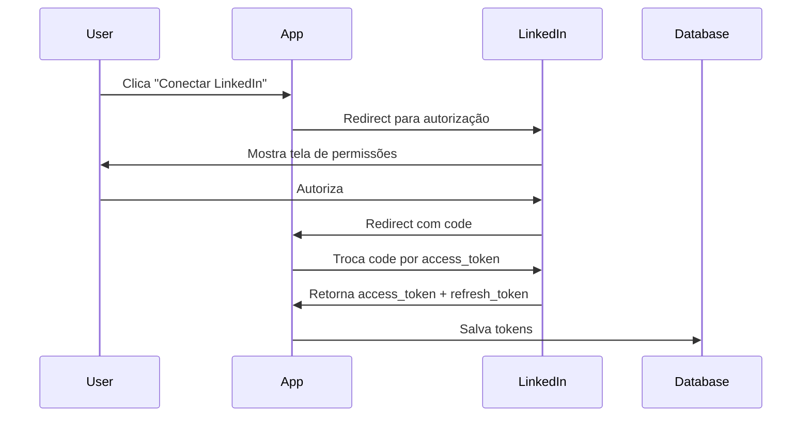

# 🔗 LinkedIn Automation Guide - Publicação Automática de Posts

> Guia completo para automatizar postagens no LinkedIn usando a LinkedIn API v2 + OAuth 2.0

## 📋 Índice

1. [Visão Geral](#visão-geral)
2. [Pré-requisitos](#pré-requisitos)
3. [Configuração da LinkedIn App](#configuração-da-linkedin-app)
4. [Autenticação OAuth 2.0](#autenticação-oauth-20)
5. [Estrutura do Sistema](#estrutura-do-sistema)
6. [Implementação](#implementação)
7. [Rate Limits e Melhores Práticas](#rate-limits-e-melhores-práticas)
8. [Troubleshooting](#troubleshooting)

---

## 🎯 Visão Geral

A automação de postagens no LinkedIn permite:

- ✅ Publicar artigos do blog automaticamente no LinkedIn
- ✅ Upload de imagens com posts
- ✅ Agendamento de posts
- ✅ Tracking de engajamento (likes, comments, shares)
- ✅ Postagem em LinkedIn Pages (empresas) ou perfis pessoais

**Fluxo de trabalho:**
```
Blog gerado → Criar post LinkedIn → Upload de imagem → Publicar → Track engajamento
```

---

## 📦 Pré-requisitos

### 1. LinkedIn App (Developer Portal)

Você precisa criar uma **LinkedIn App** para obter credenciais OAuth:

1. Acesse: https://www.linkedin.com/developers/apps
2. Clique em **"Create App"**
3. Preencha:
   - **App name**: CatBytes Blog Automation
   - **LinkedIn Page**: Selecione sua company page (ou crie uma)
   - **App logo**: Logo do CatBytes (512x512px)
   - **Legal agreement**: Aceite os termos

4. **Products** necessários:
   - ✅ **Share on LinkedIn** - Permite criar posts
   - ✅ **Sign In with LinkedIn** - Autenticação OAuth
   
5. Após aprovação (geralmente instantânea), pegue suas credenciais:
   - **Client ID**: `abc123xyz`
   - **Client Secret**: `supersecret123`

### 2. Permissões OAuth (Scopes)

Para publicar posts, você precisa dos seguintes **scopes**:

```typescript
const LINKEDIN_SCOPES = [
  'w_member_social',      // Publicar em nome do usuário
  'r_liteprofile',        // Ler perfil básico
  'r_emailaddress',       // Ler email (opcional)
  'w_organization_social' // Publicar em company page (se aplicável)
]
```

### 3. Variáveis de Ambiente

Adicione ao `.env.local`:

```bash
# LinkedIn API Credentials
LINKEDIN_CLIENT_ID=your_client_id_here
LINKEDIN_CLIENT_SECRET=your_client_secret_here
LINKEDIN_REDIRECT_URI=http://localhost:3000/api/linkedin/callback
LINKEDIN_ACCESS_TOKEN=your_access_token_here  # Gerado após OAuth
LINKEDIN_REFRESH_TOKEN=your_refresh_token_here
LINKEDIN_PERSON_URN=urn:li:person:ABC123      # Seu person ID
LINKEDIN_ORGANIZATION_URN=urn:li:organization:123456  # Company page ID (opcional)
```

---

## 🔐 Configuração da LinkedIn App

### Passo 1: Criar App no Developer Portal

1. **Acesse**: https://www.linkedin.com/developers/apps/new
2. **Preencha o formulário**:
   ```
   App name: CatBytes Blog Automation
   LinkedIn Page: [Sua company page]
   Privacy policy URL: https://catbytes.site/privacy
   App logo: [Upload logo 512x512]
   Legal agreement: ✅ Accept
   ```

3. **Clique em "Create app"**

### Passo 2: Configurar Redirect URLs

Em **Auth** → **OAuth 2.0 settings**:

```
Authorized redirect URLs for your app:
- http://localhost:3000/api/linkedin/callback (desenvolvimento)
- https://catbytes.site/api/linkedin/callback (produção)
```

### Passo 3: Solicitar Produtos

Em **Products**, solicite acesso a:

1. **Share on LinkedIn** - Status: Approved ✅
2. **Sign In with LinkedIn** - Status: Approved ✅

> ⚠️ **Importante**: A aprovação é geralmente instantânea para "Share on LinkedIn", mas pode levar 1-2 dias para casos especiais.

---

## 🔑 Autenticação OAuth 2.0

### Fluxo OAuth Completo



### Implementação do OAuth Flow

#### 1. Criar rota de autenticação

**`app/api/linkedin/auth/route.ts`**:

```typescript
import { NextRequest, NextResponse } from 'next/server'

export async function GET(request: NextRequest) {
  const clientId = process.env.LINKEDIN_CLIENT_ID
  const redirectUri = process.env.LINKEDIN_REDIRECT_URI
  const state = generateRandomState() // CSRF protection
  
  const scopes = [
    'w_member_social',
    'r_liteprofile',
    'r_emailaddress'
  ].join(' ')
  
  const authUrl = `https://www.linkedin.com/oauth/v2/authorization?` + 
    `response_type=code&` +
    `client_id=${clientId}&` +
    `redirect_uri=${encodeURIComponent(redirectUri!)}&` +
    `state=${state}&` +
    `scope=${encodeURIComponent(scopes)}`
  
  return NextResponse.redirect(authUrl)
}

function generateRandomState(): string {
  return Math.random().toString(36).substring(7)
}
```

#### 2. Criar rota de callback

**`app/api/linkedin/callback/route.ts`**:

```typescript
import { NextRequest, NextResponse } from 'next/server'

export async function GET(request: NextRequest) {
  const { searchParams } = new URL(request.url)
  const code = searchParams.get('code')
  const state = searchParams.get('state')
  
  if (!code) {
    return NextResponse.json({ error: 'No authorization code' }, { status: 400 })
  }
  
  // Trocar code por access token
  const tokenResponse = await fetch('https://www.linkedin.com/oauth/v2/accessToken', {
    method: 'POST',
    headers: {
      'Content-Type': 'application/x-www-form-urlencoded',
    },
    body: new URLSearchParams({
      grant_type: 'authorization_code',
      code,
      client_id: process.env.LINKEDIN_CLIENT_ID!,
      client_secret: process.env.LINKEDIN_CLIENT_SECRET!,
      redirect_uri: process.env.LINKEDIN_REDIRECT_URI!,
    }),
  })
  
  const tokens = await tokenResponse.json()
  
  if (tokens.error) {
    return NextResponse.json({ error: tokens.error_description }, { status: 400 })
  }
  
  // Salvar tokens no banco de dados
  await saveLinkedInTokens({
    access_token: tokens.access_token,
    refresh_token: tokens.refresh_token,
    expires_in: tokens.expires_in,
  })
  
  return NextResponse.redirect('/admin/blog?linkedin=connected')
}
```

#### 3. Refresh de Access Token

Access tokens expiram em **60 dias**. Use refresh tokens para renovar:

```typescript
async function refreshLinkedInToken(refreshToken: string) {
  const response = await fetch('https://www.linkedin.com/oauth/v2/accessToken', {
    method: 'POST',
    headers: {
      'Content-Type': 'application/x-www-form-urlencoded',
    },
    body: new URLSearchParams({
      grant_type: 'refresh_token',
      refresh_token: refreshToken,
      client_id: process.env.LINKEDIN_CLIENT_ID!,
      client_secret: process.env.LINKEDIN_CLIENT_SECRET!,
    }),
  })
  
  const tokens = await response.json()
  
  // Salvar novos tokens
  await saveLinkedInTokens({
    access_token: tokens.access_token,
    refresh_token: tokens.refresh_token,
    expires_in: tokens.expires_in,
  })
  
  return tokens.access_token
}
```

---

## 🏗️ Estrutura do Sistema

### Arquivos a Criar

```
lib/
├── linkedin-api.ts           # Core API functions
├── linkedin-auth.ts          # OAuth helpers
└── linkedin-image-upload.ts  # Image upload to LinkedIn

app/api/linkedin/
├── auth/route.ts             # OAuth initiation
├── callback/route.ts         # OAuth callback
├── post/route.ts             # Create LinkedIn post
└── refresh-token/route.ts    # Refresh access token

components/admin/
└── linkedin-connect-button.tsx  # UI para conectar LinkedIn

supabase/migrations/
└── add_linkedin_tokens.sql   # Tabela para salvar tokens
```

### Schema do Banco de Dados

```sql
-- Tabela para salvar tokens OAuth
CREATE TABLE linkedin_tokens (
  id UUID PRIMARY KEY DEFAULT uuid_generate_v4(),
  access_token TEXT NOT NULL,
  refresh_token TEXT NOT NULL,
  expires_at TIMESTAMP NOT NULL,
  person_urn TEXT,
  created_at TIMESTAMP DEFAULT NOW(),
  updated_at TIMESTAMP DEFAULT NOW()
);

-- Tabela para tracking de posts LinkedIn
CREATE TABLE linkedin_posts (
  id UUID PRIMARY KEY DEFAULT uuid_generate_v4(),
  blog_post_id UUID REFERENCES blog_posts(id),
  linkedin_post_id TEXT NOT NULL,
  linkedin_post_url TEXT,
  published_at TIMESTAMP DEFAULT NOW(),
  likes_count INT DEFAULT 0,
  comments_count INT DEFAULT 0,
  shares_count INT DEFAULT 0,
  last_synced_at TIMESTAMP
);
```

---

## 💻 Implementação

### 1. Biblioteca Core - `lib/linkedin-api.ts`

```typescript
/**
 * LinkedIn API - Publicação de Posts
 */

interface LinkedInPostParams {
  text: string
  imageUrl?: string
  articleUrl?: string
  articleTitle?: string
}

interface LinkedInPostResponse {
  success: boolean
  postId?: string
  postUrl?: string
  error?: string
}

/**
 * Publica post no LinkedIn
 */
export async function publishLinkedInPost(
  params: LinkedInPostParams
): Promise<LinkedInPostResponse> {
  try {
    const accessToken = await getValidAccessToken()
    const personUrn = process.env.LINKEDIN_PERSON_URN
    
    if (!accessToken || !personUrn) {
      return {
        success: false,
        error: 'LinkedIn not configured. Missing access token or person URN.'
      }
    }
    
    // Step 1: Upload image (se fornecida)
    let mediaUrn: string | undefined
    if (params.imageUrl) {
      mediaUrn = await uploadLinkedInImage(params.imageUrl, accessToken)
    }
    
    // Step 2: Criar post
    const postData = createLinkedInPostPayload(personUrn, params, mediaUrn)
    
    const response = await fetch('https://api.linkedin.com/v2/ugcPosts', {
      method: 'POST',
      headers: {
        'Authorization': `Bearer ${accessToken}`,
        'Content-Type': 'application/json',
        'X-Restli-Protocol-Version': '2.0.0',
      },
      body: JSON.stringify(postData),
    })
    
    if (!response.ok) {
      const error = await response.json()
      console.error('[LinkedIn] Post creation failed:', error)
      return {
        success: false,
        error: error.message || 'Failed to create LinkedIn post'
      }
    }
    
    const result = await response.json()
    const postId = result.id
    const postUrl = `https://www.linkedin.com/feed/update/${postId}/`
    
    console.log('[LinkedIn] ✅ Post published:', postUrl)
    
    return {
      success: true,
      postId,
      postUrl,
    }
  } catch (error) {
    console.error('[LinkedIn] Error publishing post:', error)
    return {
      success: false,
      error: error instanceof Error ? error.message : 'Unknown error'
    }
  }
}

/**
 * Cria payload do post para LinkedIn API
 */
function createLinkedInPostPayload(
  personUrn: string,
  params: LinkedInPostParams,
  mediaUrn?: string
) {
  const payload: any = {
    author: personUrn,
    lifecycleState: 'PUBLISHED',
    specificContent: {
      'com.linkedin.ugc.ShareContent': {
        shareCommentary: {
          text: params.text,
        },
        shareMediaCategory: mediaUrn ? 'IMAGE' : 'ARTICLE',
      },
    },
    visibility: {
      'com.linkedin.ugc.MemberNetworkVisibility': 'PUBLIC',
    },
  }
  
  // Se tem imagem
  if (mediaUrn) {
    payload.specificContent['com.linkedin.ugc.ShareContent'].media = [
      {
        status: 'READY',
        media: mediaUrn,
      },
    ]
  }
  
  // Se tem artigo (link)
  if (params.articleUrl) {
    payload.specificContent['com.linkedin.ugc.ShareContent'].media = [
      {
        status: 'READY',
        originalUrl: params.articleUrl,
        title: {
          text: params.articleTitle || '',
        },
      },
    ]
  }
  
  return payload
}

/**
 * Obtém access token válido (renova se expirado)
 */
async function getValidAccessToken(): Promise<string | null> {
  // Buscar token do banco
  const tokens = await getLinkedInTokensFromDB()
  
  if (!tokens) {
    return null
  }
  
  // Verificar se expirou
  const now = new Date()
  const expiresAt = new Date(tokens.expires_at)
  
  if (now >= expiresAt) {
    // Token expirado - renovar
    console.log('[LinkedIn] Access token expired. Refreshing...')
    const newAccessToken = await refreshLinkedInToken(tokens.refresh_token)
    return newAccessToken
  }
  
  return tokens.access_token
}

/**
 * Upload de imagem para LinkedIn
 */
async function uploadLinkedInImage(
  imageUrl: string,
  accessToken: string
): Promise<string> {
  const personUrn = process.env.LINKEDIN_PERSON_URN!
  
  // Step 1: Registrar upload
  const registerResponse = await fetch(
    'https://api.linkedin.com/v2/assets?action=registerUpload',
    {
      method: 'POST',
      headers: {
        'Authorization': `Bearer ${accessToken}`,
        'Content-Type': 'application/json',
      },
      body: JSON.stringify({
        registerUploadRequest: {
          recipes: ['urn:li:digitalmediaRecipe:feedshare-image'],
          owner: personUrn,
          serviceRelationships: [
            {
              relationshipType: 'OWNER',
              identifier: 'urn:li:userGeneratedContent',
            },
          ],
        },
      }),
    }
  )
  
  const registerData = await registerResponse.json()
  const uploadUrl = registerData.value.uploadMechanism[
    'com.linkedin.digitalmedia.uploading.MediaUploadHttpRequest'
  ].uploadUrl
  const asset = registerData.value.asset
  
  // Step 2: Download imagem
  const imageResponse = await fetch(imageUrl)
  const imageBuffer = await imageResponse.arrayBuffer()
  
  // Step 3: Upload imagem
  await fetch(uploadUrl, {
    method: 'PUT',
    headers: {
      'Authorization': `Bearer ${accessToken}`,
    },
    body: imageBuffer,
  })
  
  return asset
}

// Helper functions (implementar conforme necessário)
async function getLinkedInTokensFromDB() {
  // Buscar do Supabase
  const { data } = await supabaseAdmin
    .from('linkedin_tokens')
    .select('*')
    .order('created_at', { ascending: false })
    .limit(1)
    .single()
  
  return data
}

async function saveLinkedInTokens(tokens: any) {
  const expiresAt = new Date(Date.now() + tokens.expires_in * 1000)
  
  await supabaseAdmin.from('linkedin_tokens').insert({
    access_token: tokens.access_token,
    refresh_token: tokens.refresh_token,
    expires_at: expiresAt.toISOString(),
  })
}
```

### 2. Integração com Geração de Blog

**`app/api/blog/generate/route.ts`** (adicionar no final):

```typescript
import { publishLinkedInPost } from '@/lib/linkedin-api'

// Após gerar o post do blog...
if (post.published) {
  // Auto-publicar no LinkedIn
  try {
    const linkedInResult = await publishLinkedInPost({
      text: `📝 Novo artigo no blog!\n\n${post.title}\n\n${post.excerpt}\n\n🔗 Leia mais:`,
      articleUrl: `https://catbytes.site/pt-BR/blog/${post.slug}`,
      articleTitle: post.title,
      imageUrl: post.cover_image_url,
    })
    
    if (linkedInResult.success) {
      console.log('[Blog Generate] ✅ LinkedIn post created:', linkedInResult.postUrl)
      
      // Salvar LinkedIn post ID no banco
      await supabaseAdmin.from('linkedin_posts').insert({
        blog_post_id: post.id,
        linkedin_post_id: linkedInResult.postId,
        linkedin_post_url: linkedInResult.postUrl,
      })
    }
  } catch (error) {
    console.error('[Blog Generate] LinkedIn post failed:', error)
    // Não bloqueia geração do blog
  }
}
```

---

## ⚡ Rate Limits e Melhores Práticas

### Rate Limits da LinkedIn API

| Endpoint | Limite | Janela |
|----------|--------|--------|
| UGC Posts (criar post) | 100 requests | 24 horas |
| Media Upload | 50 uploads | 24 horas |
| Token Refresh | 1000 requests | 24 horas |

### Melhores Práticas

1. **✅ Cache de tokens**: Não faça refresh desnecessário
2. **✅ Retry logic**: Implemente retry com exponential backoff
3. **✅ Error handling**: LinkedIn retorna erros detalhados - logge-os
4. **✅ Horário de posts**: Publique em horários de maior engajamento (Tue-Thu, 9-11am)
5. **✅ Texto otimizado**:
   - Máximo 3000 caracteres
   - Use emojis para chamar atenção 🚀
   - Inclua hashtags relevantes (#webdev #tech #programming)
   - Faça perguntas para engajamento

### Exemplo de Texto Otimizado

```typescript
function formatLinkedInText(post: BlogPost): string {
  const hashtags = post.tags.slice(0, 5).map(tag => `#${tag.replace(/\s+/g, '')}`).join(' ')
  
  return `📝 Novo artigo no CatBytes Blog!

${post.title}

${post.excerpt}

💡 Neste artigo você vai aprender:
✅ [Tópico 1]
✅ [Tópico 2]
✅ [Tópico 3]

🔗 Leia o artigo completo: https://catbytes.site/pt-BR/blog/${post.slug}

${hashtags}

O que você achou? Comenta aqui! 👇`
}
```

---

## 🐛 Troubleshooting

### Erro: "Invalid access token"

**Causa**: Token expirado ou inválido

**Solução**:
```typescript
// Verificar expiração
const isExpired = new Date() >= new Date(tokens.expires_at)
if (isExpired) {
  await refreshLinkedInToken(tokens.refresh_token)
}
```

### Erro: "Insufficient permissions"

**Causa**: Faltam scopes OAuth

**Solução**: Re-autorizar com scopes corretos:
```typescript
const scopes = ['w_member_social', 'r_liteprofile']
```

### Erro: "Rate limit exceeded"

**Causa**: Mais de 100 posts em 24h

**Solução**: Implementar queue com delay:
```typescript
const LINKEDIN_POST_QUEUE_DELAY = 15 * 60 * 1000 // 15 minutos
```

### Posts não aparecem no feed

**Causa**: LinkedIn pode estar filtrando conteúdo automatizado

**Solução**:
- Varie o texto dos posts
- Não use sempre o mesmo formato
- Adicione comentários diferentes
- Interaja com posts manualmente também

---

## 🎉 Próximos Passos

1. ✅ **Implementar OAuth flow** - Conectar LinkedIn na página admin
2. ✅ **Criar lib/linkedin-api.ts** - Funções core de publicação
3. ✅ **Integrar com blog generation** - Auto-post após criar artigo
4. ⏳ **Dashboard de analytics** - Track likes, comments, shares
5. ⏳ **Scheduling** - Agendar posts para horários otimizados
6. ⏳ **A/B Testing** - Testar variações de texto para melhor engajamento

---

## 📚 Referências

- [LinkedIn Share on LinkedIn API](https://learn.microsoft.com/en-us/linkedin/consumer/integrations/self-serve/share-on-linkedin)
- [LinkedIn OAuth 2.0 Documentation](https://learn.microsoft.com/en-us/linkedin/shared/authentication/authentication)
- [LinkedIn UGC Posts API](https://learn.microsoft.com/en-us/linkedin/marketing/integrations/community-management/shares/ugc-post-api)
- [LinkedIn Media Upload](https://learn.microsoft.com/en-us/linkedin/marketing/integrations/community-management/shares/images-videos-api)

---

**Pronto!** 🚀 Agora você tem um guia completo para automatizar postagens no LinkedIn. Basta implementar passo a passo e integrar com seu fluxo de geração de blog.
