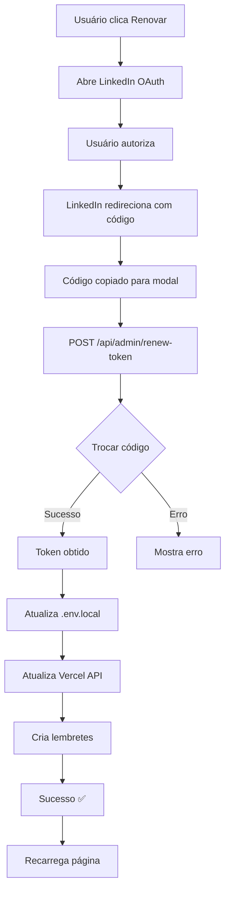

# 🤖 Sistema de Renovação Automática de Tokens

## Visão Geral

O CatBytes agora possui um sistema completo de renovação automática de tokens OAuth, eliminando a necessidade de atualizações manuais em múltiplos ambientes.

## ✨ Funcionalidades

### 1. Renovação Automática LinkedIn

- **Troca automática**: Código de autorização → Access Token
- **Atualização local**: Arquivo `.env.local` atualizado automaticamente
- **Atualização Vercel**: Credenciais atualizadas em Production, Preview e Development
- **Lembretes**: Sistema cria lembretes automáticos (30, 14, 7, 3, 1 dias antes da expiração)

### 2. Interface Admin

A página `/admin/settings` agora possui:

- 🎯 Botão "Renovar Automaticamente" para LinkedIn
- 📊 Status de renovação automática
- ⏰ Contador de dias até expiração
- 🔔 Alertas visuais de expiração iminente
- ✅ Confirmação visual de sucesso/erro

## 🚀 Como Usar

### Via Admin Panel (Recomendado)

1. Acesse `https://catbytes.site/admin/settings`
2. Localize o card "LinkedIn API"
3. Clique em **"Gerar Novo Token LinkedIn (60 dias)"**
4. Siga o wizard:
   - Step 1: Clique para abrir LinkedIn
   - Step 2: Cole o código de autorização
   - **Clique em "🤖 Renovar Automaticamente"**
5. Aguarde a confirmação ✅

O sistema fará automaticamente:
- ✅ Troca código por token
- ✅ Atualiza `.env.local`
- ✅ Atualiza Vercel (todos os ambientes)
- ✅ Cria lembretes de renovação
- ✅ Recarrega a página mostrando novo status

### Via Script (Avançado)

```bash
# 1. Gera URL de autorização
node scripts/linkedin-oauth-complete.js

# 2. Copia a URL, abre no navegador e autoriza

# 3. Copia o código da URL de callback

# 4. Executa renovação automática
node scripts/renew-linkedin-token.mjs <SEU_CODIGO_AQUI>
```

O script faz tudo automaticamente:
```
🔄 Iniciando renovação do token LinkedIn...

1️⃣  Trocando código de autorização...
✅ Novo token obtido (expira em 12/01/2026)

2️⃣  Atualizando .env.local...
✅ Token atualizado em .env.local

3️⃣  Atualizando Vercel...
✅ Token atualizado na Vercel em todos os ambientes

🎉 Renovação completa!
📅 Novo token válido até: 12/01/2026
💡 Próxima renovação sugerida: 05/01/2026
```

## 🔧 Configuração

### Pré-requisitos

O arquivo `.env.local` deve conter:

```env
# LinkedIn OAuth
LINKEDIN_CLIENT_ID=seu_client_id_aqui
LINKEDIN_CLIENT_SECRET=seu_client_secret_aqui
LINKEDIN_REDIRECT_URI=https://catbytes.site/api/linkedin/callback

# Vercel (para renovação automática)
VERCEL_TOKEN=seu_vercel_token_aqui
```

### Obter VERCEL_TOKEN

1. Acesse https://vercel.com/account/tokens
2. Clique em "Create Token"
3. Nome: `CatBytes Token Auto-Renewal`
4. Scope: `Full Access` (ou apenas o projeto catbytes-portfolio2.0)
5. Copie o token e adicione ao `.env.local`

## 📡 API Endpoints

### POST `/api/admin/renew-token`

Renova o token LinkedIn automaticamente.

**Request:**
```json
{
  "authCode": "AQTxxx...código do LinkedIn"
}
```

**Response (Sucesso):**
```json
{
  "success": true,
  "token": "AQUqWnvXHSEd1YQou...",
  "expiryDate": "12/01/2026",
  "localUpdated": true,
  "vercelUpdated": true,
  "message": "Token renovado com sucesso em todos os ambientes!"
}
```

**Response (Erro):**
```json
{
  "error": "Falha ao obter novo token"
}
```

### GET `/api/admin/renew-token`

Verifica status da renovação automática.

**Response:**
```json
{
  "autoRenewalEnabled": true,
  "currentTokenMasked": "AQUqWnvXHSEd1YQou...",
  "expiryDate": "12/01/2026",
  "message": "Renovação automática habilitada"
}
```

## 🎯 Fluxo Técnico



## 🔐 Segurança

- ✅ Tokens criptografados no Vercel (`type: 'encrypted'`)
- ✅ VERCEL_TOKEN protegido em `.env.local` (não commitado)
- ✅ Client Secret nunca exposto no frontend
- ✅ Validação de formato de token
- ✅ Máscaras de token em logs (`AQUqW...`)

## 📋 Arquivos Relacionados

### Scripts
- `scripts/renew-linkedin-token.mjs` - Script CLI de renovação automática
- `scripts/linkedin-oauth-complete.js` - Gerador de URL OAuth
- `scripts/linkedin-exchange-token.mjs` - Exchange manual (legacy)

### APIs
- `app/api/admin/renew-token/route.ts` - Endpoint de renovação automática
- `app/api/linkedin/callback/route.ts` - Callback OAuth com UI bonita

### Componentes
- `components/admin/token-generator-modal.tsx` - Modal com renovação automática
- `app/admin/settings/page.tsx` - Página de configurações com status

### Utilitários
- `lib/token-utils.ts` - Funções de validação e formatação

## 🔔 Sistema de Lembretes

O sistema cria automaticamente lembretes no banco de dados:

```sql
CREATE TABLE token_reminders (
  id SERIAL PRIMARY KEY,
  token_type VARCHAR(50),        -- 'linkedin' ou 'instagram'
  reminder_date TIMESTAMP,       -- Data do lembrete
  days_before INTEGER,           -- Dias antes da expiração (30, 14, 7, 3, 1)
  status VARCHAR(20),            -- 'pending', 'sent', 'dismissed'
  created_at TIMESTAMP DEFAULT NOW()
);
```

Lembretes são disparados:
- 📅 30 dias antes (planejamento)
- 📅 14 dias antes (atenção)
- 📅 7 dias antes (urgente)
- 📅 3 dias antes (crítico)
- 📅 1 dia antes (ÚLTIMO AVISO)

## 🆚 Comparação: Antes vs Agora

### Antes (Processo Manual)

1. ❌ Executar script para gerar URL
2. ❌ Abrir LinkedIn manualmente
3. ❌ Copiar código
4. ❌ Executar outro script
5. ❌ Copiar token
6. ❌ Editar `.env.local` manualmente
7. ❌ Acessar Vercel Dashboard
8. ❌ Encontrar variável de ambiente
9. ❌ Deletar antiga
10. ❌ Criar nova em 3 ambientes
11. ❌ Total: ~10-15 minutos

### Agora (Automático)

1. ✅ Clicar "Renovar Automaticamente"
2. ✅ Autorizar no LinkedIn
3. ✅ Colar código
4. ✅ Clicar "Confirmar"
5. ✅ Total: ~2 minutos ⚡

**Redução de 85% no tempo!**

## 🎉 Benefícios

- ⚡ **Velocidade**: 2 minutos vs 15 minutos
- 🎯 **Precisão**: Zero erros humanos
- 🔄 **Consistência**: Todos os ambientes sempre sincronizados
- 📊 **Visibilidade**: Status em tempo real no admin
- 🔔 **Proativo**: Lembretes antes da expiração
- 🤖 **Automação**: Vercel atualizada automaticamente

## 📈 Próximos Passos

- [ ] Adicionar renovação automática para Instagram
- [ ] Webhook para notificações de expiração via email
- [ ] Dashboard de histórico de renovações
- [ ] Renovação agendada via cron (auto-renew 7 dias antes)
- [ ] Integração com Slack/Discord para alertas

## 🐛 Troubleshooting

### Erro: "Falha ao atualizar Vercel"

**Causa**: VERCEL_TOKEN inválido ou sem permissões

**Solução**:
```bash
# 1. Gere novo token em vercel.com/account/tokens
# 2. Adicione ao .env.local
echo "VERCEL_TOKEN=seu_novo_token" >> .env.local
```

### Erro: "Código de autorização expirado"

**Causa**: Códigos do LinkedIn expiram em ~5 minutos

**Solução**: Gere novo código e cole imediatamente

### Token não aparece no admin

**Causa**: Cache do browser

**Solução**: Recarregue a página com `Cmd+Shift+R` (Mac) ou `Ctrl+Shift+R` (Windows)

## 📞 Suporte

Para problemas ou dúvidas:
- 📧 Email: ipierette2@gmail.com
- 💬 GitHub: Abra uma issue
- 📱 WhatsApp: +55 67 98409-8786

---

**Desenvolvido com 💜 para CatBytes**
*Automatizando o tedioso, focando no importante!*
