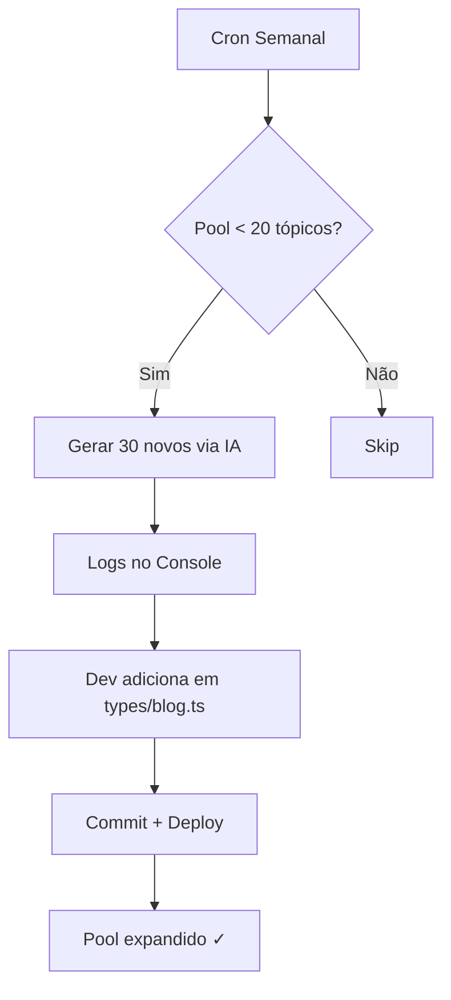

# 🎯 Sistema Automático de Expansão de Tópicos

Sistema inteligente que **gera tópicos automaticamente usando IA** para garantir que o blog sempre tenha conteúdo novo e raramente precise repetir tópicos.

## 🚀 Como Funciona

### 1. **Verificação Automática Semanal**
- **Quando**: Todo domingo às 03:00 UTC (00:00 BRT)
- **O que faz**: Verifica cada categoria de blog
- **Threshold**: Se restam < 20 tópicos disponíveis, gera novos
- **Quantidade**: Gera 30 novos tópicos por categoria necessitada

### 2. **Geração Inteligente via IA**
- Usa GPT-4o-mini para criar tópicos relevantes
- Analisa tópicos existentes para evitar duplicação
- Considera tendências de 2025-2027
- Foca em SEO e relevância para o público-alvo

### 3. **Integração Automática no Cron**
O cron principal (`/api/simple-cron`) executa:
```
Domingo 03:00 UTC → Verifica pool de tópicos → Gera se necessário
```

## 📊 Status Atual

| Categoria | Tópicos Atuais | Meta (2 anos) | % Completo |
|-----------|---------------|---------------|------------|
| Automação e Negócios | 40 | 104 | 38% |
| Programação e IA | 55 | 104 | 53% |
| Cuidados Felinos | 30 | 104 | 29% |
| Tech Aleatório | 50 | 104 | 48% |
| **TOTAL** | **175** | **416** | **42%** |

## 🛠️ Uso Manual

### Via Script CLI

```bash
# Verificar todas categorias e gerar se necessário
node scripts/generate-topics.js

# Gerar 50 tópicos de Programação e IA
node scripts/generate-topics.js "Programação e IA" 50

# Gerar 30 tópicos (padrão) de Automação
node scripts/generate-topics.js "Automação e Negócios"
```

### Via API (Desenvolvimento)

```bash
# Modo automático (verifica todas categorias)
curl http://localhost:3000/api/topics/generate?auto=true

# Gerar para categoria específica
curl "http://localhost:3000/api/topics/generate?category=Programação%20e%20IA&count=50"
```

### Via API (Produção)

```bash
# Com autenticação
curl https://catbytes.com.br/api/topics/generate?auto=true \
  -H "Authorization: Bearer ${CRON_SECRET}"
```

## 📝 Adicionar Tópicos Gerados

Quando tópicos são gerados, siga estes passos:

1. **Copie os tópicos** do output do console/script
2. **Abra** `types/blog.ts`
3. **Localize** a categoria correspondente
4. **Cole** os novos tópicos no array
5. **Commit** as mudanças

Exemplo:
```typescript
// types/blog.ts
'Programação e IA': [
  // ... tópicos existentes ...
  
  // NOVOS TÓPICOS GERADOS EM 20/11/2025
  'RAG com Supabase: IA que conhece seus dados',
  'Ollama + TypeScript: LLMs locais no Node.js',
  'Fine-tuning de LLMs: quando e como fazer',
  // ...
] as const,
```

## 🔄 Fluxo Completo



## 🎯 Benefícios

### ✅ Nunca Repetir Tópicos
- Pool sempre >= 20 tópicos disponíveis por categoria
- Sistema de rastreamento de 2 anos
- Geração automática quando necessário

### 🤖 Geração Inteligente
- IA cria tópicos relevantes e específicos
- Considera SEO e tendências atuais
- Evita duplicação analisando existentes

### ⚡ Zero Manutenção Manual
- Verificação automática semanal
- Não precisa lembrar de criar tópicos
- Sistema se auto-regula

### 💰 Custo Otimizado
- Gera apenas quando necessário (< 20 disponíveis)
- Usa GPT-4o-mini (mais barato)
- Uma vez por semana (não toda geração de post)

## 🔧 Configuração

### Variáveis de Ambiente

```env
OPENAI_API_KEY=sk-...           # Para gerar tópicos via IA
CRON_SECRET=...                  # Para proteger endpoints
```

### Customização

Edite `lib/topic-generator.ts` para ajustar:

```typescript
// Threshold de geração (padrão: 20)
await needsMoreTopics(category, 20)

// Quantidade gerada (padrão: 30)
await generateNewTopics(category, 30)

// Temperatura da IA (criatividade)
temperature: 0.9  // 0.0 = conservador, 1.0 = criativo
```

## 📅 Próximas Melhorias

- [ ] Auto-commit em PR separado (evitar manual)
- [ ] Dashboard de métricas de tópicos
- [ ] Categorização automática de tópicos
- [ ] A/B testing de tópicos por performance
- [ ] Integração com analytics (quais tópicos performam melhor)

## 🚨 Troubleshooting

### Tópicos não foram gerados

1. Verifique logs do cron: `/api/simple-cron` domingo 03:00 UTC
2. Execute manualmente: `node scripts/generate-topics.js`
3. Verifique variável `OPENAI_API_KEY` configurada

### Tópicos gerados mas não aparecem

- Tópicos são **logados no console**, não adicionados automaticamente
- Você precisa **copiar e adicionar manualmente** em `types/blog.ts`
- Isso garante controle de qualidade antes do deploy

### Categoria não precisa de tópicos

```
[Topic Generator] ✓ Categoria "X" tem tópicos suficientes
```

Isso é normal! Só gera quando restam < 20 disponíveis.

## 📚 Arquivos do Sistema

```
lib/
  topic-generator.ts          # Lógica de geração IA
  topic-usage-manager.ts      # Rastreamento 2 anos
  
app/api/
  topics/generate/route.ts    # Endpoint API
  simple-cron/route.ts        # Integração cron (linha 193)
  
scripts/
  generate-topics.js          # CLI manual
  
supabase/migrations/
  003_topic_usage_tracking.sql  # Database tracking
  
types/
  blog.ts                     # Pool de tópicos (175 atuais)
```

## 💡 Exemplo Prático

### Cenário: Categoria "Programação e IA"

1. **Estado atual**: 55 tópicos, 30 já usados = 25 disponíveis ✅
2. **Próxima semana**: Mais 4 artigos gerados = 21 disponíveis ✅
3. **Semana seguinte**: Mais 4 artigos = 17 disponíveis ❌ (< 20)
4. **Cron detecta**: Restam apenas 17, precisa gerar!
5. **IA gera**: 30 novos tópicos relevantes
6. **Log mostra**: Lista para adicionar em types/blog.ts
7. **Dev adiciona**: Pool agora tem 85 tópicos (47 disponíveis) ✅
8. **Próximas 11 semanas**: Sem necessidade de geração

---

**Sistema desenvolvido em**: 20 de novembro de 2025  
**Versão**: 1.0.0  
**Status**: ✅ Ativo e funcional
